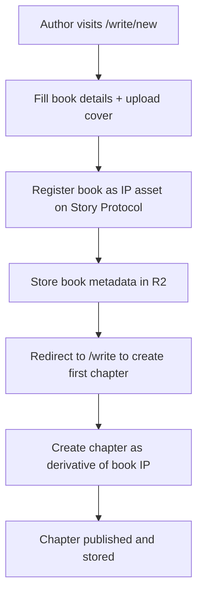
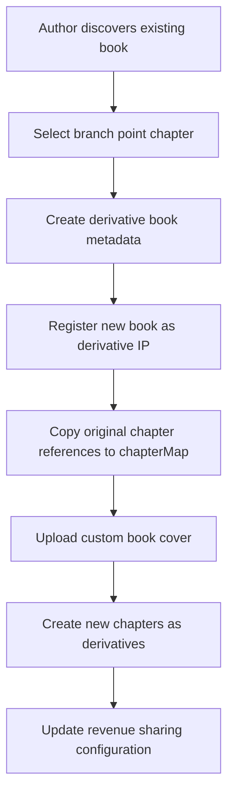
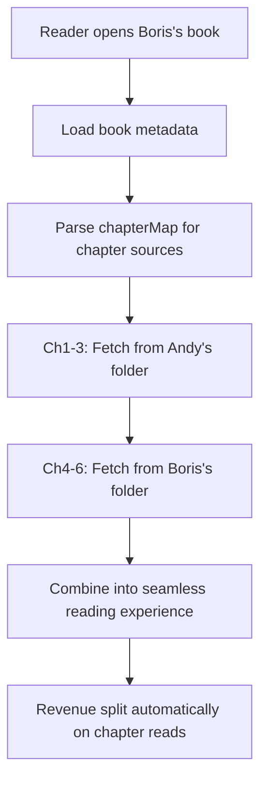

# 📚 Book Registration & Branching System

## Overview

The Book Registration & Branching System is StoryHouse.vip's revolutionary feature that enables **collaborative storytelling** through a hierarchical IP structure where books are parent assets and chapters are derivatives. Authors can branch from any chapter to create new books while maintaining attribution and revenue sharing.

## Key Concepts

### 1. **Hierarchical IP Structure**

```
Book IP Asset (Parent)
├── Chapter 1 IP Asset (Child)
├── Chapter 2 IP Asset (Child)
└── Chapter 3 IP Asset (Child)
```

- **Books** are registered as primary IP assets on Story Protocol
- **Chapters** are registered as derivative IP assets of their parent book
- **Revenue flows** from chapters to book owners and vice versa

### 2. **Collaborative Branching Model**

```
Andy's Original Book:               Boris's Derivative Book:
┌─────────────────────────┐        ┌─────────────────────────┐
│ The Detective's Portal  │        │ Detective Portal: Sci-Fi│
│ ├── Ch1 (Andy)         │◄────┬──┤ ├── Ch1 (Andy's)       │
│ ├── Ch2 (Andy)         │     │  │ ├── Ch2 (Andy's)       │
│ └── Ch3 (Andy)         │     │  │ ├── Ch3 (Andy's)       │
└─────────────────────────┘     │  │ ├── Ch4 (Boris)       │
                               │  │ ├── Ch5 (Boris)       │
                               │  │ └── Ch6 (Boris)       │
                               │  └─────────────────────────┘
                               │
                    Branch Point: Ch3
```

**Key Benefits:**
- ✅ **Unique Identity**: Each remix gets its own book cover, title, and discovery page
- ✅ **Efficient Storage**: Original chapters reused via metadata references
- ✅ **Revenue Sharing**: Automatic split between original and remix authors  
- ✅ **Seamless Reading**: Readers don't know content comes from multiple sources

## Technical Architecture

### Storage Structure

```
/books/
  /{authorAddress}-{bookSlug}/
    ├── metadata.json              # Book metadata with chapterMap
    ├── cover.jpg                  # Book cover image  
    └── /chapters/
        ├── /ch1/
        │   ├── content.json       # Chapter content
        │   └── metadata.json      # Chapter metadata
        ├── /ch2/
        └── /ch3/
```

**Examples:**
```
/books/0x1234...abcd-detective-portal/     # Andy's original
/books/0x5678...efgh-detective-portal-sf/  # Boris's sci-fi remix
/books/0x9abc...ijkl-detective-portal-dark/ # Daisy's dark version
```

### Book Metadata Schema

```typescript
interface BookMetadata {
  // Basic Information
  bookId: string              // "0x5678-detective-sf"
  title: string               // "The Detective's Portal: Sci-Fi Adventure"
  description: string         // Book description
  authorAddress: string       // "0x5678..."
  authorName: string          // "Boris" 
  slug: string               // "detective-sf"
  coverUrl: string           // R2 URL to book cover
  
  // IP Registration
  ipAssetId: string          // Story Protocol IP asset ID
  licenseTermsId: string     // PIL terms for licensing
  
  // Branching Information
  parentBook?: string        // "0x1234-detective" (for derivative books)
  branchPoint?: string       // "ch3" (where branching occurred)
  derivativeBooks: string[]  // ["0x9abc-detective-dark"] (child books)
  
  // Chapter Resolution Map
  chapterMap: {
    [chapterNumber: string]: string  // "ch1": "0x1234-detective/chapters/ch1"
  }
  
  // Revenue Attribution
  originalAuthors: {
    [authorAddress: string]: {
      chapters: string[]       // ["ch1", "ch2", "ch3"]
      revenueShare: number     // Percentage (0-100)
    }
  }
  
  // Discovery & Analytics
  totalChapters: number
  genres: string[]
  contentRating: string
  isRemixable: boolean
  createdAt: string
  updatedAt: string
  
  // Engagement Metrics
  totalReads: number
  averageRating: number
  totalRevenue: number
}
```

### Chapter Metadata Schema

```typescript
interface ChapterMetadata {
  // Basic Information
  chapterId: string
  chapterNumber: number
  title: string
  summary: string
  content: string
  
  // Authorship
  authorAddress: string
  authorName: string
  bookId: string             // Parent book ID
  
  // IP Registration
  ipAssetId: string          // Story Protocol IP asset ID
  parentIpAssetId: string    // Book IP asset ID
  
  // Economics
  unlockPrice: number        // $TIP cost to read
  readReward: number         // $TIP earned for completion
  licensePrice: number       // $TIP cost for remix rights
  
  // Content Metrics
  wordCount: number
  readingTime: number        // Estimated minutes
  qualityScore: number       // AI-generated (0-100)
  originalityScore: number   // AI-generated (0-100)
  
  // Generation Details
  generationMethod: string   // "ai" | "human" | "hybrid"
  aiPrompt?: string         // Original prompt if AI-generated
  
  // Engagement
  totalReads: number
  averageRating: number
  totalRevenue: number
  
  // Classification
  genre: string
  mood: string
  contentRating: string
  tags: string[]
  
  createdAt: string
  updatedAt: string
}
```

## User Workflows

### 1. Book Registration Workflow



**API Flow:**
```typescript
// 1. Register book IP
const bookIpResponse = await POST('/api/books/register', {
  title: "The Detective's Portal",
  description: "A time-traveling detective story",
  coverFile: File,
  authorAddress: "0x1234...",
  licenseTerms: {
    commercialUse: true,
    derivativesAllowed: true,
    commercialRevShare: 2500 // 25%
  }
})

// 2. Store in R2
const bookData = {
  bookId: `${authorAddress}-${slug}`,
  ipAssetId: bookIpResponse.ipAssetId,
  chapterMap: {},
  originalAuthors: {
    [authorAddress]: { chapters: [], revenueShare: 100 }
  }
}
```

### 2. Book Branching Workflow



**API Flow:**
```typescript
// 1. Create derivative book
const derivativeResponse = await POST('/api/books/branch', {
  parentBookId: "0x1234-detective",
  branchPoint: "ch3",
  newTitle: "The Detective's Portal: Sci-Fi Adventure",
  newCover: File,
  authorAddress: "0x5678..."
})

// 2. Hybrid chapter map created automatically
const chapterMap = {
  "ch1": "0x1234-detective/chapters/ch1",  // Reference to original
  "ch2": "0x1234-detective/chapters/ch2",  // Reference to original  
  "ch3": "0x1234-detective/chapters/ch3",  // Reference to original
  "ch4": "0x5678-detective-sf/chapters/ch4", // New content
  "ch5": "0x5678-detective-sf/chapters/ch5", // New content
  "ch6": "0x5678-detective-sf/chapters/ch6"  // New content
}
```

### 3. Hybrid Reading Experience



**Chapter Resolution Logic:**
```typescript
async function getChapterContent(bookId: string, chapterNumber: number) {
  // 1. Load book metadata
  const book = await getBookMetadata(bookId)
  
  // 2. Resolve chapter source from chapterMap
  const chapterPath = book.chapterMap[`ch${chapterNumber}`]
  
  // 3. Fetch chapter from appropriate source
  const chapterContent = await getChapterFromPath(chapterPath)
  
  // 4. Track revenue attribution
  const authorAddress = getChapterAuthor(chapterPath)
  await trackRevenueAttribution(bookId, chapterNumber, authorAddress)
  
  return chapterContent
}
```

## Revenue Sharing Model

### Automatic Revenue Distribution

When a reader pays to unlock a chapter in a branched book:

```typescript
interface RevenueDistribution {
  chapterRevenue: {
    unlock: 0.5,      // $TIP paid by reader
    readReward: 0.1   // $TIP earned by reader
  },
  authorShare: {
    chapterAuthor: 0.4,    // 80% to chapter author
    bookAuthor: 0.05,      // 10% to book creator  
    platform: 0.05        // 10% platform fee
  }
}
```

**Example: Reader unlocks Chapter 2 in Boris's book**
- Chapter 2 was written by Andy (original author)
- Reader pays 0.5 $TIP
- Andy gets 0.4 $TIP (chapter author)
- Boris gets 0.05 $TIP (book curator)
- Platform gets 0.05 $TIP

### Cross-Book Analytics

```typescript
interface BookAnalytics {
  totalRevenue: number           // All revenue from this book
  chapterBreakdown: {
    [chapterNumber: string]: {
      author: string
      revenue: number
      reads: number
    }
  },
  authorContributions: {
    [authorAddress: string]: {
      chaptersContributed: number
      revenueGenerated: number
      revenueShare: number
    }
  },
  derivativeBooks: {
    count: number
    totalRevenue: number         // Revenue from all derivatives
  }
}
```

## API Endpoints

### Book Registration

```typescript
// Register new book
POST /api/books/register
{
  title: string
  description: string
  coverFile: File
  authorAddress: string
  licenseTerms: LicenseTerms
}

// Response
{
  bookId: string
  ipAssetId: string
  coverUrl: string
  success: boolean
}
```

### Book Branching

```typescript
// Create derivative book
POST /api/books/branch
{
  parentBookId: string
  branchPoint: string       // "ch3"
  newTitle: string
  newDescription: string
  newCover: File
  authorAddress: string
}

// Response
{
  bookId: string
  ipAssetId: string
  chapterMap: object
  success: boolean
}
```

### Book Discovery

```typescript
// Get all books
GET /api/books
// Query params: ?author=0x123&genre=mystery&remixable=true

// Get specific book
GET /api/books/[bookId]

// Get book chapters
GET /api/books/[bookId]/chapters

// Get derivation tree
GET /api/books/[bookId]/derivatives
```

### Chapter Resolution

```typescript
// Get chapter content (resolves automatically)
GET /api/books/[bookId]/chapters/[chapterNumber]

// Response includes source attribution
{
  content: ChapterContent
  source: {
    originalBookId: string
    originalAuthor: string
    chapterPath: string
  }
  revenue: RevenueAttribution
}
```

## Implementation Phases

### Phase 1: Core Infrastructure ✅ DESIGNED
- Book metadata schema definition
- R2 storage structure implementation  
- Basic book registration API
- Chapter resolution logic

### Phase 2: Branching System
- Derivative book creation workflow
- Hybrid reading experience
- Revenue sharing automation
- Cross-book analytics

### Phase 3: Enhanced Discovery
- Book browsing with remix indicators
- Advanced search and filtering
- Cross-book recommendation engine
- Social features and sharing

### Phase 4: Advanced Features
- Multi-level branching (branches of branches)
- Collaborative editing workflows
- Advanced analytics and insights
- Creator marketplace features

## Success Metrics

### Engagement Metrics
- **Branching Rate**: % of books that get remixed
- **Multi-Author Books**: % of books with multiple contributors
- **Cross-Discovery**: Traffic between original and derivative books
- **Revenue Sharing**: Average revenue split satisfaction

### Creator Metrics  
- **Book Registration Rate**: Books created vs. single chapters
- **Remix Success Rate**: Derivative books that gain traction
- **Cross-Author Collaboration**: Number of successful partnerships
- **Revenue per Book**: Including derivative revenue

### Reader Metrics
- **Hybrid Reading Experience**: Seamless vs. confused readers
- **Discovery Satisfaction**: Finding books through branching
- **Reading Completion**: Multi-author book completion rates
- **Revenue Attribution Understanding**: Reader awareness of author splits

---

**Revolutionary Impact**: The first platform enabling true collaborative storytelling with automated IP protection and revenue sharing, creating a new genre of multi-author digital literature.