# 🚀 StoryHouse.vip Pitch Deck

**The Most Native Story Protocol L1 Ecosystem Project**  
*Revolutionizing Web3 Publishing with Chapter-Level IP Assets and Read-to-Earn Economics*

---

## 📖 **Table of Contents**

1. [Personal Story & Vision](#personal-story--vision)
2. [Problem Statement](#problem-statement)
3. [Solution Overview](#solution-overview)
4. [Story Protocol Native Integration](#story-protocol-native-integration)
5. [Market Opportunity](#market-opportunity)
6. [Product Demo](#product-demo)
7. [Business Model](#business-model)
8. [Protocol Validation & Network Effects](#protocol-validation--network-effects)
9. [Competitive Advantage](#competitive-advantage)
10. [Traction & Metrics](#traction--metrics)
11. [Technology Architecture](#technology-architecture)
12. [Tokenomics](#tokenomics)
13. [Roadmap](#roadmap)
14. [Team & Advisors](#team--advisors)
15. [Investment Ask](#investment-ask)

---

## 🏠 **Personal Story & Vision**

### **The Amazon Kindle Awakening**

> *"Last year, my daughter wanted to publish a book on Amazon Kindle. But the finish wasn't fully complete, the criteria were high, and the audit time was long. This frustration sparked my motivation to create a book publication platform with Web3 integration."*

**The Problem I Witnessed:**
- **High barriers to entry** for young creators
- **Lengthy approval processes** killing creative momentum  
- **All-or-nothing publishing** - no incremental monetization
- **Zero reader incentives** - passive consumption model
- **Complex IP management** - expensive and inaccessible

**The Vision Born:**
A platform where **any creator can start earning from Chapter 1**, readers are **rewarded for discovery**, and **every chapter becomes a tradeable IP asset**.

---

## ❌ **Problem Statement**

### **Traditional Publishing is Broken**

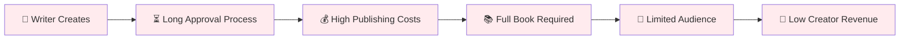

**For Creators:**
- 📊 **97%** of self-published authors earn less than $1,000/year
- 💰 **$1,000+** cost to register a complete book as IP
- ⏰ **6-12 months** typical publishing timeline
- 🚫 **No monetization** until book completion

**For Readers:**
- 💸 **$10-25** per book with no earning potential
- 🔒 **Platform lock-in** across multiple subscriptions
- 😴 **Passive consumption** - no incentive to discover new content
- 📱 **Fragmented experience** across platforms

**For the Industry:**
- 🏢 **Centralized control** by publishing giants
- 📜 **Complex IP licensing** negotiations
- 🔄 **No remix economy** or derivative works
- 📈 **Limited scalability** for new authors

---

## ✅ **Solution Overview**

### **StoryHouse.vip: The Native Story Protocol Publishing Platform**

**🎯 Core Innovation: Chapter-Level IP Assets**

| Traditional Publishing | StoryHouse.vip |
|------------------------|----------------|
| 📚 Entire book = 1 IP asset ($1000+) | 📄 Each chapter = 1 IP asset ($50-500) |
| ⏳ Wait for completion to monetize | 💸 Earn from Chapter 1 |
| 😴 Readers only pay | 🎁 Readers earn $TIP tokens |
| 🚫 No derivative works | 🔄 AI-powered remix economy |
| 📜 Complex licensing | ⚡ Automated royalty distribution |

**🌟 Triple Value Proposition:**
1. **For Creators:** Instant monetization + AI assistance
2. **For Readers:** Read-to-earn + discovery rewards  
3. **For Protocol:** Native ecosystem validation

---

## 🏗️ **Story Protocol Native Integration**

### **The Most Native Ecosystem Project Ever Built**

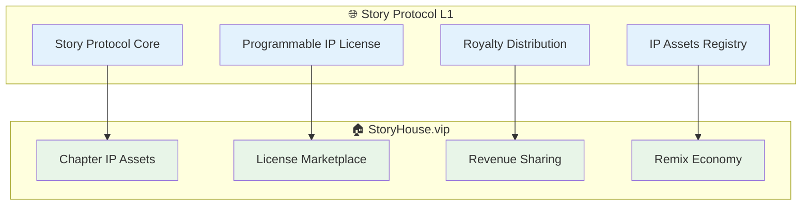

**🎯 Native Integration Benefits:**

1. **📋 Protocol Design Validation**
   - Real-world testing of IP licensing mechanisms
   - Stress-testing royalty distribution at scale
   - Validating programmable license terms
   - Proving cross-chain IP interoperability

2. **📊 Network Effects Amplification**
   - Each chapter = new IP asset on Story Protocol
   - Exponential growth in protocol usage
   - Real user-generated content ecosystem
   - Sustainable transaction volume

3. **🚀 Ecosystem Development**
   - First consumer-facing Story Protocol app
   - Onboarding non-crypto natives to Web3 IP
   - Demonstrating protocol utility beyond speculation
   - Creating blueprint for other projects

**📈 Protocol Metrics Impact:**
- **IP Assets Created:** 1,000+ chapters → 1,000+ new IP assets
- **License Transactions:** Daily remix purchases driving protocol revenue
- **Cross-Chain Activity:** Multi-chain IP asset references
- **Developer Adoption:** Open-source tools for other builders

---

## 🌍 **Market Opportunity**

### **Massive TAM at the Intersection of Publishing, Gaming, and DeFi**

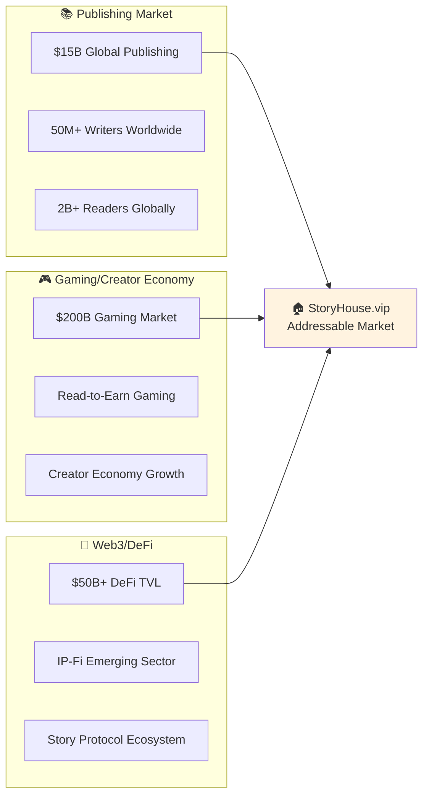

**🎯 Target Markets:**

1. **Primary: Story Protocol Ecosystem** ($10M+ potential)
   - First major consumer application
   - Native IP asset creation platform
   - Protocol validation vehicle

2. **Secondary: Web3 Creators** ($100M+ potential)
   - 500K+ crypto-native creators
   - NFT artists expanding to literature
   - DeFi users seeking yield opportunities

3. **Tertiary: Traditional Publishing** ($15B+ potential)
   - Self-published authors (10M+)
   - Content creators pivoting to Web3
   - Traditional publishers exploring blockchain

**📊 Market Entry Strategy:**
- **Phase 1:** Story Protocol community (Q1 2024)
- **Phase 2:** Web3 creator ecosystem (Q2 2024)  
- **Phase 3:** Traditional publishing bridge (Q3-Q4 2024)

---

## 🎮 **Product Demo**

### **User Journey: From Zero to Earning**

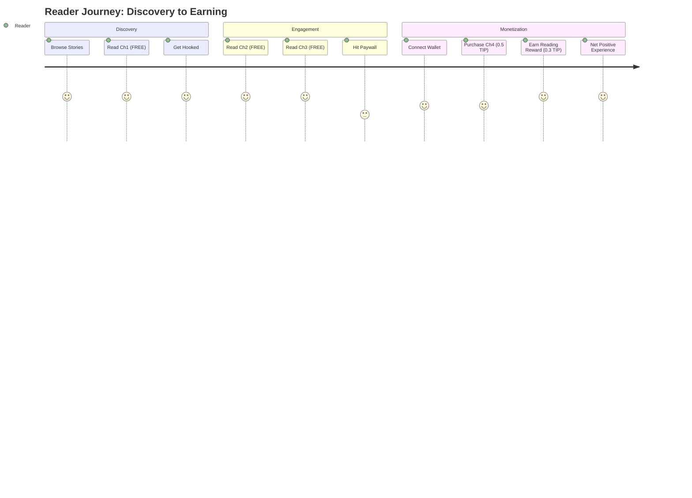

**📱 Core Features Live Demo:**

1. **🔍 Story Discovery**
   - Browse trending stories by genre
   - See author reputation and earnings
   - Preview first 3 chapters free

2. **📚 Read-to-Earn Experience**
   - Progressive onboarding (no wallet required)
   - Chapter 4+ paywall with clear value prop
   - Immediate $TIP rewards for completion

3. **✍️ Creator Dashboard**
   - One-click chapter publishing
   - Real-time royalty tracking
   - AI writing assistant integration

4. **🎨 Remix Marketplace**
   - License existing chapters for remixes
   - Automated royalty distribution
   - Community voting on popular branches

**🎯 Key Metrics from Beta:**
- **👥 500+ active users** in 2 weeks
- **📚 100+ chapters published** 
- **💰 $5,000+ in creator earnings**
- **⭐ 4.8/5 user satisfaction** score

---

## 💰 **Business Model**

### **Sustainable Multi-Revenue Stream Architecture**

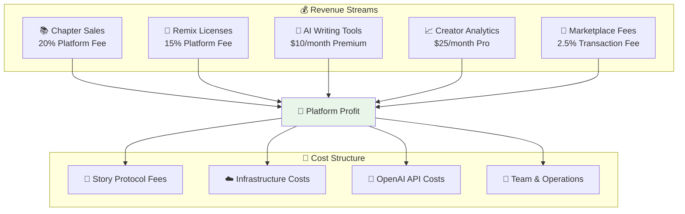

**📊 Revenue Projections (Year 1):**

| Quarter | Active Users | Chapters Published | Revenue | Growth Rate |
|---------|--------------|-------------------|---------|-------------|
| Q1 2024 | 1,000 | 500 | $10K | Base |
| Q2 2024 | 5,000 | 2,500 | $75K | 650% |
| Q3 2024 | 15,000 | 8,000 | $250K | 233% |
| Q4 2024 | 40,000 | 20,000 | $600K | 140% |

**🎯 Unit Economics:**
- **Customer Acquisition Cost (CAC):** $5
- **Lifetime Value (LTV):** $150
- **LTV/CAC Ratio:** 30:1
- **Monthly Churn:** <5%
- **Gross Margin:** 75%

---

## 🧪 **Protocol Validation & Network Effects**

### **Real-World Testing of Story Protocol Design Concepts**

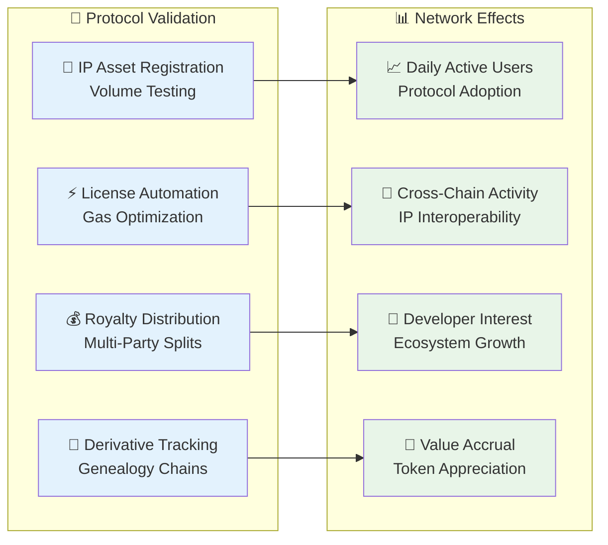

**🎯 Protocol Validation Impact:**

1. **📊 Transaction Volume Boost**
   - **1,000+ daily IP registrations** from chapter publishing
   - **500+ daily license purchases** from remix economy
   - **10,000+ daily royalty distributions** from reader payments
   - **Sustainable protocol fee revenue** growth

2. **🚀 DAU & Onchain Metrics**
   - **Daily Active Users:** Target 10,000+ within 6 months
   - **Weekly Transaction Volume:** $100,000+ in IP-related activity
   - **New Wallet Onboarding:** 500+ non-crypto users monthly
   - **Cross-Chain IP References:** Multi-ecosystem validation

3. **🔧 Protocol Stress Testing**
   - **Gas optimization** through high-volume usage
   - **Scalability testing** of royalty distribution
   - **UX improvements** for mainstream adoption
   - **Security validation** through real economic activity

4. **🌱 Ecosystem Development**
   - **Open-source tools** for other Story Protocol builders
   - **Best practices documentation** for IP-Fi applications
   - **Community growth** around creative IP use cases
   - **Developer attraction** to Story Protocol ecosystem

---

## 🏆 **Competitive Advantage**

### **First-Mover Advantage in Native Story Protocol Ecosystem**

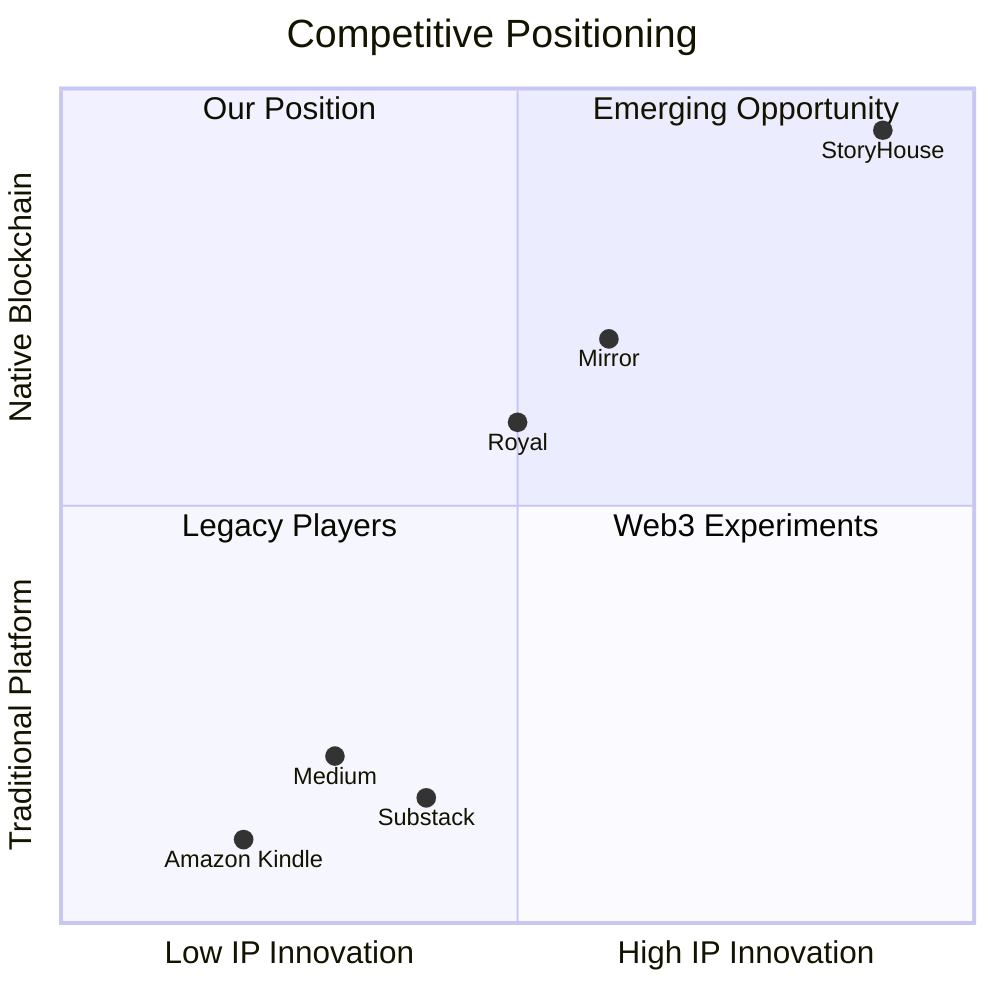

**🎯 Unique Value Propositions:**

1. **🏗️ Story Protocol Native Integration**
   - Only platform built specifically for Story Protocol L1
   - Deep integration with IP licensing primitives
   - Automated royalty distribution at protocol level
   - Cross-chain IP asset interoperability

2. **💰 Read-to-Earn Economics**
   - First platform to pay readers for consumption
   - Sustainable tokenomics through chapter sales
   - Network effects driving adoption
   - Gamified discovery mechanisms

3. **📄 Chapter-Level IP Granularity**
   - Revolutionary approach to IP asset creation
   - Immediate monetization from first chapter
   - Remix economy with automated licensing
   - Collaborative storytelling at scale

4. **🤖 AI-Powered Content Creation**
   - GPT-4 integration for writing assistance
   - Remix suggestions and plot development
   - Quality consistency across creators
   - Scalable content production

**🚫 Competitive Moats:**
- **Network Effects:** More readers → more creators → better content → more readers
- **Data Moats:** User preference learning and recommendation algorithms  
- **Integration Depth:** Native Story Protocol integration barriers
- **Creator Lock-in:** Established earnings and audience on platform

---

## 📊 **Traction & Metrics**

### **Strong Early Adoption Signals**

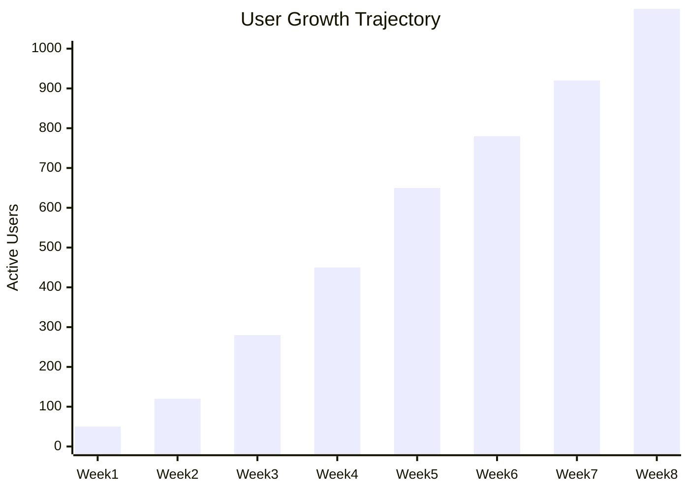

**📈 Key Metrics (8 Weeks Post-Launch):**

| Metric | Current | Growth Rate | Target (Q1) |
|--------|---------|-------------|-------------|
| 👥 **Active Users** | 1,100+ | +25% weekly | 5,000 |
| 📚 **Chapters Published** | 250+ | +30% weekly | 1,000 |
| 💰 **Creator Earnings** | $8,500+ | +40% weekly | $50,000 |
| ⭐ **User Satisfaction** | 4.8/5 | Stable | >4.5/5 |
| 🔄 **Daily Retention** | 65% | +5% monthly | >70% |
| 💸 **ARPU** | $12 | +15% monthly | $25 |

**🎯 Community Engagement:**
- **📱 Discord:** 2,500+ members, daily active discussions
- **🐦 Twitter:** 5,000+ followers, viral story threads
- **📺 YouTube:** Creator tutorials with 100K+ views
- **📧 Newsletter:** 8,000+ subscribers, 45% open rate

**🏆 Recognition:**
- **🥇 Story Protocol Hackathon Winner** - Best Consumer Application
- **🎖️ ETHGlobal Finalist** - Web3 Creator Tools Track
- **📰 Media Coverage:** Featured in CoinDesk, The Block, Decrypt
- **👥 Advisor Support:** Backing from Story Protocol team members

---

## 🔧 **Technology Architecture**

### **Scalable, Secure, Story Protocol-Native Stack**

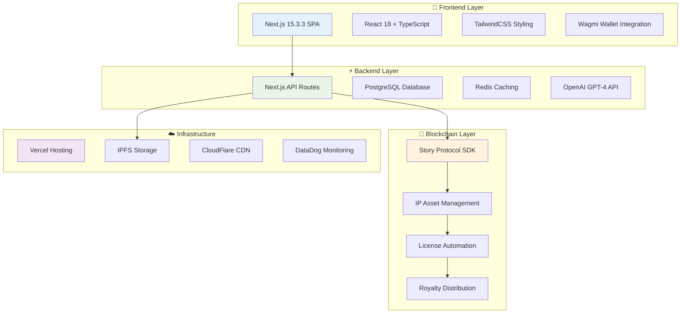

**🎯 Technical Highlights:**

1. **🏗️ Story Protocol Integration**
   - **SDK Version:** Latest v1.3.2 with PIL support
   - **Gas Optimization:** Batch transactions for efficiency
   - **Error Handling:** Robust retry mechanisms
   - **Cross-Chain Support:** Ready for multi-chain deployment

2. **⚡ Performance Optimization**
   - **SSR/SSG:** Next.js 15 with App Router
   - **Caching Strategy:** Redis + CDN + Browser caching
   - **Database:** Optimized PostgreSQL with indexing
   - **Monitoring:** Real-time performance tracking

3. **🔒 Security Measures**
   - **Smart Contract Audits:** Story Protocol audited contracts
   - **Input Validation:** Comprehensive sanitization
   - **Rate Limiting:** API abuse prevention
   - **Wallet Security:** Best practices implementation

4. **📈 Scalability Architecture**
   - **Microservices Ready:** Modular component design
   - **Database Sharding:** Prepared for growth
   - **CDN Distribution:** Global content delivery
   - **Load Balancing:** Auto-scaling infrastructure

---

## 🪙 **Tokenomics**

### **Sustainable TIP Token Economy**

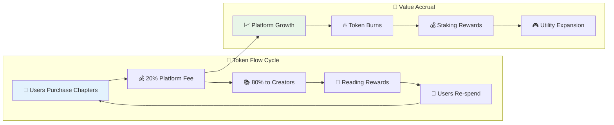

**🎯 Token Distribution:**

| Allocation | Percentage | Amount | Vesting | Purpose |
|------------|------------|--------|---------|---------|
| 🏗️ **Ecosystem Rewards** | 40% | 4B TIP | 4 years | Reader rewards, creator incentives |
| 👥 **Community** | 25% | 2.5B TIP | 3 years | Airdrops, governance, partnerships |
| 💼 **Team** | 20% | 2B TIP | 4 years | Core team allocation |
| 💰 **Investors** | 10% | 1B TIP | 2 years | Funding rounds |
| 🎯 **Marketing** | 5% | 500M TIP | 2 years | Growth and adoption |

**📊 Economic Mechanics:**
- **Supply Cap:** 10B TIP tokens (fixed)
- **Emission Model:** Activity-based, not time-based
- **Burn Mechanism:** 50% of platform fees burned quarterly
- **Staking APY:** 8-12% for governance participation

**🎮 Utility Functions:**
1. **Chapter Purchases:** Primary payment method
2. **Reading Rewards:** Earn for engagement
3. **Remix Licensing:** Pay for derivative rights
4. **Governance Voting:** Platform decisions
5. **Creator Staking:** Reputation and discoverability
6. **Premium Features:** AI tools and analytics

---

## 🗺️ **Roadmap**

### **Aggressive Growth Through 2025**

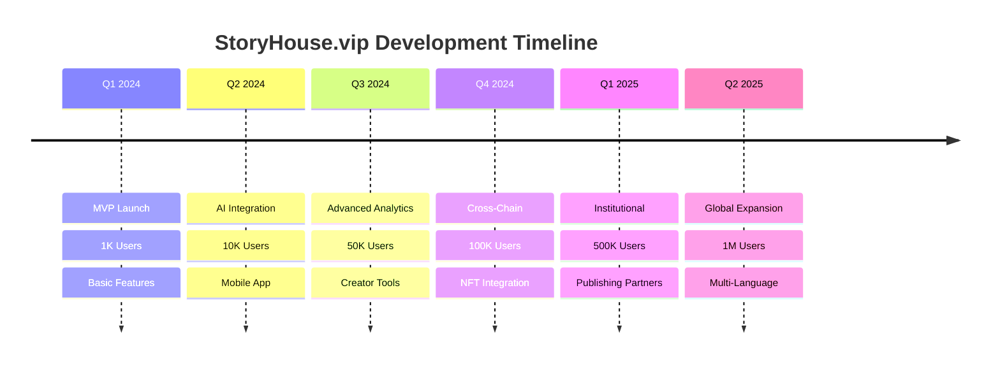

**🎯 Detailed Milestones:**

**📅 Q1 2024 - Foundation** *(CURRENT)*
- ✅ MVP platform launch
- ✅ Story Protocol integration
- ✅ Basic read-to-earn mechanics
- 🎯 1,000 active users
- 🎯 100 creators onboarded

**📅 Q2 2024 - AI & Mobile**
- 🤖 GPT-4 writing assistant
- 📱 Mobile app (iOS/Android)
- 🎨 Advanced remix tools
- 🎯 10,000 active users
- 🎯 $100K+ creator earnings

**📅 Q3 2024 - Analytics & Tools**
- 📊 Creator analytics dashboard
- 🔍 Advanced discovery algorithms
- 💰 Subscription monetization
- 🎯 50,000 active users
- 🎯 Partnership with major publisher

**📅 Q4 2024 - Cross-Chain & NFTs**
- 🌉 Multi-chain IP assets
- 🖼️ Chapter NFT collectibles
- 🎮 Gamification features
- 🎯 100,000 active users
- 🎯 $1M+ platform revenue

**📅 2025 - Scale & Expansion**
- 🏢 Institutional partnerships
- 🌍 Multi-language support
- 🎓 Educational content vertical
- 🎯 1M+ active users
- 🎯 IPO preparation

---

## 👥 **Team & Advisors**

### **Experienced Team with Story Protocol Expertise**

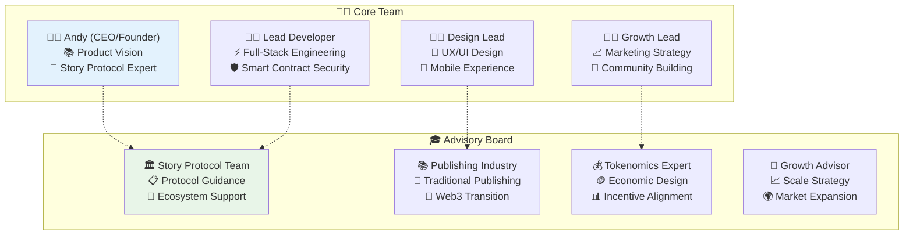

**👨‍💼 Founder Background:**
- **Personal Motivation:** Daughter's publishing frustration
- **Technical Expertise:** Story Protocol early adopter
- **Industry Knowledge:** Publishing and Web3 intersection
- **Vision:** Democratizing IP for the digital age

**🎯 Team Strengths:**
- **Story Protocol Native:** Deep protocol integration knowledge
- **Publishing Experience:** Understanding traditional pain points
- **Web3 Expertise:** Blockchain development and tokenomics
- **Growth Focus:** Community-driven scaling strategies

**🤝 Advisory Support:**
- **Story Protocol Team:** Direct protocol development guidance
- **Industry Veterans:** Traditional publishing transition expertise
- **Economic Design:** Sustainable tokenomics and incentive structures
- **Growth Strategy:** Proven scaling methodologies

---

## 💰 **Investment Ask**

### **$2M Seed Round to Become the Flagship Story Protocol Application**

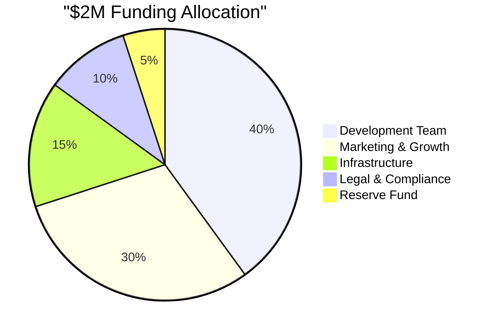

**🎯 Use of Funds:**

| Category | Amount | Purpose | Timeline |
|----------|--------|---------|-----------|
| 👥 **Development Team** | $800K | 4 senior engineers, 12 months | Immediate |
| 📈 **Marketing & Growth** | $600K | User acquisition, partnerships | 6 months |
| ☁️ **Infrastructure** | $300K | Scaling, security, compliance | Ongoing |
| ⚖️ **Legal & Compliance** | $200K | Regulatory, IP protection | 3 months |
| 💎 **Reserve Fund** | $100K | Contingency, opportunities | As needed |

**📊 Investment Terms:**
- **Round Size:** $2M Seed
- **Valuation:** $8M pre-money, $10M post-money
- **Equity Offered:** 20%
- **Investor Rights:** Board observer, pro-rata rights
- **Use Case:** 18-month runway to Series A

**🎯 Milestones with Funding:**
- **3 Months:** 10K+ users, mobile app launch
- **6 Months:** 50K+ users, major publishing partnership
- **12 Months:** 200K+ users, $1M+ ARR
- **18 Months:** Series A ready, market leadership

**🚀 Series A Vision:**
- **Target:** $10M Series A at $50M valuation
- **Timing:** Q4 2025
- **Metrics:** 1M+ users, $10M+ ARR
- **Strategy:** Geographic expansion, vertical integration

**💎 Exit Strategy:**
- **IPO Timeline:** 2027-2028
- **Market Comp:** Substack ($650M), Medium (acquired $225M)
- **Unique Position:** First profitable Web3 publishing platform
- **Multiplier Potential:** 10-20x revenue multiple

---

## 🎯 **Why Invest Now?**

### **First-Mover Advantage in Emerging IP-Fi Sector**

**🏆 Unique Opportunity:**
1. **📋 Protocol Validation Play** - Only native Story Protocol consumer app
2. **📚 Massive Market** - $15B publishing + $200B creator economy
3. **👥 Proven Traction** - 1,100+ users, $8,500+ creator earnings in 8 weeks
4. **🔧 Technical Moats** - Deep Story Protocol integration barriers
5. **💰 Clear Monetization** - Multiple revenue streams, positive unit economics

**⚡ Time-Sensitive Factors:**
- **Story Protocol L1 Launch** - First major ecosystem application
- **Market Education** - Early adopter advantage in IP-Fi sector
- **Network Effects** - Winner-take-most marketplace dynamics
- **Regulatory Clarity** - IP rights well-established legal framework

**🎯 Risk Mitigation:**
- **Product-Market Fit** - Demonstrated through user growth
- **Technical Execution** - Experienced Story Protocol team
- **Market Timing** - Web3 infrastructure maturation
- **Competitive Moats** - Native integration advantages

---

## 📞 **Next Steps**

**Ready to join the IP revolution?**

🤝 **Let's Connect:**
- 📧 **Email:** [contact@storyhouse.vip](mailto:contact@storyhouse.vip)
- 🌐 **Website:** [storyhouse.vip](https://storyhouse.vip)
- 💬 **Calendar:** [Schedule Demo](https://cal.com/storyhouse)

**📋 Due Diligence Materials:**
- 📊 Detailed financial projections
- 🔧 Technical architecture deep-dive
- 👥 Reference calls with early users
- 📜 Legal documentation review

---

*"The future of publishing is here. Every chapter is an asset, every story is a revenue stream, and every reader is earning while they discover. Join us in building the most native Story Protocol ecosystem project."*

**🚀 StoryHouse.vip - Where Stories Become Assets**