# 📊 StoryHouse Diagram Creation & Modification Guide

**Author**: Development Team
**Status**: Current
**Purpose**: Complete guide for creating and modifying StoryHouse story branching diagrams

---

## 🎯 **Overview**

StoryHouse uses **Mermaid diagrams** to visualize story branching models. This guide provides everything needed to create, modify, and maintain these diagrams using a git-style visual approach.

## 🛠️ **Technical Foundation**

### **Diagram Engine: Mermaid**

- **Syntax**: Flowchart with left-to-right layout
- **Tool**: `create_diagram` function with Mermaid content
- **Style**: Git-inspired horizontal branching model

### **Current Implementation**

```mermaid
flowchart LR
    A1["Ch1<br/>FREE 🆓"] --> A2["Ch2<br/>FREE 🆓"]
    A2 --> A3["Ch3<br/>FREE 🆓"]

    %% Andy's Main Branch (Gray)
    A3 --> A4["Ch4<br/>Andy Original<br/>💰 0.5 TIP"]
    A4 --> A5["Ch5<br/>Andy<br/>💰 0.5 TIP"]
    A5 --> A6["Ch6<br/>Andy<br/>💰 0.5 TIP"]
    A6 --> A7["Ch7<br/>Andy<br/>💰 0.5 TIP"]
    A7 --> A8["Ch8<br/>Andy<br/>💰 0.5 TIP"]
    A8 --> A9["Ch9<br/>Andy<br/>💰 0.5 TIP"]
    A9 --> A10["Ch10<br/>Andy<br/>💰 0.5 TIP"]

    %% Boris Sci-Fi Branch (Blue)
    A3 --> B4["Ch4<br/>Boris Sci-Fi<br/>💰 0.5 TIP<br/>📜 2.0 TIP license"]
    B4 --> B5["Ch5<br/>Boris<br/>💰 0.5 TIP"]
    B5 --> B6["Ch6<br/>Boris<br/>💰 0.5 TIP"]
    B6 --> B7["Ch7<br/>Boris<br/>💰 0.5 TIP"]
    B7 --> B8["Ch8<br/>Boris<br/>💰 0.5 TIP"]

    %% Cecilia Romance Branch (Green) - off Boris
    B8 --> C9["Ch9<br/>Cecilia Romance<br/>💰 0.5 TIP<br/>📜 2.0 TIP license"]

    %% Daisy Dark Branch (Orange) - off Andy
    A8 --> D9["Ch9<br/>Daisy Dark<br/>💰 0.5 TIP<br/>📜 2.0 TIP license"]

    classDef freeChapter fill:#90EE90,stroke:#006400,stroke-width:3px
    classDef andyChapter fill:#D3D3D3,stroke:#696969,stroke-width:2px
    classDef borisChapter fill:#87CEEB,stroke:#4682B4,stroke-width:2px
    classDef ceciliaChapter fill:#98FB98,stroke:#228B22,stroke-width:2px
    classDef daisyChapter fill:#FFA500,stroke:#FF8C00,stroke-width:2px

    class A1,A2,A3 freeChapter
    class A4,A5,A6,A7,A8,A9,A10 andyChapter
    class B4,B5,B6,B7,B8 borisChapter
    class C9 ceciliaChapter
    class D9 daisyChapter
```



---

## 🎨 **Design System**

### **Color Palette**

```css
/* Free Chapters */
--free-fill: #90ee90; /* Light green */
--free-stroke: #006400; /* Dark green */

/* Character Branches */
--andy-fill: #d3d3d3; /* Light gray */
--andy-stroke: #696969; /* Dim gray */

--boris-fill: #87ceeb; /* Sky blue */
--boris-stroke: #4682b4; /* Steel blue */

--cecilia-fill: #98fb98; /* Pale green */
--cecilia-stroke: #228b22; /* Forest green */

--daisy-fill: #ffa500; /* Orange */
--daisy-stroke: #ff8c00; /* Dark orange */
```

### **Icon System**

| Symbol | Meaning          | Usage                  |
| ------ | ---------------- | ---------------------- |
| 🆓     | Free chapter     | Chapters 1-3           |
| 💰     | Paid chapter     | Chapters 4+            |
| 📜     | License required | Remix chapters         |
| 🔮     | Fantasy          | Andy's original style  |
| 🚀     | Sci-Fi           | Boris' branch style    |
| 🌹     | Romance          | Cecilia's branch style |
| ⚡     | Dark/Alternative | Daisy's branch style   |

### **Node Naming Convention**

```
Format: [AuthorInitial][ChapterNumber]
Examples:
- A1 = Andy Chapter 1
- B4 = Boris Chapter 4
- C9 = Cecilia Chapter 9
- D9 = Daisy Chapter 9
```

---

## 📝 **Modification Templates**

### **Template 1: Add New Character Branch**

**Request Format:**

```
"Add new branch for [Character Name]:
- Branch Type: [Genre/Style]
- Color: [Color preference]
- Branches from: [Parent] Chapter [Number]
- Creates chapters: [Range]
- License fee: [Amount] $TIP"
```

**Implementation Pattern:**

```mermaid
%% New character branch
[ParentChapter] --> [NewChar][ChapterNum]["Ch[Num]<br/>[Character] [Style]<br/>💰 0.5 TIP<br/>📜 [License] TIP license"]

%% Add to class definitions
classDef [newChar]Chapter fill:[color],stroke:[strokeColor],stroke-width:2px
class [NewChar][ChapterNum] [newChar]Chapter
```

### **Template 2: Modify Existing Branch**

**Request Format:**

```
"Modify [Character]'s branch:
- Change color from [old] to [new]
- Add chapters [range]
- Change branching point to [new parent]"
```

### **Template 3: Add Complex Features**

**Revenue Tracking:**

```
"Add revenue indicators showing:
- Total earnings per branch
- Monthly recurring income
- License fee totals"
```

**Merge Points:**

```
"Add merge where [Character1] and [Character2]
collaborate on Chapter [Number]"
```

---

## 🔧 **Mermaid Syntax Reference**

### **Basic Structure**


### **Layout Options**

- `flowchart LR` - Left to Right (preferred)
- `flowchart TD` - Top Down
- `flowchart RL` - Right to Left
- `flowchart BT` - Bottom to Top

### **Node Shapes**

```mermaid
A["Rectangle"]
B("Round edges")
C{"Diamond"}
D[/"Trapezoid"/]
E(("Circle"))
F>"Flag"]
```

### **Connection Types**

```mermaid
A --> B    %% Arrow
A --- B    %% Line
A -.-> B   %% Dotted arrow
A ==> B    %% Thick arrow
```

---

## 🎯 **Quick Reference Examples**

### **Example 1: Simple Addition**

**Request:** _"Add Elena's mystery branch from Andy Chapter 5, purple color"_

**Implementation:**

```mermaid
A5 --> E6["Ch6<br/>Elena Mystery<br/>💰 0.5 TIP<br/>📜 2.0 TIP license"]

classDef elenaChapter fill:#DDA0DD,stroke:#8B008B,stroke-width:2px
class E6 elenaChapter
```

### **Example 2: Color Change**

**Request:** _"Change Boris from blue to red"_

**Implementation:**

```mermaid
classDef borisChapter fill:#FF6B6B,stroke:#DC143C,stroke-width:2px
```

### **Example 3: Merge Scenario**

**Request:** _"Show Cecilia and Daisy collaborating on Chapter 10"_

**Implementation:**

```mermaid
C9 --> CD10["Ch10<br/>Cecilia+Daisy<br/>Collaboration<br/>💰 0.5 TIP"]
D9 --> CD10
```

---

## 📋 **Modification Checklist**

### **Before Making Changes:**

- [ ] Identify which characters/branches are affected
- [ ] Determine if new colors are needed
- [ ] Check if branching logic still makes sense
- [ ] Verify licensing fees flow correctly

### **During Implementation:**

- [ ] Update node definitions
- [ ] Add/modify connections
- [ ] Update class definitions
- [ ] Apply new styles

### **After Changes:**

- [ ] Test diagram renders correctly
- [ ] Verify all branches are visible
- [ ] Check color contrast and readability
- [ ] Update related documentation

---

## 🚀 **Advanced Features**

### **Interactive Elements** (Future)

```mermaid
%% Click events (not currently implemented)
A1 --> A2
click A1 "javascript:showChapterDetails(1)"
```

### **Subgraphs** (Complex scenarios)

```mermaid
subgraph "Original Story"
    A1 --> A2 --> A3
end

subgraph "Boris Branch"
    B4 --> B5 --> B6
end
```

### **Multiple License Types**

```mermaid
B4["Ch4<br/>Boris Sci-Fi<br/>💰 0.5 TIP<br/>📜 Standard: 2.0 TIP<br/>👑 Premium: 5.0 TIP"]
```

---

## 📚 **Documentation Links**

- **Quick Reference**: `docs/reference/DIAGRAM_QUICK_REFERENCE.md`
- **Main Design Doc**: `docs/product/DESIGN.md`
- **User Scenarios**: `docs/product/USER_SCENARIO_BRANCHING_MODEL.md`
- **Technical Overview**: `docs/technical/OVERVIEW.md`
- **Mermaid Documentation**: https://mermaid.js.org/

---

## 🔄 **Version History**

| Version | Date         | Changes                           |
| ------- | ------------ | --------------------------------- |
| 1.0     | Latest       | Initial git-style branching model |
| 1.1     | TBD          | Color scheme refinements          |
| 2.0     | TBD          | Interactive features              |

---

## 💡 **Best Practices**

1. **Consistency**: Always use the same naming convention
2. **Clarity**: Keep node text concise but informative
3. **Colors**: Maintain color associations for characters
4. **Flow**: Preserve left-to-right reading flow
5. **Testing**: Always verify diagram renders before committing

---

**Need to modify a diagram?** Use this template:

```
"Update the StoryHouse branching diagram:

[Describe specific changes here]

Keep the same git-style horizontal flow and color coding."
```
