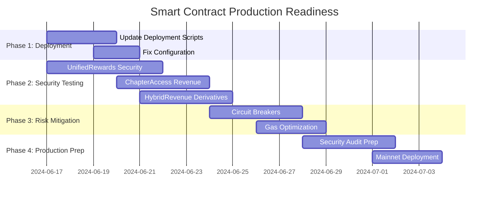

# 🚨 Smart Contracts Production Readiness Plan

**Objective**: Address critical deployment and testing gaps to achieve production-ready smart contract architecture

**Timeline**: 2-3 weeks for complete implementation  
**Status**: In Progress  
**Priority**: Critical (Security & Architecture)

---

## 📋 **Critical Issues Analysis**

### 🔴 **Issue 1: Deployment Architecture Mismatch**
**Problem**: Deployment scripts reference obsolete 6-contract architecture, current implementation has 5 contracts
**Impact**: Cannot deploy current contracts to production
**Risk Level**: HIGH (Blocks production deployment)

### 🔴 **Issue 2: Test Coverage Security Gaps** 
**Problem**: Missing critical security tests for edge cases, reentrancy, and failure scenarios
**Impact**: Unknown vulnerabilities in production
**Risk Level**: CRITICAL (Security vulnerabilities)

### 🔴 **Issue 3: UnifiedRewardsController Complexity Risk**
**Problem**: Single 20.4KB contract handling all reward logic creates single point of failure
**Impact**: Complex upgrades, debugging challenges, gas optimization issues
**Risk Level**: MEDIUM-HIGH (Operational complexity)

---

## 🎯 **Implementation Plan**

## **PHASE 1: Critical Deployment Infrastructure (Week 1)**

### **Task 1.1: Update Deployment Scripts**
**Timeline**: 2-3 days  
**Assignee**: Smart Contract Team  
**Priority**: 🚨 CRITICAL

#### **Subtasks:**
1. **Create New 5-Contract Deployment Script**
   ```bash
   # File: packages/contracts/script/Deploy5ContractArchitecture.s.sol
   
   Contracts to Deploy:
   ├── TIPToken.sol (3.7KB)
   ├── RewardsManager.sol (7.5KB) 
   ├── UnifiedRewardsController.sol (20.4KB)
   ├── ChapterAccessController.sol (15.3KB)
   └── HybridRevenueController.sol (16.0KB)
   
   Dependencies:
   ├── TIPToken → RewardsManager (minter role)
   ├── RewardsManager → All Controllers (controller registration)
   ├── UnifiedRewardsController → RewardsManager, TIPToken
   ├── ChapterAccessController → RewardsManager, TIPToken
   └── HybridRevenueController → RewardsManager, TIPToken
   ```

2. **Update Deployment Configuration**
   ```json
   // File: packages/contracts/deployments.json
   {
     "aeneid-testnet": {
       "contracts": {
         "TIPToken": "0xe5Cd6E2392eB0854F207Ad474ee9FB98d80C934E",
         "RewardsManager": "0xf5ae031ba92295c2ae86a99e88f09989339707e5",
         "UnifiedRewardsController": "TBD",
         "ChapterAccessController": "TBD", 
         "HybridRevenueController": "TBD"
       },
       "deploymentBlock": "TBD",
       "networkId": 1315
     }
   }
   ```

3. **Create Deployment Verification Script**
   ```bash
   # File: packages/contracts/script/VerifyDeployment.s.sol
   
   Verification Steps:
   ├── Contract bytecode verification
   ├── Role and permission setup validation
   ├── Integration testing between contracts
   ├── Gas cost analysis and optimization
   └── Security parameter validation
   ```

#### **Implementation Details:**
```solidity
// Deploy5ContractArchitecture.s.sol Structure

contract Deploy5ContractArchitecture is Script {
    struct DeploymentRegistry {
        address tipToken;
        address rewardsManager;
        address unifiedRewardsController;
        address chapterAccessController;
        address hybridRevenueController;
        address deployer;
        uint256 deploymentBlock;
        string network;
    }

    function run() external {
        // 1. Deploy TIPToken (or use existing)
        // 2. Deploy RewardsManager
        // 3. Deploy UnifiedRewardsController
        // 4. Deploy ChapterAccessController  
        // 5. Deploy HybridRevenueController
        // 6. Setup roles and permissions
        // 7. Verify all integrations
    }
}
```

#### **Acceptance Criteria:**
- ✅ Deployment script successfully deploys all 5 contracts
- ✅ All role assignments and permissions configured correctly
- ✅ Integration tests pass between all contracts
- ✅ Gas costs optimized and documented
- ✅ Deployment can be run idempotently (multiple times safely)

---

### **Task 1.2: Fix Deployment Configuration**
**Timeline**: 1-2 days  
**Priority**: 🚨 CRITICAL

#### **Subtasks:**
1. **Update forge remappings** for new architecture
2. **Update package.json scripts** for deployment commands
3. **Create environment variable templates** for different networks
4. **Update README with new deployment instructions**

#### **Files to Update:**
```bash
packages/contracts/
├── foundry.toml           # Update remappings
├── .env.example          # Add new contract addresses
├── package.json          # Update deployment scripts
├── README.md             # New deployment instructions
└── deployments/          # Network-specific configurations
    ├── aeneid-testnet.json
    ├── story-mainnet.json
    └── local.json
```

---

## **PHASE 2: Critical Security Testing (Week 1-2)**

### **Task 2.1: Complete UnifiedRewardsController Security Tests**
**Timeline**: 4-5 days  
**Priority**: 🚨 CRITICAL

#### **Missing Security Tests:**

1. **Reentrancy Attack Tests**
   ```solidity
   // File: packages/contracts/test/security/ReentrancyAttacks.t.sol
   
   contract MaliciousReentrancyContract {
       // Attempts to re-enter reward claiming functions
       // Tests protection against recursive calls
   }
   
   Tests:
   ├── claimChapterReward reentrancy
   ├── purchaseRemixLicense reentrancy  
   ├── claimStoryCreationReward reentrancy
   └── distributeEngagementReward reentrancy
   ```

2. **Daily Limits & Anti-Gaming Tests**
   ```solidity
   // File: packages/contracts/test/security/AntiGaming.t.sol
   
   Tests:
   ├── Daily chapter reading limits (maxDailyChapters = 20)
   ├── Reading time validation (minimum 60 seconds)
   ├── Quality score gaming prevention
   ├── Streak manipulation prevention
   └── Multiple account gaming detection
   ```

3. **Token Transfer Failure Handling**
   ```solidity
   // File: packages/contracts/test/security/TokenFailures.t.sol
   
   Tests:
   ├── TIP token transfer failures during rewards
   ├── Insufficient balance scenarios
   ├── Paused token scenarios
   ├── Reverted transfer scenarios
   └── Emergency withdrawal mechanisms
   ```

4. **Edge Case Boundary Testing**
   ```solidity
   // File: packages/contracts/test/security/EdgeCases.t.sol
   
   Tests:
   ├── Quality scores >100 validation
   ├── Reading streak integer overflow
   ├── Reward calculation overflow
   ├── Zero address validations
   └── Empty string parameter handling
   ```

#### **Implementation Approach:**
```solidity
// Example: Reentrancy Attack Test
contract ReentrancyAttackTest is Test {
    function testClaimChapterRewardReentrancy() public {
        MaliciousContract attacker = new MaliciousContract();
        
        // Setup attacker as a legitimate user
        setupAttacker(attacker);
        
        // Attempt reentrancy attack
        vm.expectRevert("ReentrancyGuard: reentrant call");
        attacker.attemptReentrancy();
    }
}
```

---

### **Task 2.2: Complete ChapterAccessController Revenue Tests**
**Timeline**: 3-4 days  
**Priority**: 🔴 HIGH

#### **Missing Revenue Function Tests:**

1. **Platform Earnings Tests**
   ```solidity
   // File: packages/contracts/test/revenue/PlatformEarnings.t.sol
   
   Tests:
   ├── Platform earnings accumulation from chapter unlocks
   ├── withdrawPlatformEarnings function security
   ├── Revenue share percentage updates
   ├── Multi-author revenue distribution
   └── Platform fee calculation accuracy
   ```

2. **Revenue Distribution Edge Cases**
   ```solidity
   // File: packages/contracts/test/revenue/RevenueEdgeCases.t.sol
   
   Tests:
   ├── Zero revenue distribution scenarios
   ├── Single wei revenue distribution
   ├── Maximum revenue distribution limits
   ├── Revenue distribution with paused contracts
   └── Revenue distribution to zero address prevention
   ```

3. **Access Control Revenue Tests**
   ```solidity
   // File: packages/contracts/test/revenue/RevenueAccessControl.t.sol
   
   Tests:
   ├── Only admin can withdraw platform earnings
   ├── Only admin can update revenue share
   ├── Revenue share cannot exceed 100%
   ├── Multiple admin revenue operations
   └── Admin role transfer during revenue operations
   ```

---

### **Task 2.3: Complete HybridRevenueController Derivative Tests**
**Timeline**: 3-4 days  
**Priority**: 🔴 HIGH

#### **Missing Derivative Scenario Tests:**

1. **Multi-Level Derivative Tests**
   ```solidity
   // File: packages/contracts/test/derivatives/MultiLevel.t.sol
   
   Tests:
   ├── Derivative of derivative (3+ levels deep)
   ├── Revenue distribution through derivative chain
   ├── License inheritance through multiple levels  
   ├── Circular dependency prevention
   └── Maximum derivative depth limits
   ```

2. **Complex Revenue Sharing Tests**
   ```solidity
   // File: packages/contracts/test/derivatives/ComplexRevenue.t.sol
   
   Tests:
   ├── Custom revenue sharing per book/chapter
   ├── RevenueShare struct usage validation
   ├── Cross-referencing between multiple parent books
   ├── Dynamic revenue share updates
   └── Revenue share conflict resolution
   ```

3. **Event Emission Tests**
   ```solidity
   // File: packages/contracts/test/derivatives/Events.t.sol
   
   Tests:
   ├── BookRegistered event emission
   ├── ChapterAttributed event emission
   ├── RevenueDistributed event emission
   ├── DerivativeLinked event emission
   └── Event parameter accuracy validation
   ```

---

## **PHASE 3: Architecture Risk Mitigation (Week 2-3)**

### **Task 3.1: UnifiedRewardsController Complexity Mitigation**
**Timeline**: 5-6 days  
**Priority**: 🟡 MEDIUM-HIGH

#### **Risk Mitigation Strategies:**

1. **Circuit Breaker Implementation**
   ```solidity
   // File: packages/contracts/src/UnifiedRewardsController.sol
   
   Features:
   ├── Emergency pause for individual reward types
   ├── Daily/weekly reward caps
   ├── Automatic circuit breaker triggers
   ├── Admin override capabilities
   └── Gradual resume mechanisms
   ```

2. **Function-Level Access Control**
   ```solidity
   // Enhanced access control for critical functions
   
   Roles:
   ├── REWARD_ADMIN_ROLE (reward configuration)
   ├── EMERGENCY_ROLE (emergency stops)
   ├── QUALITY_ASSESSOR_ROLE (quality scoring)
   ├── LICENSE_ADMIN_ROLE (license management)
   └── CIRCUIT_BREAKER_ROLE (system safeguards)
   ```

3. **Comprehensive Monitoring Events**
   ```solidity
   // Enhanced event system for monitoring
   
   Events:
   ├── RewardCapReached(user, rewardType, amount)
   ├── SuspiciousActivity(user, action, details)
   ├── CircuitBreakerTriggered(component, reason)
   ├── LargeRewardDistribution(amount, recipient)
   └── SystemHealthCheck(component, status)
   ```

#### **Alternative Architecture Analysis:**
```markdown
Option 1: Keep Unified (Current) - Recommended
+ Single contract reduces gas costs
+ Simplified state management
- Complex debugging and upgrades
- Single point of failure

Option 2: Split into Microservices
+ Better separation of concerns
+ Easier testing and debugging
+ Independent upgrade paths
- Higher gas costs (cross-contract calls)
- More complex state synchronization
```

---

### **Task 3.2: Gas Optimization Analysis**
**Timeline**: 2-3 days  
**Priority**: 🟡 MEDIUM

#### **Optimization Areas:**

1. **Batch Operations Optimization**
   ```solidity
   // Optimize existing batch functions
   
   Functions:
   ├── batchUnlockChapters optimization
   ├── batchDistributeRewards optimization  
   ├── batchRegisterStories optimization
   └── Gas cost benchmarking
   ```

2. **Storage Pattern Optimization**
   ```solidity
   // Optimize storage layout and access patterns
   
   Optimizations:
   ├── Struct packing for gas efficiency
   ├── Mapping vs array trade-offs
   ├── Storage vs memory usage
   └── Cold vs warm storage access
   ```

3. **Gas Profiling & Benchmarking**
   ```bash
   # Create gas profiling suite
   
   forge snapshot
   forge test --gas-report
   
   Benchmarks:
   ├── Individual function gas costs
   ├── Batch vs individual operation costs
   ├── Gas cost regression testing
   └── Optimization impact measurement
   ```

---

## **PHASE 4: Production Deployment Preparation (Week 3)**

### **Task 4.1: Security Audit Preparation**
**Timeline**: 3-4 days  
**Priority**: 🔴 HIGH

#### **Audit Preparation Checklist:**

1. **Code Documentation**
   ```markdown
   ├── NatSpec documentation for all public functions
   ├── Architecture decision records (ADRs)
   ├── Security assumption documentation
   ├── Known limitations and risks
   └── Deployment and upgrade procedures
   ```

2. **Test Coverage Report**
   ```bash
   # Generate comprehensive coverage report
   
   forge coverage --report lcov
   
   Target Coverage:
   ├── Line Coverage: >95%
   ├── Branch Coverage: >90%
   ├── Function Coverage: 100%
   └── Integration Coverage: >85%
   ```

3. **Security Testing Documentation**
   ```markdown
   ├── Reentrancy attack tests
   ├── Integer overflow/underflow tests
   ├── Access control tests
   ├── Input validation tests
   └── Economic attack vector tests
   ```

---

### **Task 4.2: Mainnet Deployment Strategy**
**Timeline**: 2-3 days  
**Priority**: 🔴 HIGH

#### **Deployment Strategy:**

1. **Testnet Final Validation**
   ```bash
   # Final testnet deployment and testing
   
   Steps:
   ├── Clean testnet deployment
   ├── End-to-end integration testing
   ├── Performance benchmarking
   ├── Security testing validation
   └── User acceptance testing
   ```

2. **Mainnet Deployment Plan**
   ```markdown
   Phase 1: Core Infrastructure
   ├── Deploy TIPToken
   ├── Deploy RewardsManager
   └── Verify basic functionality
   
   Phase 2: Reward Systems
   ├── Deploy UnifiedRewardsController
   ├── Configure reward parameters
   └── Test reward distribution
   
   Phase 3: Access & Revenue
   ├── Deploy ChapterAccessController
   ├── Deploy HybridRevenueController
   └── Configure revenue sharing
   
   Phase 4: Integration Testing
   ├── End-to-end testing
   ├── Performance validation
   └── Go-live
   ```

3. **Monitoring & Alerting Setup**
   ```markdown
   ├── Contract event monitoring
   ├── Gas cost tracking
   ├── Transaction failure alerting
   ├── Unusual activity detection
   └── Performance metrics dashboard
   ```

---

## 📊 **Success Metrics & Acceptance Criteria**

### **Phase 1 Success Criteria:**
- ✅ New 5-contract deployment script successfully deploys all contracts
- ✅ All role assignments and permissions configured correctly
- ✅ Deployment configuration updated and verified
- ✅ Integration tests pass between all contracts

### **Phase 2 Success Criteria:**
- ✅ 100% test coverage for all security-critical functions
- ✅ All reentrancy attack vectors tested and protected
- ✅ Revenue distribution edge cases covered
- ✅ Daily limits and anti-gaming mechanisms tested

### **Phase 3 Success Criteria:**
- ✅ Circuit breaker mechanisms implemented and tested
- ✅ Gas optimization analysis completed
- ✅ Monitoring and alerting systems implemented
- ✅ Architecture risk mitigation strategies deployed

### **Phase 4 Success Criteria:**
- ✅ Security audit preparation completed
- ✅ Comprehensive test coverage achieved (>95%)
- ✅ Mainnet deployment strategy documented
- ✅ Production monitoring systems operational

---

## 🚀 **Implementation Timeline**



---

## 🎯 **Resource Requirements**

### **Development Team:**
- **Smart Contract Developer**: Full-time (3 weeks)
- **Security Specialist**: Part-time (1 week)
- **DevOps Engineer**: Part-time (0.5 weeks)

### **Tools & Infrastructure:**
- **Foundry Framework**: Testing and deployment
- **Slither**: Static analysis for security
- **Mythril**: Security analysis tool
- **Gas Profiler**: Gas optimization analysis

### **Estimated Effort:**
- **Total Development Time**: 15-20 developer days
- **Testing Time**: 10-12 developer days
- **Documentation Time**: 5-7 developer days
- **Total**: 30-39 developer days (3-4 weeks with 1 developer)

---

## 🔄 **Risk Mitigation**

### **High-Risk Scenarios:**
1. **Security vulnerabilities discovered during testing**
   - **Mitigation**: Allocate extra time for fixes, engage security expert
   
2. **Gas optimization reveals architectural issues**
   - **Mitigation**: Have fallback plan for contract splitting if needed
   
3. **Deployment script failures on mainnet**
   - **Mitigation**: Extensive testnet validation, dry-run deployments

4. **Integration failures between contracts**
   - **Mitigation**: Comprehensive integration test suite, staged deployment

### **Contingency Plans:**
- **Plan A**: Complete as specified (preferred)
- **Plan B**: Deploy with reduced feature set, iterate
- **Plan C**: Extend timeline for critical security fixes

---

## 📋 **Next Steps**

### **Immediate Actions (This Week):**
1. **Start Phase 1**: Update deployment scripts for 5-contract architecture
2. **Begin Security Testing**: Start with UnifiedRewardsController reentrancy tests
3. **Resource Allocation**: Assign dedicated developer to smart contract work

### **Week 2 Actions:**
1. **Complete Security Testing**: All missing test scenarios
2. **Begin Risk Mitigation**: Circuit breaker implementation
3. **Documentation**: Start security audit preparation

### **Week 3 Actions:**
1. **Final Testing**: End-to-end integration testing
2. **Production Preparation**: Mainnet deployment scripts
3. **Go/No-Go Decision**: Final production readiness assessment

---

**This plan provides a comprehensive roadmap to address all critical issues and achieve production-ready smart contract architecture within 2-3 weeks.**