# Collaborative Storytelling System

## Overview & Vision

StoryHouse.vip implements a revolutionary collaborative storytelling platform using Story Protocol's IP licensing system. Writers can create branching narratives where any reader can purchase remix licenses to continue or diverge from existing stories, creating an infinite multiverse of interconnected tales.

### Core Innovation
- **Chapter-level IP Assets**: Each chapter is a separate IP asset with its own licensing terms
- **Branching Narratives**: Readers can branch from any chapter to create alternate storylines
- **Automatic Royalties**: Parent chapters earn royalties from derivative works through blockchain-native distribution
- **Community-Driven Stories**: Stories evolve through community participation rather than single authorship

## Reading vs Remix Licenses

### Reading Licenses
**Purpose**: Personal consumption access to paid chapters
- **Transferable**: `false` (locked to wallet)
- **Commercial Use**: `false` (personal reading only)
- **Derivatives Allowed**: `false` (cannot create derivative works)
- **Price**: 0.5 TIP tokens for chapters 4+
- **Chapters 1-3**: FREE (no license required)

### Remix Licenses  
**Purpose**: Permission to create derivative chapters based on existing content
- **Transferable**: `true` (can be sold/traded)
- **Commercial Use**: `true` (can monetize derivative works)
- **Derivatives Allowed**: `true` (full creative rights)
- **Price**: Set by original author (suggested: 10+ TIP tokens)
- **Author Control**: Each author decides if their chapters allow remixes

## Chapter Branching Rules

### Eligibility Requirements
To purchase a remix license for Chapter N, the user must:
1. **Target chapter allows remixes** (author setting)
2. **Write the next sequential chapter** (N+1) in the story

### Branching Logic
To purchase a remix license for a chapter, the user must:
- **Target chapter allows remixes** (author setting)
- **Write the next sequential chapter** (N+1) in the story
- **No reading prerequisites required** - writers can jump in at any chapter

## Story Genealogy System

### IP Asset Hierarchy
Each chapter is registered as a Story Protocol IP Asset with genealogy tracking:

Each chapter contains:
- **Basic Info:** Title, content, author, chapter number
- **Story Protocol Integration:** IP Asset ID, parent relationships, license terms
- **Genealogy Tracking:** Story root, parent chapter, branches, generation level
- **Access Control:** Reading price (0.5 TIP for ch4+), remix price (author-set), remix permissions

## UI/UX Flows

```mermaid
flowchart LR
    A["📚 Story Discovery"] --> B{"💰 Chapter Free?"}
    B -->|"✅ Yes"| C["📖 Read Chapter"]
    B -->|"❌ No"| D["💳 Purchase Reading License<br/>💰 0.5 TIP"]
    D --> C
    C --> E{"✍️ Want to Continue Story?"}
    E -->|"✅ Yes"| F["🎨 Purchase Remix License<br/>💰 10+ TIP"]
    E -->|"❌ No"| G["🔄 Browse Other Stories"]
    F --> H["📝 Write Next Chapter"]
    H --> I["🚀 Publish Chapter"]
    I --> J["💵 Earn Royalties"]
    
    style A fill:#e1f5fe
    style C fill:#e8f5e8
    style F fill:#fff3e0
    style J fill:#f3e5f5
```

### Reader Experience

#### 1. Browsing and Reading
**Story Discovery Interface:**
- **"The Magic Kingdom" by Andy** ⭐⭐⭐⭐⭐ (4.8/5) • 12 branches 
- **Chapter 1:** "The Beginning" (FREE) - [📖 Read] [🎨 Write Ch2: 10 TIP]
- **Chapter 2:** "The Journey" (FREE) - [📖 Read] [🎨 Write Ch3: 15 TIP]
- **Chapter 3:** "The Discovery" (FREE) - [📖 Read] [🎨 Write Ch4: 20 TIP]
- **Chapter 4:** "The Revelation" - [💰 Read: 0.5 TIP] [🎨 Write Ch5: 25 TIP]

**Key Feature:** No reading prerequisites required for remix licenses! Writers can jump in at any chapter that interests them.

#### 2. Story Tree Navigation
**Branch Explorer:**
- **Current Path:** Andy → Andy → Andy → Andy
- **Alternative Paths:**
  - Andy → Bob → Bob → Cecilia (4.9⭐)
  - Andy → Andy → Daisy → Bob (4.7⭐)
  - Andy → Andy → Andy → Cecilia (4.2⭐)
- **Actions:** [Switch Path] [Compare Endings]

### Writer Experience

#### 1. Remix License Purchase
**Continue "The Magic Kingdom"**
- **Write your Chapter 4:** Continue from Andy's Chapter 3
- **Remix License:** 20 TIP
- **Revenue Split:** You earn 85%, Andy earns 10% (parent royalty)
- **Your Chapter Settings:**
  - ☑️ Allow others to remix my chapter
  - 📝 Remix price: 25 TIP
- **Action:** [💰 Purchase Remix License]

**Note:** No need to read previous chapters first! Jump right into writing your continuation.

#### 2. Chapter Publishing
**Publish Chapter 4: "The New Path"**
- **Parent:** Chapter 3 "The Discovery" (Andy)
- **Word Count:** 2,847
- **Estimated Reading Time:** 12 minutes
- **Monetization Settings:**
  - Reading Price: 0.5 TIP (standard)
  - Allow Remixes: ✅ Yes
  - Remix License Price: 25 TIP
- **IP Registration:**
  - ☑️ Register as IP Asset
  - ☑️ Attach to parent chapter
  - ☑️ Set up royalty distribution
- **Action:** [🚀 Publish Chapter]

## Royalty Distribution

```mermaid
flowchart LR
    A["💰 Reader Pays 0.5 TIP"] --> B{"🌳 Generation Level"}
    
    B -->|"1️⃣ Single Gen"| C["📊 Revenue Split<br/>👤 Author: 85% (0.425 TIP)<br/>👨‍👩‍👧 Parent: 10% (0.05 TIP)<br/>🏢 Platform: 5% (0.025 TIP)"]
    
    B -->|"2️⃣+ Multi Gen"| D["📊 Revenue Split<br/>👤 Author: 70% (0.35 TIP)<br/>👨‍👩‍👧 Parent: 15% (0.075 TIP)<br/>👴 Grandparent: 10% (0.05 TIP)<br/>👵 Great-GP: 3% (0.015 TIP)<br/>🏢 Platform: 2% (0.01 TIP)"]
    
    C --> E["⚡ Automatic Distribution"]
    D --> E
    E --> F["💸 Royalties Sent to Wallets"]
    
    style A fill:#e3f2fd
    style C fill:#e8f5e8
    style D fill:#fff3e0
    style F fill:#f3e5f5
```

### Revenue Sharing Model
When readers purchase access to derivative chapters, revenue flows up the genealogy chain:

#### Single Generation (Direct Derivative)
**Bob's Chapter 2** (derived from Andy's Chapter 1)
When a reader pays 0.5 TIP for access:
- **Bob (Author):** 85% = 0.425 TIP
- **Andy (Parent):** 10% = 0.05 TIP  
- **Platform:** 5% = 0.025 TIP

#### Multi-Generation (Deep Derivative)
**Daisy's Chapter 4** (derived from Cecilia's Chapter 3 → Andy's Chapter 2 → Andy's Chapter 1)
When a reader pays 0.5 TIP for access:
- **Daisy (Author):** 70% = 0.35 TIP
- **Cecilia (Parent Ch3):** 15% = 0.075 TIP
- **Andy (Grandparent Ch2):** 10% = 0.05 TIP
- **Andy (Great-grandparent Ch1):** 3% = 0.015 TIP
- **Platform:** 2% = 0.01 TIP

#### Remix License Sales
**When someone buys remix license for Bob's Chapter 2 (25 TIP):**
- **Bob (Chapter Author):** 80% = 20 TIP
- **Andy (Parent):** 15% = 3.75 TIP
- **Platform:** 5% = 1.25 TIP

### Royalty Decay Model
- **Direct derivative**: Parent gets 10-15%
- **Second generation**: Grandparent gets 5-10%  
- **Third generation**: Great-grandparent gets 3-5%
- **Fourth+ generations**: Minimal percentage (1-2%)
- **Maximum ancestors**: Limit to 5 generations to prevent micro-payments

## Technical Implementation

```mermaid
flowchart TD
    subgraph "📝 Writing Phase"
        W1["👤 Writer Purchases<br/>🎨 Remix License"] --> P1["🔗 Platform Validates<br/>💰 Payment"]
        P1 --> SP1["📜 Story Protocol<br/>🏷️ Mints License Token"]
        SP1 --> B1["⛓️ Blockchain Records<br/>🎫 License Ownership"]
    end
    
    subgraph "🚀 Publishing Phase"
        W2["✍️ Writer Submits<br/>📄 Chapter Content"] --> P2["🔍 Platform Processes<br/>📋 Metadata"]
        P2 --> SP2["🆔 Story Protocol<br/>📝 Registers IP Asset"]
        SP2 --> B2["⛓️ Blockchain Creates<br/>🏆 IP Asset NFT"]
        B2 --> SP3["🔗 Link Parent<br/>👨‍👩‍👧 Relationship"]
    end
    
    subgraph "💰 Revenue Phase"
        R1["👥 Reader Purchases<br/>📖 Chapter Access"] --> P3["✅ Platform Validates<br/>🎫 License Ownership"]
        P3 --> SP4["💸 Story Protocol<br/>📊 Distributes Royalties"]
        SP4 --> B3["⚡ Blockchain Sends<br/>💵 Payments to Wallets"]
    end
    
    B1 --> W2
    SP3 --> R1
    
    style W1 fill:#e3f2fd
    style W2 fill:#e8f5e8
    style R1 fill:#fff3e0
    style B3 fill:#f3e5f5
```

### Story Protocol Integration

#### 1. License Terms Configuration
**Reading License (Premium tier customized):**
- **Transferable:** No (locked to wallet)
- **Commercial Use:** No (personal reading only)
- **Derivatives Allowed:** No (cannot create derivatives)
- **Price:** 0.5 TIP tokens
- **Expiration:** Never expires
- **Currency:** TIP tokens

**Remix License (Premium tier standard):**
- **Transferable:** Yes (can be sold/traded)
- **Commercial Use:** Yes (full commercial rights)
- **Derivatives Allowed:** Yes (can create derivatives)
- **Price:** Author-set (suggested 10+ TIP)
- **Expiration:** Never expires
- **Currency:** TIP tokens

#### 2. IP Asset Registration Process
**Chapter Registration Steps:**
1. **Upload content to IPFS** - Store chapter content and metadata
2. **Register IP Asset** - Create unique IP identifier through Story Protocol
3. **Attach license terms** - Link reading and remix license configurations
4. **Register derivative relationship** - Connect to parent chapter (if applicable)
5. **Return IP Asset ID** - Unique identifier for blockchain tracking

#### 3. License Token Minting
**Reading License Minting:**
- Creates personal access token for chapter reading
- No ancestor royalties (direct payment to author)
- Non-transferable license locked to user's wallet

**Remix License Minting:**
- Creates transferable license for derivative creation
- Includes ancestor royalty chain calculations
- Enables commercial rights and further derivatives

### Database Schema

#### Chapter Genealogy Table
**Database Structure for Chapter Relationships:**
- **Primary Key:** UUID identifier
- **Chapter ID:** IP Asset ID (66 characters)
- **Parent Chapter ID:** Parent IP Asset ID (optional)
- **Story Root ID:** Original story IP Asset ID
- **Generation Level:** Depth in story tree (0 = root)
- **Branch Path:** Array of ancestor IDs
- **Created At:** Timestamp
- **Indexes:** Story root, parent chapter, generation level for fast queries

#### License Ownership Tracking
**Database Structure for License Management:**
- **Primary Key:** UUID identifier
- **Token ID:** License Token ID (66 characters)
- **Owner Address:** Ethereum wallet address (42 characters)
- **Chapter IP Asset ID:** Associated chapter (66 characters)
- **License Type:** Reading or remix enum
- **License Terms ID:** Story Protocol license terms
- **Minting Fee:** Decimal amount paid
- **Transaction Hash:** Ethereum transaction reference
- **Minted At:** Timestamp
- **Indexes:** Owner address, chapter asset, license type
- **Unique Constraint:** One reading license per user per chapter

### API Endpoints

#### Chapter Access Validation
**API Endpoint:** GET /api/books/{bookId}/chapter/{chapterNumber}/access

**Response includes:**
- **Can Read:** Boolean access permission
- **Has Reading License:** Current license ownership status
- **Can Remix:** Boolean remix permission
- **Has Remix License:** Current remix license ownership
- **Reading License Price:** Cost in TIP tokens
- **Remix License Price:** Cost in TIP tokens
- **Parent Chapter:** Reference to source chapter (if derivative)
- **Note:** No reading prerequisites required for remix licenses

#### License Minting
**API Endpoint:** POST /api/books/{bookId}/chapter/{chapterNumber}/mint-license

**Request Parameters:**
- **User Address:** Ethereum wallet address
- **License Type:** 'reading' or 'remix'
- **Chapter IP Asset ID:** Target chapter identifier

**Response:**
- **Success:** Boolean operation result
- **License Token ID:** Minted token identifier (on success)
- **Transaction Hash:** Ethereum transaction reference (on success)
- **Error:** Error message (on failure)

#### Story Tree Query
**API Endpoint:** GET /api/stories/{storyRootId}/tree

**Story Tree Response:**
- **Story Root:** Root chapter node
- **Branches:** Array of chapter nodes
- **Total Chapters:** Count of all chapters
- **Total Authors:** Count of unique contributors
- **Max Generation:** Deepest branch level

**Chapter Node Structure:**
- **Chapter IP Asset ID:** Unique identifier
- **Chapter Number:** Sequence number
- **Title:** Chapter title
- **Author:** Writer's name
- **Parent Chapter ID:** Source chapter (if derivative)
- **Children:** Array of derivative chapters
- **Generation Level:** Depth in tree
- **Stats:** Reads, revenue, rating metrics

## Examples & Use Cases

### Use Case 1: Fantasy Epic with Multiple Endings
**"The Dragon's Quest" by Andy**
- Andy writes chapters 1-5 of an epic fantasy
- Chapter 3 introduces a major choice: "Save the village or pursue the dragon?"
- Reader Bob buys remix license for Chapter 3, writes Chapter 4a: "The Village Hero"
- Reader Cecilia buys remix license for Chapter 3, writes Chapter 4b: "The Dragon Hunter"  
- Both paths continue to grow with community contributions
- Andy earns royalties from all derivative chapters

### Use Case 2: Mystery Novel with Reader Detectives
**"The Locked Room" by Andy**
- Andy writes chapters 1-3 setting up an impossible murder mystery
- Writers can jump in to solve the case (no need to read all previous chapters):
  - Chapter 4a: "The Butler's Secret" by Bob
  - Chapter 4b: "The Hidden Passage" by Cecilia
  - Chapter 4c: "The Time Paradox" by Daisy
- Community votes on their favorite solution
- Most popular branch gets featured as "Community Canon"

### Use Case 3: Educational Choose-Your-Own-Adventure
**"History Adventures: Ancient Rome" by Andy**
- Educational content with historical scenarios
- Students can jump into any historical period to explore "What if" scenarios:
  - "What if Caesar crossed the Rubicon differently?" by Bob
  - "What if Cleopatra allied with different Romans?" by Cecilia
- No need to read entire historical sequence first
- Each branch teaches different historical lessons
- Andy earns ongoing royalties while students learn through creative writing

### Use Case 4: Collaborative World-Building
**"New Metropolis 2157" by Andy**
- Andy creates the world and first few chapters
- Community members buy remix licenses to explore different districts:
  - "The Underground Markets" by Bob
  - "Corporate Towers Mystery" by Cecilia
  - "Rebel Hideout Chronicles" by Daisy
- Shared universe grows organically
- Cross-references between branches create rich interconnected lore

## Future Enhancements

### Phase 1: Core System (Current)
- ✅ Chapter-level IP assets
- ✅ Reading vs Remix licenses  
- ✅ Basic genealogy tracking
- ✅ Simple royalty distribution

### Phase 2: Enhanced Discovery
- 🔄 Story tree visualization UI
- 🔄 Branch comparison tools
- 🔄 Community voting on favorite paths
- 🔄 Curated collections by theme/genre

### Phase 3: Advanced Features
- 📋 Cross-chapter references and callbacks
- 📋 Collaborative world-building tools
- 📋 Time-limited writing contests
- 📋 Reader prediction markets

### Phase 4: AI Integration
- 📋 AI-assisted story consistency checking
- 📋 Automatic genre and theme tagging
- 📋 Personalized reading path recommendations
- 📋 AI co-writing tools for remix authors

### Phase 5: Advanced Economics
- 📋 Dynamic pricing based on demand
- 📋 Seasonal/event-based license sales
- 📋 Bundle deals for story collections
- 📋 Secondary market for remix licenses

### Phase 6: Social Features
- 📋 Author collaboration tools
- 📋 Reader discussion forums per chapter
- 📋 Live writing events and challenges
- 📋 Author/reader mentorship programs

## Technical Considerations

### Performance Optimization
- **Caching Strategy**: Cache license ownership checks for frequently accessed chapters
- **Pagination**: Large story trees need efficient querying and display
- **IPFS Optimization**: Pin popular content for faster loading

### Security Measures
- **License Verification**: Always verify blockchain state for access control
- **Sybil Protection**: Prevent fake accounts from manipulating story ratings
- **Content Moderation**: Automated and manual review for inappropriate derivatives

### Scalability Planning
- **Database Sharding**: Partition by story root for large-scale deployment
- **CDN Integration**: Distribute content globally for reading performance
- **Async Processing**: Handle royalty distributions asynchronously

---

*This document serves as the comprehensive specification for StoryHouse.vip's collaborative storytelling system. It should be updated as new features are implemented and user feedback is incorporated.*