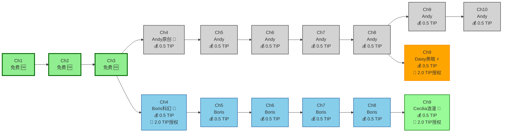

负责人：@Andy Wu

日期：2025年6月1日

## **主要版块（首屏重要位置）**

**主标题：** "阅读故事，赚取代币，AI创作"

**副标题：** "前3章免费。阅读即可赚取$TIP代币。改编内容，从创造力中获利。"

**双重行动号召策略：**

```typescript
// 并排放置两个显眼按钮
<CTAButton primary>开始免费阅读</CTAButton>
<CTAButton secondary>创作你的故事</CTAButton>
```

**信任指标：** "无需钱包即可开始 • 由Story Protocol提供支持"

## **价值主张版块**

**对读者：**

- "前3章免费阅读 - 无需注册"
- "完成每章即可赚取$TIP代币"
- "阅读奖励可超过章节解锁成本"
- "改编故事并从创造力中获利"

**对作者：**

- "AI帮你写作，区块链帮你赚钱"
- "读者解锁章节时即刻获得收益"
- "他人改编你的作品时赚取授权费"
- "从改编衍生品中建立持续收入"

**对改编创作者：**

- "将现有故事转化为新作品"
- "支付授权费，从独特内容中获利"
- "通过新颖视角吸引既有受众"

基于区块链落地页最佳实践，此版块应使用**简洁、专业的设计，留有充足的留白空间**。

## **产品演示版块**

**"观看StoryHouse.vip实际操作"**

采用落地页最佳实践——**展示产品实际运行效果**。包含：

- **三面板演示：** 读者赚取代币 → 作者创作内容 → 改编者构建衍生品
- **阅读赚取可视化：** 展示用户阅读时$TIP代币的累积过程
- **MetaMask集成流程：** 第3章后的流畅钱包连接
- **AI生成预览：** 展示文本提示+表情符号+图像=生成章节的过程
- **改编工作流：** 演示授权费支付和衍生内容创作流程

## **信任与可信度版块**

对区块链平台至关重要，因为存在**诈骗担忧**。包含：

- **"基于Story Protocol构建"** - 利用其可信度
- **"MetaMask安全保障"** - 可信钱包集成
- **安全徽章** 来自任何智能合约审计
- **团队照片和LinkedIn档案** - 区块链网站需要真实面孔
- **早期用户推荐** 展示阅读赚取成功案例

## **运作方式版块**

**增强用户流程的三栏布局：**

| 对读者                 | 平台功能       | 对作者              |
| ---------------------- | -------------- | ------------------- |
| 1. 浏览故事            | **技术支持**   | 1. 连接钱包         |
| 2. 免费阅读3章         | Story Protocol | 2. 描述你的故事     |
| 3. 第4章后连接MetaMask | 与AI协助       | 3. AI生成内容       |
| 4. 支付$TIP解锁章节    | **阅读赚取**   | 4. 从销售中赚取$TIP |
| 5. 完成阅读赚取$TIP    | 奖励系统       | 5. 授权改编权利     |
| 6. 支付授权费改编内容  |                | 6. 从衍生品中获利   |

**额外改编创作者流程：**

- 寻找改编内容 → 支付$TIP授权费 → 创作衍生品 → 从你的版本中获利

## **代币经济学可视化版块**

**"理解$TIP代币流转"**

交互式图表展示：

- **读者历程：** 免费阅读 → 付费解锁 → 阅读赚取奖励
- **创作者经济：** 章节销售 → 改编授权 → 衍生品版税
- **代币转换：** $TIP ↔ $IP桥接说明
- **经济平衡：** 阅读赚取如何抵消或超过阅读成本

## **移动优先设计要求**

基于**83%移动端流量**统计，优先考虑：

**移动端主要版块：**

- 单栏布局
- 大尺寸、便于拇指操作的CTA按钮
- **最小16px字体**以确保可读性
- 突出显示代币赚取计数器
- "无需钱包即可开始"信任指标

**移动端阅读体验：**

- **简化的MetaMask集成** 在第3章后
- **代币余额小工具** 阅读时始终可见
- **一键章节解锁** 显示$TIP余额
- **阅读进度跟踪** 用于赚取验证
- **轻松改编访问** 透明的授权费用

**移动端导航：**

- **移除导航链接** 防止分心
- 持续转化机会的粘性底部CTA栏
- **渐进式披露** - 仅在第3章后显示钱包功能
- **代币收入追踪器** 在持续显示的头部

## **转化优化功能**

**增强多步骤引导：**

```typescript
// 无摩擦落地页流程
步骤1：浏览和阅读（无需注册）
步骤2：第3章悬念钩子
步骤3：MetaMask连接（清晰价值主张）
步骤4：首次$TIP购买和赚取演示
步骤5：改编发现和创作教程
```

**社会证明元素：**

- **实时收入计数器：** "读者今日赚取X个$TIP代币"
- **热门改编展示：** "顶级收入衍生内容"
- **创作者成功故事：** "作者月赚Y个$TIP"
- **阅读赚取推荐：** "我赚取的比阅读花费的更多"

## **MetaMask集成设计**

**钱包连接用户体验：**

- **延迟集成：** 仅在第3章参与后提示
- **清晰价值沟通：** "连接以赚取$TIP并解锁更多章节"
- **Gas费透明度：** 预先显示预估成本
- **备选方案：** 支持MetaMask之外的其他钱包

**交易流程设计：**

- **章节解锁流程：** 购买前清晰显示$TIP成本
- **阅读赚取确认：** 赚取代币时的视觉反馈
- **改编授权流程：** 透明的费用结构和支付流程
- **代币转换小工具：** 便捷的$TIP ↔ $IP兑换界面

## **区块链特定设计元素**

遵循**加密货币落地页设计模式**：

**视觉设计：**

- **代币聚焦渐变**（TIP金色到Story Protocol紫色）
- **3D元素** 用于TIP代币可视化和赚取动画
- **交互组件** 显示阅读赚取流程
- **改编链可视化** 显示衍生内容连接

**文案策略：**

- **受益导向标题** 强调赚取潜力
- **清晰价值交换：** "阅读、赚取、创作、重复"
- **简化区块链语言：** 关注"赚取代币"而非技术细节
- **经济赋权信息：** "你的阅读时间很有价值"

## **潜在客户生成集成**

**渐进式参与策略：**

```typescript
// 无摩擦内容发现
落地：即时故事访问（无需邮箱）
第3章：带有赚取潜力的MetaMask提示
钱包后：收入通知邮箱
完全参与：带有偏好的档案完成
```

**阅读赚取引导：**

- **收入计算器：** 显示阅读习惯的潜在$TIP奖励
- **首章奖励：** 钱包连接额外$TIP
- **推荐奖励：** 带来新读者赚取$TIP

## **性能优化**

**移动端加载速度：**

- **即时故事预览** 加载
- **渐进式MetaMask集成**（不阻塞初始体验）
- **懒加载** 代币可视化和改编功能
- **针对3G网络优化**（全球可访问性）

**A/B测试设置：**

- **阅读赚取强调** vs. 内容质量焦点
- **3个免费章节** vs. 不同章节数量
- **MetaMask时机**（第3章 vs. 更早/更晚）
- **代币赚取可视化** 样式和突出程度

## **退出意图与重定向**

**退出意图弹窗：**

"等等！你即将错过赚取$TIP代币的机会！"

- 突出从阅读时间获得的潜在收益
- **展示热门故事** 具有高阅读赚取潜力
- **60秒价值演示** 承诺

**重定向营销活动：**

- **邮件序列** 针对阅读但未连接钱包的用户
- **社交媒体广告** 突出成功读者收益
- **改编机会提醒** 针对参与但未创作的用户

这种增强的落地页设计平衡了**复杂的代币经济学**与**直观的用户体验**，强调独特的阅读赚取价值主张，同时让区块链技术感觉**有回报且易于访问**，而不是令人害怕。

关键是将阅读定位为**赚取机会**，同时保持使StoryHouse.vip在数字出版领域独特的创意和社区方面。

---

# **前端实施指南**

**StoryHouse.vip Web应用程序**
**技术栈**：Next.js 15、TypeScript、Tailwind CSS、Wagmi v2、Framer Motion
**状态**：生产就绪，完整智能合约集成

## 🎯 **概述**

StoryHouse.vip前端是一个现代化、响应式的Web应用程序，无缝集成AI驱动的内容创作与基于区块链的奖励系统。使用Next.js 15和最新的Web3技术构建，为去中心化叙事生态系统中的读者和创作者提供直观的用户体验。

## 🏗️ **架构**

### **应用程序结构**

```
apps/frontend/
├── src/
│   ├── app/                    # Next.js 15应用路由器
│   │   ├── api/               # API路由
│   │   │   ├── generate/      # AI故事生成
│   │   │   └── auth/          # 身份验证端点
│   │   ├── create/            # 故事创作界面
│   │   ├── read/              # 阅读体验
│   │   ├── profile/           # 用户仪表板
│   │   ├── rewards/           # 奖励跟踪
│   │   ├── remix/             # 改编授权
│   │   └── layout.tsx         # 带Web3提供者的根布局
│   ├── components/            # React组件
│   │   ├── ui/               # 基础UI组件(shadcn/ui)
│   │   ├── web3/             # Web3特定组件
│   │   ├── story/            # 故事相关组件
│   │   ├── rewards/          # 奖励系统组件
│   │   ├── creator/          # 创作者工具
│   │   └── remix/            # 改编授权组件
│   ├── hooks/                # 自定义React hooks
│   │   ├── useContract.ts    # 合约交互hooks
│   │   ├── useRewards.ts     # 奖励系统hooks
│   │   ├── useAI.ts          # AI集成hooks
│   │   ├── useAuth.ts        # 身份验证hooks
│   │   └── useAnalytics.ts   # 分析hooks
│   ├── lib/                  # 工具库
│   │   ├── contracts.ts      # 合约配置
│   │   ├── wagmi.ts          # Wagmi配置
│   │   ├── openai.ts         # OpenAI客户端
│   │   ├── analytics.ts      # 分析集成
│   │   └── utils.ts          # 通用工具
│   ├── types/                # TypeScript定义
│   │   ├── contracts.ts      # 合约类型定义
│   │   ├── story.ts          # 故事相关类型
│   │   ├── rewards.ts        # 奖励系统类型
│   │   ├── user.ts           # 用户档案类型
│   │   └── api.ts            # API响应类型
│   └── styles/               # 全局样式和主题
└── public/                   # 静态资源
```

---

# **增强分支与授权模型**

## 🎯 **用户场景：多作者故事分支**

**角色**：Andy（原创）、Boris（科幻改编者）、Cecilia（浪漫改编者）、Daisy（另类改编者）、Emma（读者）

### **故事分支可视化**

**Git风格分支模型：** 类似于软件开发，故事可以分支和合并，创建多个叙事路径。

```
🎯 分支结构：
• 主分支（灰色）：Andy的原创"传送门编年史"
• 功能A（蓝色）：Boris的科幻分支"赛博朋克版"
• 功能A-1（绿色）：Cecilia的浪漫分支"爱与电路"
• 功能B（橙色）：Daisy的黑暗分支"黑暗路径"
```

**关键分支规则：**

- ✅ **免费章节（1-3）** 被所有分支继承
- 💰 **付费章节（4+）** 需要授权费进行改编
- 🔄 **授权费** 支付给直接父作者
- 📈 **版税** 从成功衍生品中流入

**可视化故事地图：**



**分支详情：**

- **主线（Andy）**：🔮 奇幻冒险，第4-10章付费
- **Boris**：🚀 科幻转型，从第4章分支
- **Cecilia**：🌹 浪漫元素，从Boris第8章分支
- **Daisy**：⚡ 黑暗另类，从Andy第8章分支

### **章节选择界面设计**

```
┌─────────────────────────────────────────────────────────────────┐
│ 📖 传送门编年史 - 第4章路径选择                                │
├─────────────────────────────────────────────────────────────────┤
│                                                                 │
│ 您已完成第3章！选择您的路径继续：                               │
│                                                                 │
│ ┌─────────────────────┐ ┌─────────────────────┐                 │
│ │ 🔮 原创（Andy）     │ │ 🚀 科幻（Boris）   │                 │
│ │                     │ │                     │                 │
│ │ 继续奇幻冒险        │ │ 赛博朋克转折       │                 │
│ │                     │ │ 硬核科幻元素       │                 │
│ │                     │ │                     │                 │
│ │ 💰 0.5 $TIP        │ │ 💰 0.5 $TIP        │                 │
│ │ 📊 4.8★ (324读者)   │ │ 📊 4.6★ (198读者)   │                 │
│ │                     │ │                     │                 │
│ │ [继续原创]          │ │ [尝试科幻]         │                 │
│ └─────────────────────┘ └─────────────────────┘                 │
│                                                                 │
│ ┌─────────────────────┐ ┌─────────────────────┐                 │
│ │ 🌹 浪漫             │ │ ⚡ 黑暗路径        │                 │
│ │ (第9章可用)         │ │ (第9章可用)        │                 │
│ │                     │ │                     │                 │
│ │ Cecilia的浪漫       │ │ Daisy的黑暗        │                 │
│ │ 故事演绎            │ │ 另类结局           │                 │
│ │                     │ │                     │                 │
│ │ 💰 稍后可用         │ │ 💰 稍后可用        │                 │
│ │ 📊 4.9★ (89读者)    │ │ 📊 4.7★ (156读者)   │                 │
│ │                     │ │                     │                 │
│ │ [预览浪漫]          │ │ [预览黑暗]         │                 │
│ └─────────────────────┘ └─────────────────────┘                 │
│                                                                 │
│ 💡 所有路径都以相同的第1-3章开始（免费）                       │
│                                                                 │
└─────────────────────────────────────────────────────────────────┘
```

### **改编创作界面**

```
┌─────────────────────────────────────────────────────────────────┐
│ 🔄 创建改编章节 - 需要授权                                      │
├─────────────────────────────────────────────────────────────────┤
│                                                                 │
│ 📚 源故事："传送门编年史" by Andy                              │
│ 📖 创建：第4章改编                                             │
│                                                                 │
│ 💰 需要授权费：                                                │
│ ┌─────────────────────────────────────────────────────────────┐ │
│ │ 🎫 标准改编授权                                            │ │
│ │                                                             │ │
│ │ • 第4章+改编权利                                           │ │
│ │ • 允许商业使用                                              │ │
│ │ • 向原作者支付25%持续版税                                  │ │
│ │ • 需要署名                                                  │ │
│ │                                                             │ │
│ │ 💰 费用：2.0 $TIP（一次性）                               │ │
│ │ 📊 支付给：Andy（原作者）                                  │ │
│ │                                                             │ │
│ │ [购买授权并继续]                                           │ │
│ └─────────────────────────────────────────────────────────────┘ │
│                                                                 │
│ ⚠️ 授权包括：                                                  │
│ • 基于第1-3章创建新第4章的权利                                │
│ • 第1-3章在您的版本中将保持免费                               │
│ • 您的第4章+可以定价并授权给其他人                            │
│                                                                 │
│ 🔒 您的钱包：5.2 $TIP可用                                     │
│                                                                 │
└─────────────────────────────────────────────────────────────────┘
```

### **收入仪表板 - 多流分析**

```
┌─────────────────────────────────────────────────────────────────┐
│ 💰 Andy的收入仪表板                                             │
├─────────────────────────────────────────────────────────────────┤
│                                                                 │
│ 📊 总收入：22.7 $TIP                                           │
│                                                                 │
│ ┌─────────────────────┐ ┌─────────────────────┐                 │
│ │ 📚 直接收入         │ │ 🔄 授权收入         │                 │
│ │                     │ │                     │                 │
│ │ 章节解锁：          │ │ 改编费：            │                 │
│ │ 💰 15.2 $TIP       │ │ 💰 4.0 $TIP        │                 │
│ │                     │ │                     │                 │
│ │ • 第4-10章销售      │ │ • Boris：2.0 $TIP   │                 │
│ │ • 324总阅读量       │ │ • Daisy：2.0 $TIP   │                 │
│ │                     │ │                     │                 │
│ └─────────────────────┘ └─────────────────────┘                 │
│                                                                 │
│ ┌─────────────────────┐ ┌─────────────────────┐                 │
│ │ 👑 持续版税         │ │ 📈 增长指标         │                 │
│ │                     │ │                     │                 │
│ │ 来自衍生品：        │ │ 新改编者：          │                 │
│ │ 💰 3.5 $TIP/月     │ │ 📊 本月2位          │                 │
│ │                     │ │                     │                 │
│ │ • Boris分支         │ │ 总衍生品：          │                 │
│ │ • Daisy分支         │ │ 📊 3个活跃分支      │                 │
│ │                     │ │                     │                 │
│ └─────────────────────┘ └─────────────────────┘                 │
│                                                                 │
│ 🎯 收入来源：                                                   │
│ ████████████████████████████████████████████ 67% 章节销售      │
│ ████████████████████ 18% 授权费                                │
│ ███████████████ 15% 持续版税                                  │
│                                                                 │
└─────────────────────────────────────────────────────────────────┘
```

### **关键分支模型设计原则**

1. **简单性** - 用户无需理解复杂的区块链概念
2. **透明度** - 所有费用和版税清晰显示
3. **公平性** - 创作者从原创和衍生品中获得回报
4. **可扩展性** - 支持无限级别的改编
5. **质量标准** - 原创性评分和转化要求

**设计状态**：✅ 完整分支模型，带有可视化图表
