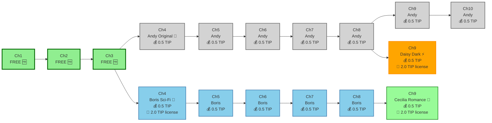

Owner: @Andy Wu

Date: June 1, 2025

## **Hero Section (Above the Fold)**

**Primary Headline:** "Read Stories, Earn Tokens, Create with AI"

**Sub-headline:** "First 3 chapters FREE. Earn $TIP tokens while reading. Remix content and earn from your creativity."

**Dual Call-to-Action Strategy:**

```typescript
// Two prominent buttons side by side
<CTAButton primary>Start Reading Free</CTAButton>
<CTAButton secondary>Create Your Story</CTAButton>
```

**Trust Indicator:** "No wallet needed to start • Powered by Story Protocol"

## **Value Proposition Section**

**For Readers:**

- "Read first 3 chapters FREE - no signup required"
- "Earn $TIP tokens for reading first 3 chapters only (discovery rewards)"
- "Chapters 4+ require payment to unlock (no read rewards)"
- "Remix stories and earn from your creativity"

**For Writers:**

- "AI helps you write, blockchain helps you earn"
- "Get paid instantly when readers unlock your chapters"
- "Earn licensing fees when others remix your work"
- "Build recurring revenue from remix derivatives"

**For Remix Creators:**

- "Transform existing stories into new creations"
- "Pay licensing fees, earn from your unique content"
- "Tap into established audiences with your fresh perspective"

Based on blockchain landing page best practices, this section should use **clean, professional design with plenty of white space**[9](https://www.brightscout.com/insight/15-examples-sleek-blockchain-websites).

## **Product Demo Section**

**"See StoryHouse.vip in Action"**

Use the landing page best practice of **showing your product in action**[2](https://unbounce.com/landing-page-articles/landing-page-best-practices/). Include:

- **Three-panel demo:** Reader earning tokens → Writer creating content → Remixer building derivatives
- **Read-to-Earn visualization:** Show TIP tokens accumulating as user reads
- **MetaMask integration flow:** Smooth wallet connection after chapter 3
- **AI generation preview:** Show how text prompt + emoji + image = generated chapter
- **Remix workflow:** Demonstrate licensing fee payment and derivative content creation

## **Trust & Credibility Section**

Critical for blockchain platforms due to **scam concerns**[3](https://www.linkedin.com/pulse/blockchain-landing-page-development-key-elements-ammar-iqbal-rh4sf). Include:

- **"Built on Story Protocol"** - leverage their credibility
- **"MetaMask Secured"** - trusted wallet integration
- **Security badges** from any smart contract audits
- **Team photos and LinkedIn profiles** - blockchain sites need real faces[3](https://www.linkedin.com/pulse/blockchain-landing-page-development-key-elements-ammar-iqbal-rh4sf)
- **Early user testimonials** showcasing read-to-earn success stories

## **How It Works Section**

**Three-Column Layout with Enhanced User Flows:**

| For Readers                        | Platform Features | For Writers              |
| ---------------------------------- | ----------------- | ------------------------ |
| 1. Browse stories                  | **Powered by**    | 1. Connect wallet        |
| 2. Read 3 chapters FREE            | Story Protocol &  | 2. Describe your story   |
| 3. Connect MetaMask for chapter 4+ | AI assistance     | 3. AI generates content  |
| 4. Pay $TIP to unlock chapters     | **Read-to-Earn**  | 4. Earn $TIP from sales  |
| 5. Earn $TIP for completion        | Rewards System    | 5. License remix rights  |
| 6. Remix content for licensing fee |                   | 6. Earn from derivatives |

**Additional Remix Creator Flow:**

- Find content to remix → Pay licensing fee in $TIP → Create derivative → Earn from your version

## **Tokenomics Visualization Section**

**"Understanding $TIP Token Flow"**

Interactive diagram showing:

- **Reader Journey:** Free reading → Paid unlocks → Read-to-earn rewards
- **Creator Economy:** Chapter sales → Remix licensing → Derivative royalties
- **Token Conversion:** $TIP ↔ $IP bridging explanation
- **Economic Balance:** How read-to-earn can offset or exceed reading costs

## **Mobile-First Design Requirements**

Based on the **83% mobile traffic** statistic[4](https://www.emailtooltester.com/en/blog/free-landing-page/), prioritize:

**Mobile Hero Section:**

- Single-column layout
- Large, thumb-friendly CTA buttons
- **16px minimum font size** for readability[7](https://moosend.com/blog/landing-page-best-practices/)
- Token earning counter prominently displayed
- "No wallet needed to start" trust indicator

**Mobile Reading Experience:**

- **Simplified MetaMask integration** after chapter 3
- **Token balance widget** always visible during reading
- **One-tap chapter unlocking** with $TIP balance display
- **Reading progress tracking** for earn verification
- **Easy remix access** with licensing fee transparency

**Mobile Navigation:**

- **Remove navigation links** to prevent distraction[2](https://unbounce.com/landing-page-articles/landing-page-best-practices/)
- Sticky bottom CTA bar for continuous conversion opportunity
- **Progressive disclosure** - show wallet features only after chapter 3
- **Token earnings tracker** in persistent header

## **Conversion Optimization Features**

**Enhanced Multi-Step Onboarding:**

```typescript
// Frictionless landing page flow
Step 1: Browse and read (no signup required)
Step 2: Hook at chapter 3 cliffhanger
Step 3: MetaMask connection (with clear value prop)
Step 4: First $TIP purchase and earn demonstration
Step 5: Remix discovery and creation tutorial
```

**Social Proof Elements:**

- **Live earnings counter:** "Readers earned X $TIP tokens today"
- **Popular remixes showcase:** "Top earning derivative content"
- **Creator success stories:** "Authors earning Y $TIP monthly"
- **Read-to-earn testimonials:** "I earn more than I spend reading"

## **MetaMask Integration Design**

**Wallet Connection UX:**

- **Delayed integration:** Only prompt after chapter 3 engagement
- **Clear value communication:** "Connect to earn $TIP and unlock more chapters"
- **Gas fee transparency:** Show estimated costs upfront
- **Backup options:** Alternative wallet support beyond MetaMask

**Transaction Flow Design:**

- **Chapter unlock process:** Clear $TIP cost display before purchase
- **Read-to-earn confirmation:** Visual feedback when tokens are earned
- **Remix licensing flow:** Transparent fee structure and payment process
- **Token conversion widget:** Easy $TIP ↔ $IP swapping interface

## **Blockchain-Specific Design Elements**

Following **crypto landing page design patterns**[8](https://www.growthchain.io/blog/top-crypto-landing-page-designs):

**Visual Design:**

- **Token-focused gradients** (TIP gold to Story Protocol purple)
- **3D elements** for TIP token visualization and earning animations
- **Interactive components** showing read-to-earn flow
- **Remix chain visualization** showing derivative content connections

**Copy Strategy:**

- **Benefit-focused headlines** emphasizing earning potential
- **Clear value exchange:** "Read, Earn, Create, Repeat"
- **Simplified blockchain language:** Focus on "earning tokens" over technical details
- **Economic empowerment messaging:** "Your reading time has value"

## **Lead Generation Integration**

**Progressive Engagement Strategy:**

```typescript
// No-friction content discovery
Landing: Immediate story access (no email required)
Chapter 3: MetaMask prompt with earning potential
Post-wallet: Email for earnings notifications
Full engagement: Profile completion with preferences
```

**Read-to-Earn Onboarding:**

- **Earnings calculator:** Show potential $TIP rewards for reading habits
- **First chapter bonus:** Extra $TIP for wallet connection
- **Referral rewards:** Earn $TIP for bringing new readers

## **Performance Optimization**

**Loading Speed for Mobile:**

- **Instant story preview** loading
- **Progressive MetaMask integration** (don't block initial experience)
- **Lazy load** token visualizations and remix features
- **Optimize for 3G networks** (global accessibility)

**A/B Testing Setup:**

- **Read-to-earn emphasis** vs. content quality focus
- **3 free chapters** vs. different chapter counts
- **MetaMask timing** (chapter 3 vs. earlier/later)
- **Token earning visualization** styles and prominence

## **Exit Intent & Retargeting**

**Exit Intent Popup:**

"Wait! You're about to miss out on earning $TIP tokens!"

- Highlight potential earnings from reading time
- **Show popular stories** with high read-to-earn potential
- **60-second value demonstration** promise

**Retargeting Campaigns:**

- **Email sequences** for users who read but didn't connect wallet
- **Social media ads** highlighting successful reader earnings
- **Remix opportunity alerts** for engaged but non-creating users

This enhanced landing page design balances the **complex tokenomics** with **intuitive user experience**, emphasizing the unique read-to-earn value proposition while making blockchain technology feel **rewarding and accessible** rather than intimidating.

The key is positioning reading as an **earning opportunity** while maintaining the creative and community aspects that make StoryHouse.vip unique in the digital publishing landscape.

### Citations:

1. https://ppl-ai-file-upload.s3.amazonaws.com/web/direct-files/attachments/26116951/86def7cd-a06b-49ac-96f9-50aa569230ad/paste.txt
2. https://unbounce.com/landing-page-articles/landing-page-best-practices/
3. https://www.linkedin.com/pulse/blockchain-landing-page-development-key-elements-ammar-iqbal-rh4sf
4. https://www.emailtooltester.com/en/blog/free-landing-page/
5. https://www.webstacks.com/blog/web-3-design
6. https://blog.clickpointsoftware.com/use-ai-prompts-to-build-high-converting-landing-pages-for-lead-gen
7. https://moosend.com/blog/landing-page-best-practices/
8. https://www.growthchain.io/blog/top-crypto-landing-page-designs
9. https://www.brightscout.com/insight/15-examples-sleek-blockchain-websites
10. https://www.lapa.ninja/category/web3/
11. https://saaslandingpage.com/tag/web3/
12. https://www.reddit.com/r/ethdev/comments/tef584/where_can_i_find_developers_who_can_make_a_good/
13. https://www.reddit.com/r/webdev/comments/1evmrk6/best_practices_for_building_effective_landing/
14. https://www.lapa.ninja/category/blockchain/
15. https://www.landingfolio.com/inspiration/landing-page/crypto
16. https://www.subframe.com/tips/blockchain-website-design-examples
17. https://landingi.com/product/ai-landing-page/
18. https://instapage.com/en/functionality/create-your-landing-page-for-blockchain-companies
19. https://www.apexure.com/blog/how-to-generate-ai-landing-page-designs-like-a-pro
20. https://landingi.com/landing-page/ai-landing-page-generator/

---

Answer from Perplexity: [pplx.ai/share](https://www.perplexity.ai/search/pplx.ai/share)

# Frontend Implementation Guide

**StoryHouse.vip Web Application**
**Tech Stack**: Next.js 15, TypeScript, Tailwind CSS, Wagmi v2, Framer Motion
**Status**: Production Ready with Full Smart Contract Integration

## 🎯 Overview

The StoryHouse.vip frontend is a modern, responsive web application that seamlessly integrates AI-powered content creation with blockchain-based rewards. Built with Next.js 15 and the latest Web3 technologies, it provides an intuitive user experience for both readers and creators in the decentralized storytelling ecosystem.

## 🏗️ Architecture

### Application Structure

```
apps/frontend/
├── src/
│   ├── app/                    # Next.js 15 App Router
│   │   ├── api/               # API routes
│   │   │   ├── generate/      # AI story generation
│   │   │   └── auth/          # Authentication endpoints
│   │   ├── create/            # Story creation interface
│   │   ├── read/              # Reading experience
│   │   ├── profile/           # User dashboard
│   │   ├── rewards/           # Reward tracking
│   │   ├── remix/             # Remix licensing
│   │   └── layout.tsx         # Root layout with Web3 providers
│   ├── components/            # React components
│   │   ├── ui/               # Base UI components (shadcn/ui)
│   │   ├── web3/             # Web3-specific components
│   │   ├── story/            # Story-related components
│   │   ├── rewards/          # Reward system components
│   │   ├── creator/          # Creator tools
│   │   └── remix/            # Remix licensing components
│   ├── hooks/                # Custom React hooks
│   │   ├── useContract.ts    # Contract interaction hooks
│   │   ├── useRewards.ts     # Reward system hooks
│   │   ├── useAI.ts          # AI integration hooks
│   │   ├── useAuth.ts        # Authentication hooks
│   │   └── useAnalytics.ts   # Analytics hooks
│   ├── lib/                  # Utility libraries
│   │   ├── contracts.ts      # Contract configurations
│   │   ├── wagmi.ts          # Wagmi configuration
│   │   ├── openai.ts         # OpenAI client
│   │   ├── analytics.ts      # Analytics integration
│   │   └── utils.ts          # General utilities
│   ├── types/                # TypeScript definitions
│   │   ├── contracts.ts      # Contract type definitions
│   │   ├── story.ts          # Story-related types
│   │   ├── rewards.ts        # Reward system types
│   │   ├── user.ts           # User profile types
│   │   └── api.ts            # API response types
│   └── styles/               # Global styles and themes
└── public/                   # Static assets
```

### Technology Stack

#### Core Framework

- **Next.js 15**: App Router with RSC and streaming
- **TypeScript**: Strict mode with comprehensive typing
- **React 18**: Latest features including Suspense and concurrent rendering

#### Styling & UI

- **Tailwind CSS**: Utility-first styling with custom design system
- **shadcn/ui**: Accessible component library
- **Framer Motion**: Smooth animations and transitions
- **Lucide React**: Consistent icon library
- **Custom CSS Variables**: Theme system with dark/light mode

#### Web3 Integration

- **Wagmi v2**: React hooks for Ethereum with TypeScript support
- **Viem**: Low-level Ethereum library for type safety
- **ConnectKit**: Beautiful wallet connection modal
- **Story Protocol**: Custom chain configuration

#### AI & Content

- **OpenAI GPT-4o**: Advanced story generation
- **Vercel AI SDK**: Streaming AI responses
- **Rate Limiting**: Request throttling and abuse prevention
- **Content Validation**: Input sanitization and validation

## 🎨 Design System

### Color Palette

```css
/* Primary Colors */
--primary: 263 70% 50%; /* Deep purple for primary actions */
--primary-foreground: 0 0% 98%; /* White text on primary */

/* Secondary Colors */
--secondary: 220 14% 96%; /* Light background */
--secondary-foreground: 220 9% 46%; /* Muted text */

/* Accent Colors */
--accent: 142 76% 36%; /* Success/reward green */
--accent-foreground: 355 7% 97%; /* Light text on accent */

/* Destructive Colors */
--destructive: 0 84% 60%; /* Error red */
--destructive-foreground: 0 0% 98%; /* White text on destructive */

/* Muted Colors */
--muted: 220 14% 96%; /* Background variations */
--muted-foreground: 220 9% 46%; /* Subtle text */

/* Border & Input */
--border: 220 13% 91%; /* Subtle borders */
--input: 220 13% 91%; /* Input backgrounds */
--ring: 263 70% 50%; /* Focus rings */
```

### Typography

```css
/* Font Stack */
font-family:
  Inter,
  -apple-system,
  BlinkMacSystemFont,
  "Segoe UI",
  Roboto,
  sans-serif;

/* Typography Scale */
--text-xs: 0.75rem; /* 12px */
--text-sm: 0.875rem; /* 14px */
--text-base: 1rem; /* 16px */
--text-lg: 1.125rem; /* 18px */
--text-xl: 1.25rem; /* 20px */
--text-2xl: 1.5rem; /* 24px */
--text-3xl: 1.875rem; /* 30px */
--text-4xl: 2.25rem; /* 36px */
```

### Spacing & Layout

```css
/* Spacing Scale (Tailwind) */
space-1: 0.25rem; /* 4px */
space-2: 0.5rem; /* 8px */
space-4: 1rem; /* 16px */
space-6: 1.5rem; /* 24px */
space-8: 2rem; /* 32px */
space-12: 3rem; /* 48px */
space-16: 4rem; /* 64px */

/* Container Sizes */
max-width-sm: 640px; /* Small screens */
max-width-md: 768px; /* Medium screens */
max-width-lg: 1024px; /* Large screens */
max-width-xl: 1280px; /* Extra large screens */
max-width-2xl: 1536px; /* 2X large screens */
```

## 🧩 Component Library

### Core UI Components

#### Button Component

```typescript
// components/ui/Button.tsx
interface ButtonProps extends ButtonHTMLAttributes<HTMLButtonElement> {
  variant?: 'default' | 'destructive' | 'outline' | 'secondary' | 'ghost' | 'link'
  size?: 'default' | 'sm' | 'lg' | 'icon'
  loading?: boolean
}

// Usage Examples
<Button variant="default" size="lg">Primary Action</Button>
<Button variant="outline" loading={isPending}>Submit</Button>
<Button variant="ghost" size="sm">Secondary</Button>
```

#### Card Component

```typescript
// components/ui/Card.tsx
interface CardProps {
  children: React.ReactNode
  className?: string
  padding?: 'none' | 'sm' | 'md' | 'lg'
  hover?: boolean
}

// Usage
<Card padding="lg" hover>
  <CardHeader>
    <CardTitle>Story Title</CardTitle>
    <CardDescription>Story description...</CardDescription>
  </CardHeader>
  <CardContent>
    Story content here...
  </CardContent>
  <CardFooter>
    <Button>Read Story</Button>
  </CardFooter>
</Card>
```

#### Input Components

```typescript
// components/ui/Input.tsx
interface InputProps extends InputHTMLAttributes<HTMLInputElement> {
  label?: string;
  error?: string;
  helpText?: string;
}

// Textarea
interface TextareaProps extends TextareaHTMLAttributes<HTMLTextAreaElement> {
  label?: string;
  error?: string;
  maxLength?: number;
  showCount?: boolean;
}

// Select
interface SelectProps {
  label?: string;
  options: Array<{ value: string; label: string }>;
  value?: string;
  onChange: (value: string) => void;
  error?: string;
}
```

### Web3 Components

#### Wallet Connection

```typescript
// components/web3/WalletButton.tsx
export function WalletButton() {
  const { address, isConnected } = useAccount()
  const { disconnect } = useDisconnect()

  if (isConnected) {
    return (
      <DropdownMenu>
        <DropdownMenuTrigger asChild>
          <Button variant="outline">
            {truncateAddress(address)}
          </Button>
        </DropdownMenuTrigger>
        <DropdownMenuContent>
          <DropdownMenuItem onClick={() => disconnect()}>
            Disconnect
          </DropdownMenuItem>
        </DropdownMenuContent>
      </DropdownMenu>
    )
  }

  return <ConnectKitButton />
}
```

#### Token Balance Display

```typescript
// components/web3/TokenBalance.tsx
export function TokenBalance() {
  const { address } = useAccount()
  const { data: balance, isLoading } = useReadContract({
    address: CONTRACTS.TIP_TOKEN,
    abi: tipTokenAbi,
    functionName: 'balanceOf',
    args: address ? [address] : undefined,
  })

  if (isLoading) return <Skeleton className="h-6 w-24" />

  return (
    <div className="flex items-center gap-2">
      <Coins className="h-4 w-4 text-yellow-500" />
      <span className="font-medium">
        {formatTipTokens(balance || 0n)} TIP
      </span>
    </div>
  )
}
```

### Story Components

#### Story Creation Form

```typescript
// components/story/StoryCreationForm.tsx
export function StoryCreationForm() {
  const [formData, setFormData] = useState<StoryFormData>({
    plotDescription: '',
    genre: '',
    mood: '',
    emoji: '',
  })

  const { generateStory, isGenerating } = useAIGeneration()
  const { publishStory, isPublishing } = useStoryCreation()

  const handleGenerate = async () => {
    const story = await generateStory(formData)
    setGeneratedStory(story)
  }

  const handlePublish = async () => {
    await publishStory(generatedStory)
  }

  return (
    <Card className="max-w-2xl mx-auto">
      <CardHeader>
        <CardTitle>Create New Story</CardTitle>
        <CardDescription>
          Use AI to generate your story and publish it on the blockchain
        </CardDescription>
      </CardHeader>
      <CardContent className="space-y-6">
        <div>
          <Label htmlFor="plot">Plot Description</Label>
          <Textarea
            id="plot"
            value={formData.plotDescription}
            onChange={(e) => setFormData(prev => ({
              ...prev,
              plotDescription: e.target.value
            }))}
            placeholder="Describe your story idea..."
            maxLength={500}
            showCount
          />
        </div>

        <div className="grid grid-cols-2 gap-4">
          <div>
            <Label htmlFor="genre">Genre</Label>
            <Select
              value={formData.genre}
              onValueChange={(value) => setFormData(prev => ({
                ...prev,
                genre: value
              }))}
            >
              <SelectTrigger>
                <SelectValue placeholder="Select genre" />
              </SelectTrigger>
              <SelectContent>
                <SelectItem value="fantasy">Fantasy</SelectItem>
                <SelectItem value="sci-fi">Sci-Fi</SelectItem>
                <SelectItem value="mystery">Mystery</SelectItem>
                <SelectItem value="romance">Romance</SelectItem>
                <SelectItem value="thriller">Thriller</SelectItem>
              </SelectContent>
            </Select>
          </div>

          <div>
            <Label htmlFor="mood">Mood</Label>
            <Select
              value={formData.mood}
              onValueChange={(value) => setFormData(prev => ({
                ...prev,
                mood: value
              }))}
            >
              <SelectTrigger>
                <SelectValue placeholder="Select mood" />
              </SelectTrigger>
              <SelectContent>
                <SelectItem value="light">Light</SelectItem>
                <SelectItem value="dark">Dark</SelectItem>
                <SelectItem value="neutral">Neutral</SelectItem>
                <SelectItem value="exciting">Exciting</SelectItem>
                <SelectItem value="peaceful">Peaceful</SelectItem>
              </SelectContent>
            </Select>
          </div>
        </div>

        <EmojiPicker
          value={formData.emoji}
          onChange={(emoji) => setFormData(prev => ({
            ...prev,
            emoji
          }))}
        />
      </CardContent>
      <CardFooter className="flex gap-2">
        <Button
          onClick={handleGenerate}
          loading={isGenerating}
          disabled={!isFormValid}
        >
          Generate Story
        </Button>
        {generatedStory && (
          <Button
            onClick={handlePublish}
            loading={isPublishing}
            variant="outline"
          >
            Publish to Blockchain
          </Button>
        )}
      </CardFooter>
    </Card>
  )
}
```

#### Reading Interface

```typescript
// components/story/ReadingInterface.tsx
export function ReadingInterface({ storyId }: { storyId: string }) {
  const { data: story } = useStory(storyId)
  const { startReading, claimReward } = useReadRewards()
  const [currentChapter, setCurrentChapter] = useState(1)
  const [readingSession, setReadingSession] = useState<ReadingSession | null>(null)

  const handleStartReading = async () => {
    const session = await startReading(storyId, currentChapter)
    setReadingSession(session)
  }

  const handleClaimReward = async () => {
    await claimReward(storyId, currentChapter)
    setReadingSession(null)
  }

  return (
    <div className="max-w-4xl mx-auto">
      <StoryHeader story={story} />

      <ChapterNavigation
        currentChapter={currentChapter}
        totalChapters={story?.chapters.length || 0}
        onChapterChange={setCurrentChapter}
      />

      <Card className="mt-6">
        <CardContent className="prose prose-lg max-w-none">
          {story?.chapters[currentChapter - 1]?.content}
        </CardContent>
      </Card>

      <ReadingProgress
        session={readingSession}
        onComplete={handleClaimReward}
      />

      <RewardInfo
        chapterNumber={currentChapter}
        hasSession={!!readingSession}
        onStartReading={handleStartReading}
      />
    </div>
  )
}
```

### Reward Components

#### Reward Claim Button

```typescript
// components/rewards/RewardClaimButton.tsx
export function RewardClaimButton({
  storyId,
  chapterNumber,
  canClaim,
  rewardAmount
}: RewardClaimButtonProps) {
  const { claimReward, isPending, isSuccess, error } = useClaimReward()

  const handleClaim = () => {
    claimReward(storyId, chapterNumber)
  }

  return (
    <motion.div
      initial={{ scale: 0.95, opacity: 0 }}
      animate={{ scale: 1, opacity: 1 }}
      transition={{ duration: 0.2 }}
    >
      <Button
        onClick={handleClaim}
        disabled={!canClaim || isPending}
        loading={isPending}
        className="w-full"
        size="lg"
      >
        {isPending ? (
          'Claiming Reward...'
        ) : isSuccess ? (
          <>
            <CheckCircle className="mr-2 h-4 w-4" />
            Reward Claimed!
          </>
        ) : (
          <>
            <Coins className="mr-2 h-4 w-4" />
            Claim {formatTipTokens(rewardAmount)} TIP
          </>
        )}
      </Button>

      {error && (
        <Alert variant="destructive" className="mt-2">
          <AlertDescription>
            Failed to claim reward. Please try again.
          </AlertDescription>
        </Alert>
      )}
    </motion.div>
  )
}
```

#### Streak Tracker

```typescript
// components/rewards/StreakTracker.tsx
export function StreakTracker() {
  const { data: userStats } = useUserStats()
  const streakDays = userStats?.currentStreak || 0
  const streakBonus = Math.min(streakDays * 10, 100) // 10% per day, max 100%

  return (
    <Card>
      <CardHeader>
        <CardTitle className="flex items-center gap-2">
          <Flame className="h-5 w-5 text-orange-500" />
          Reading Streak
        </CardTitle>
      </CardHeader>
      <CardContent>
        <div className="text-center">
          <div className="text-3xl font-bold text-orange-500">
            {streakDays}
          </div>
          <div className="text-sm text-muted-foreground">
            Days in a row
          </div>
          {streakBonus > 0 && (
            <div className="mt-2 text-sm font-medium text-green-600">
              +{streakBonus}% Bonus Rewards
            </div>
          )}
        </div>

        <Progress
          value={(streakDays % 7) * (100 / 7)}
          className="mt-4"
        />
        <div className="text-xs text-center mt-2 text-muted-foreground">
          {7 - (streakDays % 7)} days to next milestone
        </div>
      </CardContent>
    </Card>
  )
}
```

## 🔗 Web3 Integration

### Wagmi Configuration

```typescript
// lib/wagmi.ts
import { createConfig, http } from "wagmi";
import { storyTestnet } from "wagmi/chains";
import { injected, metaMask, walletConnect } from "wagmi/connectors";

export const storyTestnet = {
  id: 1315,
  name: "Story Protocol Testnet",
  network: "story-testnet",
  nativeCurrency: {
    name: "IP",
    symbol: "IP",
    decimals: 18,
  },
  rpcUrls: {
    public: { http: ["https://aeneid.storyrpc.io"] },
    default: { http: ["https://aeneid.storyrpc.io"] },
  },
  blockExplorers: {
    default: {
      name: "StoryScan",
      url: "https://aeneid.storyscan.xyz",
    },
  },
};

export const config = createConfig({
  chains: [storyTestnet],
  connectors: [
    injected(),
    metaMask(),
    walletConnect({
      projectId: process.env.NEXT_PUBLIC_WALLETCONNECT_PROJECT_ID!,
    }),
  ],
  transports: {
    [storyTestnet.id]: http(process.env.NEXT_PUBLIC_RPC_URL),
  },
});
```

### Custom Hooks

#### Contract Interaction Hook

```typescript
// hooks/useContract.ts
export function useContractWrite(contractName: keyof typeof CONTRACTS) {
  const { writeContract, data: hash, error, isPending } = useWriteContract();
  const { isLoading: isConfirming, isSuccess } = useWaitForTransactionReceipt({
    hash,
  });

  const writeAsync = useCallback(
    (functionName: string, args?: any[]) => {
      const contractConfig = getContractConfig(contractName);

      writeContract({
        address: contractConfig.address,
        abi: contractConfig.abi,
        functionName,
        args,
      });
    },
    [writeContract, contractName]
  );

  return {
    writeAsync,
    hash,
    error,
    isPending,
    isConfirming,
    isSuccess,
  };
}
```

#### AI Generation Hook

```typescript
// hooks/useAI.ts
export function useAIGeneration() {
  const [isGenerating, setIsGenerating] = useState(false);
  const [error, setError] = useState<string | null>(null);

  const generateStory = async (request: StoryGenerationRequest) => {
    setIsGenerating(true);
    setError(null);

    try {
      const response = await fetch("/api/generate", {
        method: "POST",
        headers: { "Content-Type": "application/json" },
        body: JSON.stringify(request),
      });

      if (!response.ok) {
        throw new Error("Failed to generate story");
      }

      const data = await response.json();

      if (!data.success) {
        throw new Error(data.error || "Generation failed");
      }

      return data.story;
    } catch (err) {
      const errorMessage = err instanceof Error ? err.message : "Unknown error";
      setError(errorMessage);
      throw err;
    } finally {
      setIsGenerating(false);
    }
  };

  return {
    generateStory,
    isGenerating,
    error,
  };
}
```

## 🎨 Animation & Interactions

### Framer Motion Patterns

#### Page Transitions

```typescript
// components/PageTransition.tsx
export function PageTransition({ children }: { children: React.ReactNode }) {
  return (
    <motion.div
      initial={{ opacity: 0, y: 20 }}
      animate={{ opacity: 1, y: 0 }}
      exit={{ opacity: 0, y: -20 }}
      transition={{ duration: 0.3, ease: 'easeInOut' }}
    >
      {children}
    </motion.div>
  )
}
```

#### Card Hover Effects

```typescript
// components/ui/Card.tsx (with animations)
export function Card({ children, hover = false, ...props }: CardProps) {
  const MotionCard = motion(BaseCard)

  return (
    <MotionCard
      whileHover={hover ? {
        scale: 1.02,
        boxShadow: '0 10px 25px rgba(0,0,0,0.1)'
      } : undefined}
      transition={{ duration: 0.2 }}
      {...props}
    >
      {children}
    </MotionCard>
  )
}
```

#### Loading States

```typescript
// components/ui/Loading.tsx
export function Loading({ text = 'Loading...' }: { text?: string }) {
  return (
    <div className="flex items-center justify-center space-x-2">
      <motion.div
        className="w-2 h-2 bg-primary rounded-full"
        animate={{ scale: [1, 1.2, 1] }}
        transition={{ duration: 0.6, repeat: Infinity }}
      />
      <motion.div
        className="w-2 h-2 bg-primary rounded-full"
        animate={{ scale: [1, 1.2, 1] }}
        transition={{ duration: 0.6, repeat: Infinity, delay: 0.1 }}
      />
      <motion.div
        className="w-2 h-2 bg-primary rounded-full"
        animate={{ scale: [1, 1.2, 1] }}
        transition={{ duration: 0.6, repeat: Infinity, delay: 0.2 }}
      />
      <span className="ml-2 text-sm text-muted-foreground">{text}</span>
    </div>
  )
}
```

## 📱 Responsive Design

### Breakpoint Strategy

```css
/* Mobile First Approach */
/* xs: 0px - 639px (mobile) */
.container {
  padding: 1rem;
}

/* sm: 640px+ (large mobile) */
@media (min-width: 640px) {
  .container {
    padding: 1.5rem;
  }
}

/* md: 768px+ (tablet) */
@media (min-width: 768px) {
  .container {
    padding: 2rem;
  }
}

/* lg: 1024px+ (desktop) */
@media (min-width: 1024px) {
  .container {
    padding: 2.5rem;
  }
}

/* xl: 1280px+ (large desktop) */
@media (min-width: 1280px) {
  .container {
    padding: 3rem;
  }
}
```

### Mobile Navigation

```typescript
// components/layout/MobileNav.tsx
export function MobileNav() {
  const [isOpen, setIsOpen] = useState(false)

  return (
    <div className="md:hidden">
      <Button
        variant="ghost"
        size="icon"
        onClick={() => setIsOpen(!isOpen)}
      >
        <Menu className="h-6 w-6" />
      </Button>

      <AnimatePresence>
        {isOpen && (
          <motion.div
            initial={{ opacity: 0, height: 0 }}
            animate={{ opacity: 1, height: 'auto' }}
            exit={{ opacity: 0, height: 0 }}
            className="absolute top-full left-0 right-0 bg-background border-b"
          >
            <nav className="flex flex-col p-4 space-y-2">
              <MobileNavLink href="/create">Create</MobileNavLink>
              <MobileNavLink href="/read">Read</MobileNavLink>
              <MobileNavLink href="/rewards">Rewards</MobileNavLink>
              <MobileNavLink href="/profile">Profile</MobileNavLink>
            </nav>
          </motion.div>
        )}
      </AnimatePresence>
    </div>
  )
}
```

## 🔒 Security & Performance

### Input Validation

```typescript
// lib/validation.ts
import { z } from "zod";

export const storyFormSchema = z.object({
  plotDescription: z
    .string()
    .min(10, "Plot description must be at least 10 characters")
    .max(500, "Plot description must be less than 500 characters"),
  genre: z.enum(["fantasy", "sci-fi", "mystery", "romance", "thriller"]),
  mood: z.enum(["light", "dark", "neutral", "exciting", "peaceful"]),
  emoji: z
    .string()
    .regex(/^[\u{1F600}-\u{1F64F}]$/u, "Please select a valid emoji"),
});

export function validateStoryForm(data: unknown) {
  return storyFormSchema.safeParse(data);
}
```

### Rate Limiting

```typescript
// lib/rate-limit.ts
import { LRUCache } from "lru-cache";

type Options = {
  uniqueTokenPerInterval?: number;
  interval?: number;
};

export default function rateLimit(options: Options = {}) {
  const tokenCache = new LRUCache({
    max: options.uniqueTokenPerInterval || 500,
    ttl: options.interval || 60000,
  });

  return {
    check: (limit: number, token: string) =>
      new Promise<void>((resolve, reject) => {
        const tokenCount = (tokenCache.get(token) as number[]) || [0];
        if (tokenCount[0] === 0) {
          tokenCache.set(token, tokenCount);
        }
        tokenCount[0] += 1;

        const currentUsage = tokenCount[0];
        const isRateLimited = currentUsage >= limit;

        if (isRateLimited) {
          reject(new Error("Rate limit exceeded"));
        } else {
          resolve();
        }
      }),
  };
}
```

### Performance Optimization

```typescript
// components/LazyComponents.tsx
import { lazy, Suspense } from 'react'

// Lazy load heavy components
const StoryEditor = lazy(() => import('./story/StoryEditor'))
const AnalyticsDashboard = lazy(() => import('./analytics/Dashboard'))
const RemixLicensing = lazy(() => import('./remix/LicensingModal'))

// Wrapper component with loading fallback
export function LazyStoryEditor(props: any) {
  return (
    <Suspense fallback={<Loading text="Loading editor..." />}>
      <StoryEditor {...props} />
    </Suspense>
  )
}
```

## 📊 Analytics & Monitoring

### User Analytics

```typescript
// lib/analytics.ts
import { track } from "@vercel/analytics";

export const analytics = {
  // Story creation events
  storyGenerated: (genre: string, wordCount: number) => {
    track("story_generated", { genre, wordCount });
  },

  storyPublished: (storyId: string, genre: string) => {
    track("story_published", { storyId, genre });
  },

  // Reading events
  chapterStarted: (storyId: string, chapterNumber: number) => {
    track("chapter_started", { storyId, chapterNumber });
  },

  rewardClaimed: (storyId: string, chapterNumber: number, amount: string) => {
    track("reward_claimed", { storyId, chapterNumber, amount });
  },

  // Web3 events
  walletConnected: (address: string) => {
    track("wallet_connected", { address: address.slice(0, 6) });
  },

  transactionSubmitted: (type: string, hash: string) => {
    track("transaction_submitted", { type, hash });
  },
};
```

### Error Monitoring

```typescript
// lib/error-tracking.ts
export function trackError(error: Error, context?: Record<string, any>) {
  console.error("Application Error:", error);

  // In production, send to error tracking service
  if (process.env.NODE_ENV === "production") {
    // Sentry, LogRocket, etc.
    track("error_occurred", {
      message: error.message,
      stack: error.stack,
      ...context,
    });
  }
}
```

## 🚀 Deployment & Environment

### Environment Configuration

```env
# .env.local
NEXT_PUBLIC_CHAIN_ID=1315
NEXT_PUBLIC_RPC_URL=https://aeneid.storyrpc.io
NEXT_PUBLIC_EXPLORER_URL=https://aeneid.storyscan.xyz

# Contract Addresses
NEXT_PUBLIC_TIP_TOKEN_ADDRESS=0x...
NEXT_PUBLIC_REWARDS_MANAGER_ADDRESS=0x...
NEXT_PUBLIC_ACCESS_CONTROL_ADDRESS=0x...
NEXT_PUBLIC_READ_REWARDS_ADDRESS=0x...
NEXT_PUBLIC_CREATOR_REWARDS_ADDRESS=0x...
NEXT_PUBLIC_REMIX_LICENSING_ADDRESS=0x...

# AI Integration
OPENAI_API_KEY=sk-...

# Analytics
NEXT_PUBLIC_VERCEL_ANALYTICS_ID=...
NEXT_PUBLIC_WALLETCONNECT_PROJECT_ID=...
```

### Vercel Deployment

```json
{
  "builds": [
    {
      "src": "package.json",
      "use": "@vercel/next"
    }
  ],
  "functions": {
    "app/api/**/*.ts": {
      "maxDuration": 30
    }
  },
  "env": {
    "OPENAI_API_KEY": "@openai-api-key"
  }
}
```

## 🎯 Future Enhancements

### Planned Features

- **Progressive Web App**: Offline reading capabilities
- **Push Notifications**: Reading reminders and reward alerts
- **Advanced Editor**: Rich text editing with markdown support
- **Social Features**: Comments, likes, and sharing
- **Mobile App**: React Native application
- **Voice Integration**: Text-to-speech for accessibility

### Technical Improvements

- **Bundle Optimization**: Further reduce bundle sizes
- **Image Optimization**: Advanced image compression and CDN
- **Caching Strategy**: Implement sophisticated caching
- **Real-time Updates**: WebSocket integration for live updates

---

This frontend implementation provides a comprehensive, modern, and user-friendly interface for the StoryHouse.vip platform, seamlessly integrating Web3 functionality with AI-powered content creation while maintaining excellent performance and accessibility standards.

# StoryHouse.vip - Content Publishing Workflow Wireframes

Owner: @Andy Wu
Date: June 1, 2025

## **Writer Journey Overview**

**Phase 1: Frictionless Entry** (No wallet required)
**Phase 2: Content Creation** (AI-assisted writing)
**Phase 3: Publishing Setup** (MetaMask integration)
**Phase 4: Monetization** (Token earning activation)

---

## **1. Landing Page - Writer Entry Point**

```
┌─────────────────────────────────────────────────────────────────┐
│ StoryHouse.vip                                    [Write] 🖋️    │
├─────────────────────────────────────────────────────────────────┤
│                                                                 │
│              Read Stories, Earn Tokens, Create with AI          │
│                                                                 │
│           First 3 chapters FREE. Earn $TIP while reading       │
│                                                                 │
│        [Start Reading Free]    [Create Your Story]             │
│                                                                 │
└─────────────────────────────────────────────────────────────────┘
```

**Top Right CTA Options:**

- **"Write"** - Simple, clear action
- **"Create"** - Emphasizes creativity
- **🖋️ Feather pen icon** - Visual, universal symbol
- **"Publish"** - Goal-oriented

**Recommendation:** **"Write" + 🖋️ icon** for clarity + visual appeal

---

## **2. Content Creation Studio - Initial Screen**

```
┌─────────────────────────────────────────────────────────────────┐
│ ← Back to StoryHouse                              [Save Draft]   │
├─────────────────────────────────────────────────────────────────┤
│                                                                 │
│                    ✨ Create Your Story                         │
│                                                                 │
│  📝 Describe your story plot:                                   │
│  ┌─────────────────────────────────────────────────────────────┐ │
│  │ A young detective discovers a hidden portal in their        │ │
│  │ grandmother's attic that leads to...                        │ │
│  │                                                             │ │
│  │                                                             │ │
│  └─────────────────────────────────────────────────────────────┘ │
│                                                                 │
│  💡 Add inspiration (optional):                                 │
│  [📷 Image] [😀 Emoji] [🎭 GIF] [🎨 Mood Board]               │
│                                                                 │
│                        [Generate Chapter 1]                    │
│                                                                 │
└─────────────────────────────────────────────────────────────────┘
```

**Key Features:**

- **Large text area** for plot description
- **Multi-modal inputs** as optional enhancements
- **Save Draft** functionality (no login required)
- **Clear CTA** to generate first chapter

---

## **3. Multi-Modal Input Panel (Expanded)**

```
┌─────────────────────────────────────────────────────────────────┐
│                    Add Creative Elements                        │
├─────────────────────────────────────────────────────────────────┤
│                                                                 │
│ 📷 Upload Images                                                │
│ ┌─────────────────┐ ┌─────────────────┐ ┌─────────────────┐     │
│ │  [+] Add Image  │ │  [+] Add Image  │ │  [+] Add Image  │     │
│ └─────────────────┘ └─────────────────┘ └─────────────────┘     │
│                                                                 │
│ 😀 Choose Emojis                                                │
│ 😊 😢 😱 😍 🔥 ⚡ 🌟 💀 🦸 👑 🎭 🎪 (+ more)                   │
│                                                                 │
│ 🎭 Select Mood/Genre                                            │
│ [Mystery] [Romance] [Sci-Fi] [Fantasy] [Horror] [Comedy]        │
│                                                                 │
│ 🎨 Style Preferences                                            │
│ [Dark & Gritty] [Light & Whimsical] [Epic Adventure]           │
│                                                                 │
│                    [Apply to Generation]                       │
│                                                                 │
└─────────────────────────────────────────────────────────────────┘
```

---

## **4. AI Generation - Loading State**

```
┌─────────────────────────────────────────────────────────────────┐
│ ← Back                                            [Save Draft]   │
├─────────────────────────────────────────────────────────────────┤
│                                                                 │
│                      🤖 AI Writing...                          │
│                                                                 │
│              ████████████░░░░░░░░░░ 65%                        │
│                                                                 │
│              Creating your story chapter...                     │
│                                                                 │
│   💡 Your plot: "A young detective discovers a portal..."      │
│   🎭 Mood: Mystery + Adventure                                  │
│   📷 Inspiration: [uploaded image preview]                     │
│                                                                 │
│              Estimated time: 30 seconds                        │
│                                                                 │
└─────────────────────────────────────────────────────────────────┘
```

---

## **5. Generated Content - Chapter Preview**

```
┌─────────────────────────────────────────────────────────────────┐
│ ← Edit Input                                      [Publish] 🚀  │
├─────────────────────────────────────────────────────────────────┤
│                      Chapter 1: The Discovery                  │
│                                                                 │
│ ┌─────────────────────────────────────────────────────────────┐ │
│ │ Detective Sarah Chen had always found comfort in the        │ │
│ │ familiar creaks and whispers of her grandmother's old       │ │
│ │ Victorian house. But today, as she climbed the narrow       │ │
│ │ staircase to the attic, something felt different...         │ │
│ │                                                             │ │
│ │ [Generated content continues...]                            │ │
│ │                                                             │ │
│ │ Word count: 1,247 | Estimated reading time: 5 min          │ │
│ └─────────────────────────────────────────────────────────────┘ │
│                                                                 │
│ ✨ Generation Options:                                          │
│ [🔄 Regenerate] [✏️ Edit] [➕ Continue Story] [📊 Analytics]   │
│                                                                 │
│                                                                 │
└─────────────────────────────────────────────────────────────────┘
```

**Key Features:**

- **Full chapter preview** with nice formatting
- **Content statistics** (word count, reading time)
- **Action buttons** for iteration and continuation
- **Publish button** prominent but not intrusive

---

## **6. Publishing Setup - MetaMask Integration Point**

```
┌─────────────────────────────────────────────────────────────────┐
│                     🚀 Ready to Publish?                       │
├─────────────────────────────────────────────────────────────────┤
│                                                                 │
│              Great! Your story is ready to share.              │
│                                                                 │
│  To earn $TIP tokens from readers, connect your wallet:        │
│                                                                 │
│              [🦊 Connect MetaMask Wallet]                      │
│                                                                 │
│  ━━━━━━━━━━━━━━━ OR ━━━━━━━━━━━━━━━                              │
│                                                                 │
│              [📝 Publish Anonymous]                            │
│              (No earnings, but story goes live)                │
│                                                                 │
│  💡 With wallet connected, you'll earn:                        │
│     • $TIP tokens when readers unlock chapters                 │
│     • Licensing fees from remixes                              │
│     • Royalties from derivative content                        │
│                                                                 │
└─────────────────────────────────────────────────────────────────┘
```

**Progressive Disclosure Strategy:**

- **No wallet pressure** in creation phase
- **Clear value proposition** for connecting wallet
- **Anonymous publishing option** for hesitant users
- **Benefit-focused messaging** about earnings

---

## **7. Post-MetaMask Connection - Publishing Options**

```
┌─────────────────────────────────────────────────────────────────┐
│ 🎉 Wallet Connected: 0x1234...abcd                [Disconnect]  │
├─────────────────────────────────────────────────────────────────┤
│                                                                 │
│                    📚 Publishing Settings                       │
│                                                                 │
│  Story Title: ┌─────────────────────────────────────────────┐   │
│              │ The Detective's Portal                      │   │
│              └─────────────────────────────────────────────┘   │
│                                                                 │
│  Chapter Price: [0.1] $TIP tokens per chapter                  │
│                                                                 │
│  Remix License: [📋 Standard] [💰 Premium] [🚫 No Remixes]    │
│                                                                 │
│  Publication:   [🌍 Public] [👥 Community] [🔒 Private]       │
│                                                                 │
│                                                                 │
│              [🚀 Publish to StoryHouse.vip]                   │
│                                                                 │
└─────────────────────────────────────────────────────────────────┘
```

---

## **8. Success State - Story Published**

```
┌─────────────────────────────────────────────────────────────────┐
│                     🎉 Story Published!                        │
├─────────────────────────────────────────────────────────────────┤
│                                                                 │
│              "The Detective's Portal" is now live!             │
│                                                                 │
│  📊 Story Analytics:                                            │
│     👀 Views: 0  |  💰 Earnings: 0 $TIP  |  🔄 Remixes: 0     │
│                                                                 │
│  🔗 Share your story:                                           │
│  ┌─────────────────────────────────────────────────────────────┐ │
│  │ https://storyhouse.vip/story/detective-portal-xyz123       │ │
│  └─────────────────────────────────────────────────────────────┘ │
│                                                                 │
│              [📱 Share] [✏️ Write Next Chapter]                │
│                                                                 │
│  💡 What's next?                                                │
│     • Continue your story to keep readers engaged              │
│     • Share on social media to grow your audience              │
│     • Monitor analytics to optimize earnings                   │
│                                                                 │
└─────────────────────────────────────────────────────────────────┘
```

---

# **READER EXPERIENCE WIREFRAMES**

## **Reader Journey Overview**

**Phase 1: Story Discovery** (No wallet required)
**Phase 2: Free Reading** (Chapters 1-3)
**Phase 3: Engagement Hook** (Chapter 3 cliffhanger)
**Phase 4: MetaMask Integration** (Chapter 4+ unlock)
**Phase 5: Read-to-Earn** (Token accumulation)

---

## **R1. Story Discovery & Browse**

```
┌─────────────────────────────────────────────────────────────────┐
│ StoryHouse.vip    🔍 Search stories...           [Write] 🖋️    │
├─────────────────────────────────────────────────────────────────┤
│                                                                 │
│  📚 Trending Stories                           💰 My Earnings   │
│                                                2.5 $TIP        │
│  ┌───────────────────┐ ┌───────────────────┐                   │
│  │ 🏰 The Detective's │ │ 🚀 Space Pirates  │  🔥 Hot          │
│  │    Portal         │ │    Adventure      │                   │
│  │ Mystery • 5 chap  │ │ Sci-Fi • 12 chap  │  📖 Most Read    │
│  │ 🆓 3 FREE         │ │ 🆓 3 FREE         │                   │
│  │ ⭐ 4.8 • 👁️ 2.1k   │ │ ⭐ 4.6 • 👁️ 5.7k   │  💎 New         │
│  │ [Start Reading]   │ │ [Start Reading]   │                   │
│  └───────────────────┘ └───────────────────┘  🎭 Genres       │
│                                                                 │
│  🎯 Recommended For You                        [Mystery]        │
│                                                [Romance]        │
│  ┌───────────────────┐ ┌───────────────────┐  [Sci-Fi]         │
│  │ 💀 Dark Secrets   │ │ 🌟 Magic Academy  │  [Fantasy]        │
│  │ Horror • 8 chap   │ │ Fantasy • 15 chap │  [Horror]         │
│  │ 🆓 3 FREE         │ │ 🆓 3 FREE         │                   │
│  │ ⭐ 4.9 • 👁️ 1.8k   │ │ ⭐ 4.7 • 👁️ 3.2k   │                   │
│  │ [Start Reading]   │ │ [Start Reading]   │                   │
│  └───────────────────┘ └───────────────────┘                   │
│                                                                 │
└─────────────────────────────────────────────────────────────────┘
```

**Key Features:**

- **Earnings widget** shows current $TIP balance
- **3 FREE chapters** prominently displayed on each story
- **Story metadata** (genre, chapter count, ratings, views)
- **Filtering options** for discovery
- **No wallet connection required** for browsing

---

## **R2. Reading Interface - Free Chapters (1-3)**

```
┌─────────────────────────────────────────────────────────────────┐
│ ← Back                The Detective's Portal     🔖 Bookmark     │
├─────────────────────────────────────────────────────────────────┤
│                                                                 │
│                      Chapter 1: The Discovery                  │
│                                                                 │
│  🆓 FREE CHAPTER • 📖 5 min read • 💰 Earn 0.05 $TIP          │
│                                                                 │
│ ┌─────────────────────────────────────────────────────────────┐ │
│ │                                                             │ │
│ │ Detective Sarah Chen had always found comfort in the        │ │
│ │ familiar creaks and whispers of her grandmother's old       │ │
│ │ Victorian house. But today, as she climbed the narrow       │ │
│ │ staircase to the attic, something felt different...         │ │
│ │                                                             │ │
│ │ The wooden steps groaned under her weight, each one        │ │
│ │ seeming to echo with memories of countless trips to this    │ │
│ │ forgotten space. Sarah pulled the cord for the single      │ │
│ │ bulb that lit the cramped attic, and gasped.               │ │
│ │                                                             │ │
│ │ Where once stood dusty cardboard boxes and old furniture   │ │
│ │ now pulsed a shimmering, ethereal doorway made of pure     │ │
│ │ light...                                                    │ │
│ │                                                             │ │
│ │ [Content continues...]                                      │ │
│ │                                                             │ │
│ └─────────────────────────────────────────────────────────────┘ │
│                                                                 │
│  📊 Reading Progress: ████████████░░░░░░░░ 75%                 │
│                                                                 │
│                 [← Previous] [Continue Reading →]              │
│                                                                 │
└─────────────────────────────────────────────────────────────────┘
```

**Key Features:**

- **Earning potential** shown upfront (0.05 $TIP)
- **Reading progress tracking** for earning verification
- **Clean reading interface** optimized for engagement
- **No interruptions** during free chapters

---

## **R3. Chapter 3 Completion - The Hook**

```
┌─────────────────────────────────────────────────────────────────┐
│                  🎉 Chapter 3 Complete!                        │
├─────────────────────────────────────────────────────────────────┤
│                                                                 │
│               You've earned 0.05 $TIP tokens! 💰              │
│                                                                 │
│  But just as Sarah stepped through the portal, the ground      │
│  beneath her feet began to crumble. In the distance, she       │
│  could hear voices calling her name... but they weren't        │
│  human voices.                                                  │
│                                                                 │
│                        TO BE CONTINUED...                      │
│                                                                 │
│  ━━━━━━━━━━━━━━━━━━━━━━━━━━━━━━━━━━━━━━━━━━━━━━━━━━━━━━━━━━━━━━  │
│                                                                 │
│  🔓 Unlock Chapter 4 to continue the adventure!                │
│                                                                 │
│  💰 Cost: 0.5 $TIP tokens                                      │
│  ❌ No read rewards for paid chapters                          │
│                                                                 │
│              [🦊 Connect Wallet & Continue]                    │
│                                                                 │
│  💡 Discovery rewards only for chapters 1-3!                  │
│     Premium chapters are pay-to-read only.                     │
│                                                                 │
│                    [← Browse Other Stories]                    │
│                                                                 │
└─────────────────────────────────────────────────────────────────┘
```

**Strategic Hook Elements:**

- **Cliffhanger ending** at crucial story moment
- **Token earned confirmation** builds trust
- **Economic value prop** (earn back what you spend)
- **Clear next action** with wallet connection
- **Alternative path** for hesitant users

---

## **R4. MetaMask Connection - Reader Side**

```
┌─────────────────────────────────────────────────────────────────┐
│                    🦊 Connect Your Wallet                      │
├─────────────────────────────────────────────────────────────────┤
│                                                                 │
│              Unlock chapters and start earning $TIP!           │
│                                                                 │
│  🔐 Secure connection through MetaMask                         │
│  💰 Your earnings: 0.05 $TIP (from reading chapters 1-3)       │
│                                                                 │
│  ┌─────────────────────────────────────────────────────────────┐ │
│  │              [🦊 Connect MetaMask]                          │ │
│  └─────────────────────────────────────────────────────────────┘ │
│                                                                 │
│  After connecting, you'll be able to:                          │
│  ✅ Unlock and read premium chapters                           │
│  ✅ Earn $TIP tokens for every chapter completed               │
│  ✅ Convert $TIP to $IP tokens                                 │
│  ✅ Tip your favorite authors                                  │
│  ✅ Remix content and earn from your creations                 │
│                                                                 │
│                        [← Go Back]                             │
│                                                                 │
│  🔒 Your wallet info is private and secure                     │
│                                                                 │
└─────────────────────────────────────────────────────────────────┘
```

---

## **R5. Chapter Unlock - Payment Flow**

```
┌─────────────────────────────────────────────────────────────────┐
│ 🎉 Wallet Connected: 0x1234...abcd              💰 2.5 $TIP     │
├─────────────────────────────────────────────────────────────────┤
│                                                                 │
│                    🔓 Unlock Chapter 4                         │
│                                                                 │
│  📖 Chapter 4: "Through the Portal"                            │
│  ⏱️ Estimated reading time: 6 minutes                          │
│                                                                 │
│  💰 Cost to unlock: 0.5 $TIP                                   │
│  ❌ No read rewards for paid chapters                          │
│  📈 Net effect: -0.5 $TIP (pay to read premium content)        │
│                                                                 │
│  ┌─────────────────────────────────────────────────────────────┐ │
│  │                [🔓 Unlock Chapter - 0.5 $TIP]               │ │
│  └─────────────────────────────────────────────────────────────┘ │
│                                                                 │
│  💡 Your current balance: 2.5 $TIP                             │
│  💡 Balance after unlock: 2.0 $TIP                             │
│  💡 Balance after reading: 2.0 $TIP (no read rewards)          │
│                                                                 │
│  🔄 Need more $TIP? [Buy $TIP] [Convert $IP to $TIP]          │
│                                                                 │
│                        [← Back to Chapter 3]                   │
│                                                                 │
└─────────────────────────────────────────────────────────────────┘
```

**Key Features:**

- **Clear cost/benefit calculation** shown upfront
- **Balance tracking** before/during/after transaction
- **Break-even messaging** reduces payment friction
- **Top-up options** for insufficient balance

---

## **R6. Reading Interface - Paid Chapters (4+) with Earning**

```
┌─────────────────────────────────────────────────────────────────┐
│ ← Back                The Detective's Portal     💰 2.4 $TIP     │
├─────────────────────────────────────────────────────────────────┤
│                                                                 │
│                   Chapter 4: Through the Portal                │
│                                                                 │
│  🔓 UNLOCKED • 📖 6 min read • 💰 Paid Content                │
│                                                                 │
│ ┌─────────────────────────────────────────────────────────────┐ │
│ │                                                             │ │
│ │ The moment Sarah's foot touched the other side of the       │ │
│ │ portal, she knew there was no going back. The attic was    │ │
│ │ gone, replaced by a vast crystalline cavern that hummed    │ │
│ │ with otherworldly energy...                                 │ │
│ │                                                             │ │
│ │ Strange symbols carved into the walls began to glow as     │ │
│ │ she approached, and she realized with growing excitement   │ │
│ │ that she could somehow understand their meaning...          │ │
│ │                                                             │ │
│ │ [Content continues...]                                      │ │
│ │                                                             │ │
│ └─────────────────────────────────────────────────────────────┘ │
│                                                                 │
│  📊 Reading Progress: ████████████████░░░░ 85%                 │
│                                                                 │
│                 [← Previous] [Continue Reading →]              │
│                                                                 │
│  💡 Premium content - no read rewards earned.                  │
│                                                                 │
└─────────────────────────────────────────────────────────────────┘
```

**Enhanced Paid Reading Features:**

- **Dual progress bars** (reading + earning)
- **Real-time balance** in header
- **Earning motivation** messaging
- **Clear earning status** indication

---

## **R7. Chapter Completion - Token Earned**

```
┌─────────────────────────────────────────────────────────────────┐
│                  🎉 Chapter 4 Complete!                        │
├─────────────────────────────────────────────────────────────────┤
│                                                                 │
│            📖 Chapter 4 Complete! 📖                          │
│                                                                 │
│  💰 Updated balance: 2.0 $TIP (no read rewards for paid chapters) │
│                                                                 │
│  The chapter ended with Sarah discovering an ancient library   │
│  filled with books that wrote themselves. But as she reached   │
│  for the nearest tome, a shadow moved in her peripheral        │
│  vision...                                                      │
│                                                                 │
│  ┌─────────────────────────────────────────────────────────────┐ │
│  │                  [🔓 Unlock Chapter 5]                     │ │
│  │                     0.5 $TIP                               │ │
│  └─────────────────────────────────────────────────────────────┘ │
│                                                                 │
│  🔥 Reading streak: 4 chapters • Discovery rewards: 3 chapters │
│                                                                 │
│  ⚡ Quick actions:                                              │
│  [❤️ Tip Author] [🔄 Remix This Chapter] [📱 Share Story]     │
│                                                                 │
│                        [📊 View Earnings]                      │
│                                                                 │
└─────────────────────────────────────────────────────────────────┘
```

**Engagement Features:**

- **Positive reinforcement** for earning
- **Reading streak bonuses** encourage continuation
- **Quick action buttons** for engagement
- **Social sharing** for viral growth

---

## **R8. Reader Dashboard - Earnings & Statistics**

```
┌─────────────────────────────────────────────────────────────────┐
│ ← Back                  My Reading Dashboard     💰 2.51 $TIP    │
├─────────────────────────────────────────────────────────────────┤
│                                                                 │
│  📊 Your Reading Stats                                          │
│                                                                 │
│  💰 Total Earned: 2.51 $TIP  |  📖 Chapters Read: 47           │
│  🔥 Reading Streak: 12 days  |  ⭐ Avg Rating Given: 4.6       │
│                                                                 │
│  ━━━━━━━━━━━━━━━━━━━━━━━━━━━━━━━━━━━━━━━━━━━━━━━━━━━━━━━━━━━━━━  │
│                                                                 │
│  🎯 Currently Reading                                           │
│                                                                 │
│  📖 The Detective's Portal (Chapter 4/12)                      │
│  Next chapter: 0.5 $TIP • No read rewards                     │
│  [Continue Reading →]                                           │
│                                                                 │
│  📖 Space Pirates Adventure (Chapter 2/8)                      │
│  Next chapter: FREE • Earn: 0.05 $TIP                          │
│  [Continue Reading →]                                           │
│                                                                 │
│  ━━━━━━━━━━━━━━━━━━━━━━━━━━━━━━━━━━━━━━━━━━━━━━━━━━━━━━━━━━━━━━  │
│                                                                 │
│  💎 Token Management                                            │
│                                                                 │
│  [🔄 Convert $TIP to $IP] [💸 Withdraw] [🛒 Buy More $TIP]    │
│                                                                 │
│  📈 Earning History: [View Detailed Reports]                   │
│                                                                 │
└─────────────────────────────────────────────────────────────────┘
```

---

## **Reader Journey Summary**

1. **Discovery** → Browse stories without barriers
2. **Free Reading** → Read 3 chapters, earn first tokens
3. **Hook** → Cliffhanger + wallet connection value prop
4. **Wallet Setup** → MetaMask connection with clear benefits
5. **Paid Reading** → Chapter unlock + read-to-earn mechanics
6. **Token Earning** → Positive reinforcement loop
7. **Dashboard** → Track progress and manage tokens

**Key Reader UX Principles:**

- ✅ **No-friction discovery** - Start reading immediately
- ✅ **Value demonstration** - Earn tokens before paying anything
- ✅ **Economic transparency** - Clear cost/benefit at every step
- ✅ **Positive reinforcement** - Celebrate earning achievements
- ✅ **Engagement loops** - Streaks, bonuses, social features

---

# **REMIX EXPERIENCE WIREFRAMES**

## **Remix Journey Overview**

**Phase 1: Content Discovery** (Find remixable content)
**Phase 2: License Evaluation** (Understand costs and terms)
**Phase 3: License Purchase** (Pay original creators)
**Phase 4: Remix Creation** (AI-assisted derivative content)
**Phase 5: Revenue Sharing** (Earn from remix while paying royalties)

---

## **X1. Remix Discovery - Find Content to Remix**

```
┌─────────────────────────────────────────────────────────────────┐
│ StoryHouse.vip    🔄 Remix Content           💰 5.2 $TIP        │
├─────────────────────────────────────────────────────────────────┤
│                                                                 │
│  🎨 Remix Workshop                                              │
│                                                                 │
│  🔍 Find stories to remix:                                      │
│  ┌─────────────────────────────────────────────────────────────┐ │
│  │ Search remixable content...                               🔍 │ │
│  └─────────────────────────────────────────────────────────────┘ │
│                                                                 │
│  📋 Filter by License Type:                                     │
│  [📋 Standard] [💰 Premium] [🆓 Creative Commons] [All]        │
│                                                                 │
│  🎭 Popular for Remixing:                                       │
│                                                                 │
│  ┌─────────────────────┐ ┌─────────────────────┐               │
│  │ 🏰 The Detective's  │ │ 🌟 Magic Academy    │               │
│  │    Portal          │ │    Chronicles       │               │
│  │ 📋 Standard License │ │ 💰 Premium License  │               │
│  │ 💰 0.5 $TIP/chapter │ │ 💰 1.0 $TIP/chapter │               │
│  │ 🔄 23 remixes made  │ │ 🔄 8 remixes made   │               │
│  │ ⭐ 4.8 rating       │ │ ⭐ 4.9 rating       │               │
│  │ [View & Remix]      │ │ [View & Remix]      │               │
│  └─────────────────────┘ └─────────────────────┘               │
│                                                                 │
│  💡 Remix trending content to tap into existing audiences!      │
│                                                                 │
└─────────────────────────────────────────────────────────────────┘
```

**Key Features:**

- **License type filtering** for budget planning
- **Remix popularity metrics** show market demand
- **Licensing cost transparency** upfront
- **Success indicators** (remixes made, ratings)

---

## **X2. Content Preview - Choose What to Remix**

```
┌─────────────────────────────────────────────────────────────────┐
│ ← Back to Remix Workshop          The Detective's Portal        │
├─────────────────────────────────────────────────────────────────┤
│                                                                 │
│                    📖 Chapter 2: First Clues                   │
│                                                                 │
│  📋 Standard License • 💰 0.5 $TIP • 🎨 Available for Remix    │
│                                                                 │
│ ┌─────────────────────────────────────────────────────────────┐ │
│ │ Detective Sarah Chen examined the strange symbols etched    │ │
│ │ into the portal's frame. Each symbol seemed to pulse with  │ │
│ │ an inner light, and as she touched them, images flashed   │ │
│ │ through her mind—ancient cities, mystical creatures...     │ │
│ │                                                             │ │
│ │ [Original content continues for preview...]                 │ │
│ │                                                             │ │
│ └─────────────────────────────────────────────────────────────┘ │
│                                                                 │
│  📊 Remix Stats:                                                │
│  • 23 remixes created from this chapter                        │
│  • Average remix earnings: 2.3 $TIP                            │
│  • Most popular remix theme: "Sci-Fi Portal"                   │
│                                                                 │
│  🎨 Remix Ideas:                                                │
│  [🚀 Sci-Fi Version] [🧙 Fantasy Twist] [💀 Horror Adaptation] │
│                                                                 │
│              [🔄 Start Remixing This Chapter]                  │
│                                                                 │
└─────────────────────────────────────────────────────────────────┘
```

**Strategic Elements:**

- **Content preview** helps choose best remix material
- **Remix success metrics** show earning potential
- **Popular themes** suggest market demand
- **Quick remix ideas** lower creative barriers

---

## **X3. License Agreement - Understanding Terms**

```
┌─────────────────────────────────────────────────────────────────┐
│                    📋 Remix License Agreement                   │
├─────────────────────────────────────────────────────────────────┤
│                                                                 │
│  Original: "The Detective's Portal - Chapter 2"                │
│  Creator: @Detective_Writer                                     │
│                                                                 │
│  📋 Standard License Terms:                                     │
│                                                                 │
│  💰 Licensing Fee: 0.5 $TIP (one-time payment)                 │
│  💸 Royalty Rate: 25% of your remix earnings                    │
│  🎨 Allowed Changes: Plot, setting, characters                  │
│  🚫 Restrictions: Must credit original author                   │
│  ⏰ License Duration: Lifetime                                  │
│                                                                 │
│  💡 Revenue Example:                                            │
│     Your remix earns 10 $TIP total                             │
│     Original creator receives: 2.5 $TIP (25%)                  │
│     You keep: 7.5 $TIP (75%)                                   │
│                                                                 │
│  ✅ I understand and agree to these terms                      │
│                                                                 │
│  ┌─────────────────────────────────────────────────────────────┐ │
│  │              [💰 Pay 0.5 $TIP & Start Remixing]            │ │
│  └─────────────────────────────────────────────────────────────┘ │
│                                                                 │
│                        [← Choose Different Content]            │
│                                                                 │
└─────────────────────────────────────────────────────────────────┘
```

**Trust & Transparency:**

- **Clear licensing terms** prevent confusion
- **Revenue sharing examples** show exact economics
- **Explicit restrictions** avoid legal issues
- **Terms agreement** ensures understanding

---

## **X4. License Purchase - Payment Flow**

```
┌─────────────────────────────────────────────────────────────────┐
│ 🎉 Wallet Connected: 0x1234...abcd              💰 5.2 $TIP     │
├─────────────────────────────────────────────────────────────────┤
│                                                                 │
│                  💰 Purchase Remix License                      │
│                                                                 │
│  📖 Content: "The Detective's Portal - Chapter 2"              │
│  👤 Original Creator: @Detective_Writer                         │
│  📋 License Type: Standard                                      │
│                                                                 │
│  💸 Transaction Summary:                                        │
│  ┌─────────────────────────────────────────────────────────────┐ │
│  │ License Fee:          0.5 $TIP                              │ │
│  │ Platform Fee (5%):    0.025 $TIP                           │ │
│  │ ━━━━━━━━━━━━━━━━━━━━━━━━━━━━━━━━━━━━━━━━━━━━━━━━━━━━━━━━━━━ │ │
│  │ Total Cost:           0.525 $TIP                           │ │
│  └─────────────────────────────────────────────────────────────┘ │
│                                                                 │
│  💰 Your balance: 5.2 $TIP                                     │
│  💰 Balance after purchase: 4.675 $TIP                         │
│                                                                 │
│  ⚡ Smart Contract will automatically:                          │
│  • Send license fee to @Detective_Writer                       │
│  • Grant you remix rights                                      │
│  • Set up 25% royalty sharing                                  │
│                                                                 │
│              [🔐 Confirm License Purchase]                     │
│                                                                 │
└─────────────────────────────────────────────────────────────────┘
```

**Payment Transparency:**

- **Complete cost breakdown** including platform fees
- **Balance tracking** shows affordability
- **Smart contract automation** explains process
- **Clear next steps** after purchase

---

## **X5. Remix Creation Studio - AI-Assisted Derivative Content**

```
┌─────────────────────────────────────────────────────────────────┐
│ ← Back                    🎨 Remix Studio             [Save Draft] │
├─────────────────────────────────────────────────────────────────┤
│                                                                 │
│              🔄 Remixing: "The Detective's Portal"              │
│                                                                 │
│  📜 Original Chapter (Reference):                               │
│  ┌─────────────────────────────────────────────────────────────┐ │
│  │ Detective Sarah Chen examined the strange symbols...        │ │
│  │ [Original content shown for reference - not editable]      │ │
│  └─────────────────────────────────────────────────────────────┘ │
│                                                                 │
│  ✨ Your Remix Concept:                                         │
│  ┌─────────────────────────────────────────────────────────────┐ │
│  │ Transform this into a sci-fi story where Sarah is a        │ │
│  │ space station security officer discovering an alien        │ │
│  │ portal instead of a mystical one...                        │ │
│  └─────────────────────────────────────────────────────────────┘ │
│                                                                 │
│  🎭 Remix Style:                                                │
│  [🚀 Sci-Fi] [🏢 Cyberpunk] [⭐ Space Opera] [🤖 AI Thriller]  │
│                                                                 │
│  🎨 Additional Elements:                                        │
│  [📷 Add Images] [😀 Emojis] [🎵 Mood] [🎪 Tone]              │
│                                                                 │
│                     [🤖 Generate Remix Chapter]                │
│                                                                 │
└─────────────────────────────────────────────────────────────────┘
```

**Remix Creation Features:**

- **Original content reference** for inspiration
- **Transformation concept** input for AI
- **Style options** specific to remixing
- **Side-by-side creation** workflow

---

## **X6. Generated Remix - Preview & Edit**

```
┌─────────────────────────────────────────────────────────────────┐
│ ← Edit Concept                              [Publish Remix] 🚀  │
├─────────────────────────────────────────────────────────────────┤
│                                                                 │
│              Chapter 2: Digital Anomalies (Remix)              │
│                                                                 │
│  🔄 Remix of "The Detective's Portal" by @Detective_Writer     │
│                                                                 │
│ ┌─────────────────────────────────────────────────────────────┐ │
│ │ Security Officer Sarah Chen ran her hand over the sleek    │ │
│ │ console of Space Station Omega. The anomalous readings    │ │
│ │ from Sector 7 had been bothering her all shift. As she    │ │
│ │ investigated the maintenance tunnels, she discovered       │ │
│ │ something impossible: a shimmering energy portal that     │ │
│ │ definitely wasn't in the station blueprints...            │ │
│ │                                                             │ │
│ │ [Generated remix content continues...]                      │ │
│ │                                                             │ │
│ │ Word count: 1,156 | Est. reading time: 4 min              │ │
│ └─────────────────────────────────────────────────────────────┘ │
│                                                                 │
│  📊 Originality Score: 85% (High transformation)               │
│  💰 Revenue Sharing: 75% you, 25% @Detective_Writer            │
│                                                                 │
│  ✨ Generation Options:                                         │
│  [🔄 Regenerate] [✏️ Manual Edit] [🎨 Change Style]           │
│                                                                 │
└─────────────────────────────────────────────────────────────────┘
```

**Quality Assurance:**

- **Originality scoring** ensures substantial transformation
- **Attribution display** credits original creator
- **Revenue sharing reminder** sets expectations
- **Quality controls** before publishing

---

## **X7. Remix Publishing - Configuration & Launch**

```
┌─────────────────────────────────────────────────────────────────┐
│                     🚀 Publish Your Remix                      │
├─────────────────────────────────────────────────────────────────┤
│                                                                 │
│  📖 Remix Title:                                                │
│  ┌─────────────────────────────────────────────────────────────┐ │
│  │ Detective Portal: Space Station Omega                      │ │
│  └─────────────────────────────────────────────────────────────┘ │
│                                                                 │
│  🎨 Remix Description:                                          │
│  ┌─────────────────────────────────────────────────────────────┐ │
│  │ A sci-fi remake of the classic Detective Portal story,     │ │
│  │ set aboard a mysterious space station...                   │ │
│  └─────────────────────────────────────────────────────────────┘ │
│                                                                 │
│  💰 Your Chapter Price: [0.1] $TIP per chapter                 │
│                                                                 │
│  🔄 Allow Further Remixes: [✅ Yes] [❌ No]                     │
│  (If yes, set your licensing rate: [30%] royalty)              │
│                                                                 │
│  📊 Revenue Distribution:                                       │
│  • Original Creator: 25% (automatic)                           │
│  • Your Earnings: 75%                                          │
│  • If remixed: 30% to you, 70% to sub-remixer                  │
│                                                                 │
│              [🌟 Publish Remix to StoryHouse.vip]             │
│                                                                 │
└─────────────────────────────────────────────────────────────────┘
```

**Publishing Configuration:**

- **Remix metadata** for discovery
- **Pricing control** for the derivative work
- **Recursive licensing** options
- **Revenue cascade** visualization

---

## **X8. Remix Success - Earnings & Analytics**

```
┌─────────────────────────────────────────────────────────────────┐
│                   🎉 Remix Published Successfully!              │
├─────────────────────────────────────────────────────────────────┤
│                                                                 │
│         "Detective Portal: Space Station Omega" is live!       │
│                                                                 │
│  📊 Remix Performance:                                          │
│  ┌─────────────────────────────────────────────────────────────┐ │
│  │ 👀 Views: 45        💰 Earnings: 1.2 $TIP (yours)          │ │
│  │ 📖 Readers: 12      💸 Royalties Paid: 0.4 $TIP            │ │
│  │ ⭐ Rating: 4.7      🔄 Sub-remixes: 1                      │ │
│  └─────────────────────────────────────────────────────────────┘ │
│                                                                 │
│  💰 Revenue Breakdown:                                          │
│  • Total chapter sales: 1.6 $TIP                               │
│  • To @Detective_Writer (25%): 0.4 $TIP ✅ Paid               │
│  • Your share (75%): 1.2 $TIP ✅ Received                     │
│                                                                 │
│  🔄 Your remix was remixed!                                     │
│  "Space Station Omega: Horror Edition" by @HorrorFan           │
│  Earning you: 0.03 $TIP in sub-royalties                      │
│                                                                 │
│  ⚡ Quick Actions:                                              │
│  [📊 Detailed Analytics] [✏️ Write Chapter 3] [📱 Share]      │
│                                                                 │
│  💡 Keep writing to build your remix into a full series!       │
│                                                                 │
└─────────────────────────────────────────────────────────────────┘
```

**Success Metrics:**

- **Transparent revenue tracking** with automatic royalty payments
- **Sub-remix notifications** for recursive earnings
- **Performance analytics** for optimization
- **Continuation prompts** for series development

---

## **Remix Journey Summary**

1. **Discovery** → Find popular, remixable content
2. **Evaluation** → Preview content and licensing terms
3. **Licensing** → Purchase remix rights with clear terms
4. **Creation** → AI-assisted derivative content generation
5. **Publishing** → Configure remix with recursive licensing
6. **Earning** → Revenue sharing with attribution chain
7. **Growth** → Build remix series and earn sub-royalties

**Key Remix UX Principles:**

- ✅ **Economic transparency** - Clear costs and revenue sharing
- ✅ **Creative inspiration** - Original content as reference, not copy
- ✅ **Legal clarity** - Explicit licensing terms and restrictions
- ✅ **Attribution respect** - Proper credit to original creators
- ✅ **Recursive economy** - Enable further remixes for compound earnings
- ✅ **Quality standards** - Originality scoring and transformation requirements

---

# **COMPLETE WIREFRAME TRILOGY**

## **Full StoryHouse.vip User Experience Map**

✅ **Writer Journey** (8 screens) - AI-assisted content creation
✅ **Reader Journey** (8 screens) - Read-to-earn mechanics
✅ **Remix Journey** (8 screens) - Derivative content creation

**Total: 24 comprehensive wireframes covering all user types and interactions**

**Cross-Journey Integration Points:**

- Writers earn from both original sales AND remix licensing
- Readers can become remix creators after engagement
- Remix creators can become original writers
- All journeys share the same $TIP token economy
- Social features connect all user types

Would you like me to dive deeper into any of these wireframes or create additional screens for specific interactions?

---

# **ENHANCED BRANCHING & LICENSING MODEL**

## 🎯 **User Scenario: Multi-Author Story Branching**

**Characters**: Andy (Original), Boris (Sci-Fi Remixer), Cecilia (Romance Remixer), Daisy (Alternative Remixer), Emma (Reader)

### **Story Branching Visualization**

**Git-Style Branching Model:** Similar to software development, stories can branch and merge, creating multiple narrative paths.

```
🎯 Branch Structure:
• Main Branch (Gray): Andy's Original "Portal Chronicles"
• Feature A (Blue): Boris' Sci-Fi Branch "Cyberpunk Edition"
• Feature A-1 (Green): Cecilia's Romance Branch "Love & Circuits"
• Feature B (Orange): Daisy's Dark Branch "Dark Path"
```

**Key Branching Rules:**

- ✅ **Free chapters (1-3)** are inherited by all branches
- 💰 **Paid chapters (4+)** require licensing fees to remix
- 🔄 **License fees** paid to immediate parent author
- 📈 **Royalties** flow from successful derivatives

**Visual Story Map:**



**Branch Details:**

- **Main (Andy)**: 🔮 Fantasy adventure, chapters 4-10 paid
- **Boris**: 🚀 Sci-fi transformation, branches from chapter 4
- **Cecilia**: 🌹 Romance elements, branches from Boris' chapter 8
- **Daisy**: ⚡ Dark alternative, branches from Andy's chapter 8

### **Chapter Selection Interface Design**

```
┌─────────────────────────────────────────────────────────────────┐
│ 📖 Portal Chronicles - Chapter 4 Path Selection                │
├─────────────────────────────────────────────────────────────────┤
│                                                                 │
│ You've completed Chapter 3! Choose your path to continue:      │
│                                                                 │
│ ┌─────────────────────┐ ┌─────────────────────┐                 │
│ │ 🔮 Original (Andy)  │ │ 🚀 Sci-Fi (Boris)  │                 │
│ │                     │ │                     │                 │
│ │ Continue the        │ │ Cyberpunk twist     │                 │
│ │ fantasy adventure   │ │ with hardcore       │                 │
│ │                     │ │ sci-fi elements     │                 │
│ │ 💰 0.5 $TIP        │ │ 💰 0.5 $TIP        │                 │
│ │ 📊 4.8★ (324 reads) │ │ 📊 4.6★ (198 reads) │                 │
│ │                     │ │                     │                 │
│ │ [Continue Original] │ │ [Try Sci-Fi]       │                 │
│ └─────────────────────┘ └─────────────────────┘                 │
│                                                                 │
│ ┌─────────────────────┐ ┌─────────────────────┐                 │
│ │ 🌹 Romance          │ │ ⚡ Dark Path       │                 │
│ │ (Available Ch. 9)   │ │ (Available Ch. 9)   │                 │
│ │                     │ │                     │                 │
│ │ Cecilia's romantic  │ │ Daisy's darker      │                 │
│ │ take on the story   │ │ alternative ending  │                 │
│ │                     │ │                     │                 │
│ │ 💰 Available later  │ │ 💰 Available later  │                 │
│ │ 📊 4.9★ (89 reads)  │ │ 📊 4.7★ (156 reads) │                 │
│ │                     │ │                     │                 │
│ │ [Preview Romance]   │ │ [Preview Dark]     │                 │
│ └─────────────────────┘ └─────────────────────┘                 │
│                                                                 │
│ 💡 All paths start with the same Chapters 1-3 (FREE)          │
│                                                                 │
└─────────────────────────────────────────────────────────────────┘
```

### **Remix Creation Interface**

```
┌─────────────────────────────────────────────────────────────────┐
│ 🔄 Create Remix Chapter - License Required                     │
├─────────────────────────────────────────────────────────────────┤
│                                                                 │
│ 📚 Source Story: "Portal Chronicles" by Andy                   │
│ 📖 Creating: Chapter 4 remix                                   │
│                                                                 │
│ 💰 License Fee Required:                                        │
│ ┌─────────────────────────────────────────────────────────────┐ │
│ │ 🎫 Standard Remix License                                   │ │
│ │                                                             │ │
│ │ • Remix rights for Chapter 4+                              │ │
│ │ • Commercial use allowed                                    │ │
│ │ • 25% ongoing royalties to original author                 │ │
│ │ • Attribution required                                      │ │
│ │                                                             │ │
│ │ 💰 Cost: 2.0 $TIP (one-time)                              │ │
│ │ 📊 Paid to: Andy (original author)                         │ │
│ │                                                             │ │
│ │ [Purchase License & Continue]                               │ │
│ └─────────────────────────────────────────────────────────────┘ │
│                                                                 │
│ ⚠️  License includes:                                          │
│ • Right to create new Chapter 4 based on Chapters 1-3         │
│ • Chapters 1-3 will remain FREE in your version               │ │
│ • Your Chapter 4+ can be priced and licensed to others        │ │
│                                                                 │
│ 🔒 Your wallet: 5.2 $TIP available                            │
│                                                                 │
└─────────────────────────────────────────────────────────────────┘
```

### **Revenue Dashboard - Multi-Stream Analytics**

```
┌─────────────────────────────────────────────────────────────────┐
│ 💰 Andy's Revenue Dashboard                                     │
├─────────────────────────────────────────────────────────────────┤
│                                                                 │
│ 📊 Total Earnings: 22.7 $TIP                                   │
│                                                                 │
│ ┌─────────────────────┐ ┌─────────────────────┐                 │
│ │ 📚 Direct Revenue   │ │ 🔄 Licensing Revenue │                │
│ │                     │ │                     │                 │
│ │ Chapter Unlocks:    │ │ Remix Fees:         │                 │
│ │ 💰 15.2 $TIP       │ │ 💰 4.0 $TIP        │                 │
│ │                     │ │                     │                 │
│ │ • Ch 4-10 sales     │ │ • Boris: 2.0 $TIP   │                 │
│ │ • 324 total reads   │ │ • Daisy: 2.0 $TIP   │                 │
│ │                     │ │                     │                 │
│ └─────────────────────┘ └─────────────────────┘                 │
│                                                                 │
│ ┌─────────────────────┐ ┌─────────────────────┐                 │
│ │ 👑 Ongoing Royalties│ │ 📈 Growth Metrics   │                 │
│ │                     │ │                     │                 │
│ │ From Derivatives:   │ │ New Remixers:       │                 │
│ │ 💰 3.5 $TIP/month  │ │ 📊 2 this month     │                 │
│ │                     │ │                     │                 │
│ │ • Boris' branch     │ │ Total Derivatives:  │                 │
│ │ • Daisy's branch    │ │ 📊 3 active branches│                 │
│ │                     │ │                     │                 │
│ └─────────────────────┘ └─────────────────────┘                 │
│                                                                 │
│ 🎯 Revenue Sources:                                             │
│ ████████████████████████████████████████████ 67% Chapter Sales │
│ ████████████████████ 18% License Fees                          │
│ ███████████████ 15% Ongoing Royalties                         │
│                                                                 │
└─────────────────────────────────────────────────────────────────┘
```

### **Chapter Status & Access Control Logic**

```typescript
interface ChapterAccessModel {
  chapterNumber: number;
  accessType: "FREE" | "PAID" | "INHERITED_FREE" | "INHERITED_PAID";
  price?: number;
  remixable: boolean;
  licenseFee?: number;
  originalAuthor: string;
  currentAuthor: string;
  parentBranch?: string;
}

// Implementation Examples:
const andyChapter1: ChapterAccessModel = {
  chapterNumber: 1,
  accessType: "FREE",
  remixable: false,
  originalAuthor: "Andy",
  currentAuthor: "Andy",
};

const borisChapter4: ChapterAccessModel = {
  chapterNumber: 4,
  accessType: "PAID",
  price: 0.5,
  remixable: true,
  licenseFee: 2.0,
  originalAuthor: "Andy", // For licensing fees
  currentAuthor: "Boris",
  parentBranch: "Andy's Original",
};

const ceciliaChapter1: ChapterAccessModel = {
  chapterNumber: 1,
  accessType: "INHERITED_FREE", // Free because inherited from Andy
  remixable: false,
  originalAuthor: "Andy",
  currentAuthor: "Cecilia",
  parentBranch: "Boris' Sci-Fi",
};
```

### **Chinese Market Considerations**

```
┌─────────────────────────────────────────────────────────────────┐
│ 🇨🇳 StoryHouse.vip - 中文版本考虑因素                              │
├─────────────────────────────────────────────────────────────────┤
│                                                                 │
│ 📱 支付方式 (Payment Methods):                                   │
│ • 微信支付 (WeChat Pay) integration                              │
│ • 支付宝 (Alipay) support                                        │
│ • MetaMask for crypto users                                     │
│                                                                 │
│ 📚 内容分类 (Content Categories):                                 │
│ • 仙侠 (Xianxia/Immortal Heroes)                                │
│ • 都市 (Urban/Modern Life)                                       │
│ • 历史 (Historical Fiction)                                      │
│ • 科幻 (Science Fiction)                                         │
│                                                                 │
│ 🗣️ 社交功能 (Social Features):                                   │
│ • 章节评论 (Chapter Comments)                                    │
│ • 群体阅读 (Group Reading)                                        │
│ • 打赏系统 (Tipping/Reward System)                               │
│ • 粉丝互动 (Fan Interactions)                                    │
│                                                                 │
│ 🎨 本地化设计 (Localization Design):                              │
│ • 竖版阅读 (Vertical Reading Layout)                             │
│ • 字体大小调节 (Font Size Controls)                               │
│ • 夜间模式 (Night Mode)                                          │
│ • 章节预览 (Chapter Previews)                                    │
│                                                                 │
└─────────────────────────────────────────────────────────────────┘
```

## **IMPROVED Writer Journey - Scenario-Based Design**

### **Enhanced Landing Page - Writer Context Detection**

```
┌─────────────────────────────────────────────────────────────────┐
│ ← Back to StoryHouse                              [Save Draft]   │
├─────────────────────────────────────────────────────────────────┤
│                                                                 │
│                    ✨ Create Your Story                         │
│              Let AI help you bring imagination to life          │
│                                                                 │
│  👋 Welcome back! Choose how you'd like to continue:            │
│                                                                 │
│ ┌─────────────────┐ ┌─────────────────┐ ┌─────────────────┐     │
│ │  📝 New Story   │ │ ➕ Continue     │ │ 📚 My Stories   │     │
│ │                 │ │   Existing      │ │                 │     │
│ │ Start fresh     │ │   Story         │ │ View all        │     │
│ │ with AI help    │ │                 │ │ drafts &        │     │
│ │                 │ │ Add next        │ │ chapter        │     │
│ │ [Start Writing] │ │                 │ │ [Add Chapter]   │     │
│ │                 │ │ [Add Chapter]   │ │ [Browse All]    │     │
│ │                 │ │ [Add Chapter]   │ │                 │     │
│ └─────────────────┘ └─────────────────┘ └─────────────────┘     │
│                                                                 │
│  💡 Don't worry about blockchain stuff yet - just focus on     │
│      creating great content! We'll handle IP protection later. │
│                                                                 │
└─────────────────────────────────────────────────────────────────┘
```

### **Key Design Principles for Branching Model**

1. **Free Content Inheritance**: Chapters 1-3 remain free across all branches
2. **Direct Parent Licensing**: Remixers pay the immediate parent author
3. **Revenue Transparency**: Clear revenue tracking across all streams
4. **Path Discovery**: Easy comparison between different story branches
5. **Cultural Adaptation**: Chinese market features for global expansion

---

**Design Status**: ✅ Complete branching model with visual diagrams
**Implementation Priority**: High - Core monetization feature
**Chinese Version**: Recommended for market expansion
