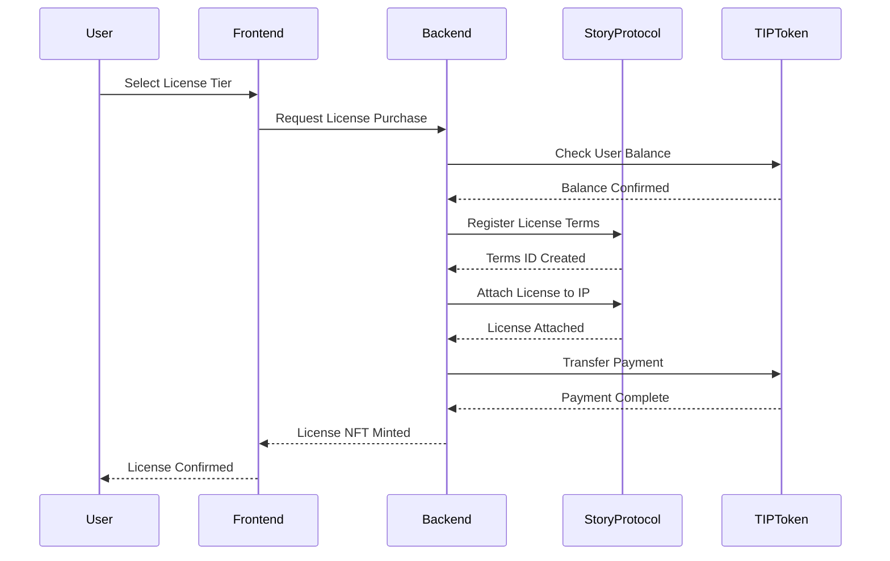

# StoryHouse Licensing System Documentation

## Overview

StoryHouse implements a sophisticated 3-tier Programmable IP License (PIL) system through Story Protocol, enabling chapter-level intellectual property licensing with automated royalty distribution. This system transforms every story chapter into a potential revenue-generating asset while maintaining creator control and attribution.

## 3-Tier License Structure

### 1. Standard License ($100 TIP tokens)
- **Commercial Use**: ✅ Allowed
- **Derivatives**: ✅ Allowed 
- **Attribution**: ✅ Required
- **Share-Alike**: ❌ Not required
- **Exclusivity**: ❌ Non-exclusive
- **Royalty Rate**: 5%
- **Use Case**: Basic remix and commercial use cases
- **Target Audience**: Independent creators, hobbyists, small projects

### 2. Premium License ($500 TIP tokens)
- **Commercial Use**: ✅ Allowed
- **Derivatives**: ✅ Allowed
- **Attribution**: ✅ Required
- **Share-Alike**: ❌ Not required
- **Exclusivity**: ❌ Non-exclusive
- **Royalty Rate**: 10%
- **Use Case**: Commercial projects expecting significant revenue
- **Target Audience**: Professional creators, mid-sized businesses

### 3. Exclusive License ($2,000 TIP tokens)
- **Commercial Use**: ✅ Allowed
- **Derivatives**: ✅ Allowed
- **Attribution**: ✅ Required
- **Share-Alike**: ❌ Not required
- **Exclusivity**: ✅ Exclusive rights
- **Royalty Rate**: 20%
- **Use Case**: Major adaptations, exclusive commercial rights
- **Target Audience**: Production companies, major publishers

## Technical Implementation

### Core Components

1. **IP Registration**: When a story/chapter is published, it's registered as an IP Asset on Story Protocol
2. **PIL Terms Creation**: Each tier creates specific PIL (Programmable IP License) terms on-chain
3. **License Attachment**: Authors can attach one or more license tiers to their IP assets
4. **Purchase Flow**: Readers/remixers purchase licenses using TIP tokens through the platform
5. **Derivative Creation**: License holders can create remixes/derivatives that are automatically linked to parent IPs
6. **Royalty Distribution**: Smart contracts automatically distribute royalties based on the tier's percentage

### Key Implementation Files

```typescript
// License Types Definition
/packages/shared/src/types/ip.ts (lines 126-139)

// IP Service Implementation  
/packages/shared/src/services/ipService.ts (lines 691-733)

// License API Endpoint
/apps/backend/app/api/ip/license/route.ts

// Frontend Integration
/apps/frontend/components/creator/IPRegistrationSection.tsx
/apps/frontend/components/creator/CollectionSection.tsx
```

### License Purchase Flow



## Benefits Analysis

### 1. Revenue Diversification for Authors
- **Multiple Income Streams**: Initial chapter sales ($50-500) + ongoing royalties (5-20%)
- **Passive Income**: Automatic royalty payments from derivative works
- **Price Discrimination**: Different tiers capture different customer segments
- **Example Revenue Model**: 
  - 100 Standard licenses = $10,000 + 5% of derivative revenue
  - 20 Premium licenses = $10,000 + 10% of derivative revenue
  - 5 Exclusive licenses = $10,000 + 20% of derivative revenue

### 2. Democratized Creative Remixing
- **Affordable Entry**: $100 vs traditional $1000+ book licenses
- **Clear Legal Framework**: On-chain licenses eliminate uncertainty
- **Automatic Attribution**: Immutable parent-child relationships
- **Creative Freedom**: Clear permissions for derivative works

### 3. Business Model Innovation
- **Franchise Building**: Story universes with official derivatives
- **Commercial Partnerships**: Premium/Exclusive tiers enable B2B deals
- **IP Asset Value**: Tradeable assets with clear revenue potential
- **Network Effects**: More derivatives → more visibility → more value

### 4. Platform Benefits
- **Transaction Volume**: Platform fees on each license purchase
- **User Retention**: Creators manage IP portfolios
- **Content Quality**: Financial incentives attract professionals
- **Competitive Advantage**: First mover in chapter-level licensing

## Economic Flywheel

```
Original Story Published
         ↓
Readers Discover Content
         ↓
Some Purchase Licenses
         ↓
Create Derivative Works
         ↓
Derivatives Published
         ↓
More Readers Discover
         ↓
Royalties Flow to Original Author
         ↓
Author Creates More Content
```

## Real-World Use Cases

### Fan Fiction Legitimization
- Fans legally create and monetize derivative works
- Original authors receive automatic royalties
- Clear attribution and relationship tracking

### Educational Adaptations
- Teachers license content for classroom materials
- Educational publishers create study guides
- Localized versions for different markets

### Media Rights Management
- Production companies secure exclusive adaptation rights
- Clear chain of rights for legal departments
- Automated royalty distribution to all stakeholders

### Translation and Localization
- Global creators license for localized versions
- Regional publishers acquire distribution rights
- Cultural adaptations with proper attribution

## Future Enhancements

### Phase 1: Advanced License Terms (Q1 2025)
- Time-limited licenses
- Geographic restrictions
- Usage-based pricing
- Bundled license packages

### Phase 2: DeFi Integration (Q2 2025)
- License NFT collateralization
- Secondary license markets
- Liquidity pools for popular IPs
- Yield farming with licensed content

### Phase 3: Cross-Platform Interoperability (Q3 2025)
- License portability across Story Protocol apps
- Universal creator royalty aggregation
- Cross-chain license recognition
- Decentralized license verification

## Smart Contract Architecture

### Core Contracts
1. **StoryProtocol Core**: IP asset registration and management
2. **PIL Terms Registry**: License terms storage and verification
3. **Royalty Module**: Automated payment distribution
4. **License Token**: ERC-721 tokens representing licenses

### Security Considerations
- Multi-signature treasury for platform fees
- Time-locked royalty claims
- Upgradeable proxy pattern for contract evolution
- Comprehensive audit trail for all transactions

## API Reference

### Purchase License
```typescript
POST /api/ip/license
{
  "ipId": "0x123...",
  "licenseType": "standard" | "premium" | "exclusive",
  "purchaserAddress": "0xabc..."
}
```

### Check License Status
```typescript
GET /api/ip/license/{ipId}/{userAddress}
Response: {
  "hasLicense": boolean,
  "licenseType": string,
  "purchaseDate": string,
  "transactionHash": string
}
```

### Claim Royalties
```typescript
POST /api/ip/royalties/claim
{
  "ipId": "0x123...",
  "creatorAddress": "0xdef..."
}
```

## Conclusion

The StoryHouse 3-tier licensing system represents a paradigm shift in digital content monetization. By leveraging Story Protocol's programmable IP infrastructure, we're creating a sustainable ecosystem where creators are fairly compensated, remixers have clear legal frameworks, and readers benefit from a rich universe of interconnected stories.

This documentation will be updated as new features are implemented and the system evolves.