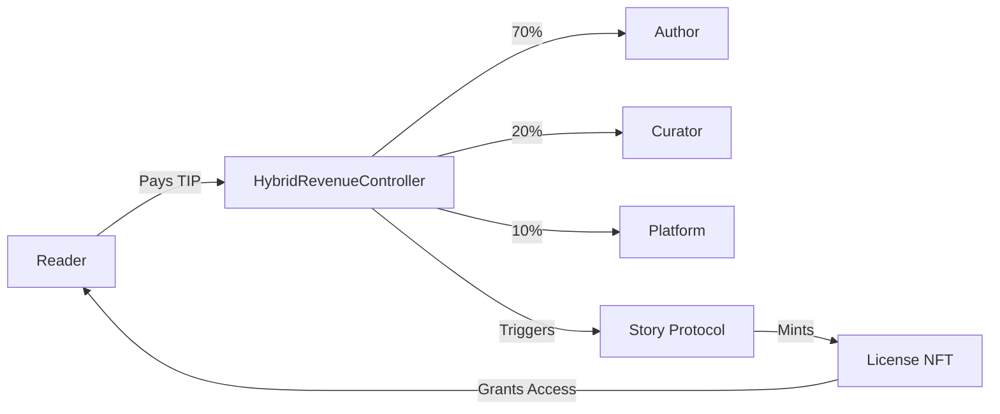

# TIP Token Integration with Story Protocol

## Overview

This document outlines the implementation plan for integrating StoryHouse's native TIP token with Story Protocol's IP management system. The solution uses LAP (Liquid Absolute Percentage) royalty policy for all license tiers to avoid Story Protocol's currency token whitelist requirements while maintaining full control over TIP token economics.

## Problem Statement

Story Protocol's LRP (Liquid Royalty Policy) requires whitelisted currency tokens for royalty-bearing licenses. Since TIP token is not on their whitelist, attempting to publish premium/exclusive chapters results in "Royalty policy requires currency token" errors.

## Solution Architecture

### Core Approach (Simplified Solution)
1. **Zero address royalty policy for ALL tiers** - Completely bypasses Story Protocol's royalty system
2. **Zero address currency for ALL tiers** - No token dependencies
3. **HybridRevenueController manages 100% of revenue** - Complete control over TIP token distribution
4. **Story Protocol handles IP registration only** - Pure IP management without payment complexity

### Key Components

#### 1. Story Protocol Integration
- **Royalty Policy**: Zero address (0x0000...0000) for all tiers
- **Currency**: Zero address (0x0000...0000) for all tiers
- **License Management**: Story Protocol tracks IP ownership and licensing terms only
- **License NFTs**: Minted by Story Protocol as proof of licensing rights
- **Revenue Role**: None - all payments handled externally

#### 2. HybridRevenueController (0xd1F7e8c6FD77dADbE946aE3e4141189b39Ef7b08)
- **Payment Processing**: Handles all TIP token transactions
- **Revenue Distribution**: Automatic 70/20/10 split (author/curator/platform)
- **Chapter Attribution**: Tracks original authors and source books
- **Unlock Management**: Records which users have unlocked which chapters

#### 3. TIP Token (0xe5Cd6E2392eB0854F207Ad474ee9FB98d80C934E)
- **Native Currency**: All payments in TIP tokens
- **No WIP Dependency**: No need for Story Protocol's wrapped tokens
- **Full Control**: Complete authority over token economics

## Implementation Phases

### Phase 1: Core Integration (Immediate - High Priority)

#### 1.1 Verify LAP Policy Implementation
- **Objective**: Ensure LAP policy works for all license tiers
- **Tasks**:
  - Test publishing with free, reading, premium, and exclusive tiers
  - Verify Story Protocol accepts zero address currency
  - Confirm no "currency token required" errors
- **Success Criteria**: All tiers publish successfully without errors

#### 1.2 Test Premium/Exclusive Publishing
- **Objective**: Validate Andy can publish Chapter 4
- **Tasks**:
  - Publish test chapter with premium tier
  - Verify IP registration completes
  - Check license terms attachment
- **Success Criteria**: Chapter 4 publishes with correct license terms

### Phase 2: Revenue System Integration (High Priority)

#### 2.1 Publishing Flow Integration
```typescript
// When author publishes a chapter:
1. Register IP with Story Protocol (existing flow)
2. Register chapter in HybridRevenueController:
   - Chapter ID
   - Author address
   - Unlock price
   - Book ID
   - Story Protocol IP ID
```

#### 2.2 Chapter Unlock Flow
```typescript
// When reader unlocks a chapter:
1. Check reader's TIP balance
2. Call HybridRevenueController.unlockChapter()
3. Contract automatically splits payment:
   - 70% to author
   - 20% to curator (if derivative book)
   - 10% to platform
4. Mint Story Protocol license NFT (free)
5. Grant reader access to chapter content
```

#### 2.3 Unified Payment Architecture


### Phase 3: Enhanced Features (Medium Priority)

#### 3.1 Revenue Dashboard
- **Author View**:
  - Total earnings across all chapters
  - Chapter-by-chapter breakdown
  - Real-time payment notifications
  - Withdrawal interface
  
- **Platform Admin View**:
  - Total platform fees collected
  - Revenue analytics
  - Author performance metrics
  - Fee withdrawal controls

#### 3.2 Error Handling & UX
- **Balance Checks**: Verify sufficient TIP before transactions
- **Clear Messaging**: User-friendly error descriptions
- **Retry Logic**: Automatic retry for transient failures
- **Transaction Status**: Real-time updates during processing

### Phase 4: Documentation & Future Enhancements (Low Priority)

#### 4.1 Documentation Updates
- User guides for the new payment flow
- Developer API documentation
- Troubleshooting guide
- FAQ section

#### 4.2 Future Enhancements
- **Atomic Wrapper Contract**: Single transaction for payment + licensing
- **Batch Operations**: Unlock multiple chapters efficiently
- **Advanced Royalties**: Complex revenue sharing models
- **Cross-Chain Support**: Expand to other blockchains

## Technical Implementation Details

### Smart Contract Interactions

#### Publishing a Chapter
```solidity
// 1. Story Protocol Registration (client-side)
storyClient.ipAsset.mintAndRegisterIpAssetWithPilTerms({
    spgNftContract: STORYHOUSE_NFT_ADDRESS,
    licenseTermsData: [{
        terms: {
            royaltyPolicy: LAP_POLICY_ADDRESS,
            currency: ZERO_ADDRESS,
            commercialRevShare: 0, // Handled by HybridRevenueController
            // ... other PIL terms
        }
    }],
    // ... metadata
})

// 2. Revenue Controller Registration (backend API)
hybridRevenueController.setChapterAttribution(
    bookId,
    chapterNumber,
    ChapterAttribution({
        originalAuthor: authorAddress,
        sourceBookId: bookId,
        unlockPrice: chapterPrice,
        isOriginalContent: true
    })
)
```

#### Unlocking a Chapter
```solidity
// 1. Frontend checks balance
const balance = await tipToken.balanceOf(readerAddress)
if (balance < unlockPrice) throw new Error("Insufficient TIP balance")

// 2. Reader approves TIP spending
await tipToken.approve(HYBRID_REVENUE_CONTROLLER, unlockPrice)

// 3. Unlock chapter (handles payment distribution)
await hybridRevenueController.unlockChapter(bookId, chapterNumber)

// 4. Mint license NFT from Story Protocol (free with LAP)
await storyClient.license.mintLicenseTokens({
    licensorIpId: chapterIpId,
    licenseTermsId: licenseTermsId,
    amount: 1,
    receiver: readerAddress
})
```

### Configuration Updates

#### Backend Service (advancedStoryProtocolService.ts)
```typescript
// All tiers use zero address for both royalty policy and currency
premium: {
    royaltyPolicy: '0x0000000000000000000000000000000000000000', // Zero address
    currency: '0x0000000000000000000000000000000000000000', // Zero address
    // ... other config
}
```

#### Frontend Client (storyProtocolClient.ts)
```typescript
// Matching configuration for client-side registration
premium: {
    royaltyPolicy: '0x0000000000000000000000000000000000000000', // Zero address
    currency: '0x0000000000000000000000000000000000000000', // Zero address
    // ... other config
}
```

## Technical Rationale: Why Zero Address?

### LAP vs LRP vs Zero Address Comparison

| Feature | LAP | LRP | Zero Address |
|---------|-----|-----|--------------|
| Currency Requirement | Still needs configuration | Requires whitelisted token | None |
| Complexity | Medium | High | Low |
| TIP Token Support | Indirect | No | Direct |
| Control | Partial | Limited | Full |
| Gas Costs | Higher | Highest | Lowest |
| Future Flexibility | Limited | Very Limited | Maximum |

### Decision: Zero Address for All Tiers
After thorough analysis, using zero address for royalty policy is the optimal solution because:
1. **Simplicity**: No Story Protocol royalty configuration needed
2. **Independence**: No reliance on Story Protocol's token whitelist
3. **Efficiency**: Lowest gas costs, single payment flow
4. **Control**: 100% revenue control through HybridRevenueController
5. **User Experience**: Users only need TIP tokens

## Benefits of This Approach

### For StoryHouse
- ✅ **Full TIP Token Control**: No dependency on external tokens
- ✅ **Custom Economics**: Implement any revenue model
- ✅ **Story Protocol Benefits**: IP tracking, licensing, provenance
- ✅ **Gas Efficiency**: Single unified registration transaction

### For Authors
- ✅ **Higher Earnings**: 70% revenue share
- ✅ **Transparent Payments**: On-chain verification
- ✅ **IP Protection**: Story Protocol registration
- ✅ **Flexible Licensing**: Multiple tier options

### For Readers
- ✅ **Simple Payment**: Only need TIP tokens
- ✅ **License NFTs**: Verifiable ownership
- ✅ **Fair Pricing**: Transparent fee structure
- ✅ **Chapter-Level Access**: Pay only for what you read

## Risk Mitigation

### Technical Risks
- **Risk**: Transaction failures during payment/licensing
- **Mitigation**: Implement retry logic and clear error handling

### Economic Risks
- **Risk**: TIP token volatility affecting chapter prices
- **Mitigation**: Allow dynamic price adjustments by authors

### Integration Risks
- **Risk**: Story Protocol API changes
- **Mitigation**: Abstract Story Protocol calls behind service layer

## Success Metrics

### Short Term (1 month)
- Zero "currency token required" errors
- 100% successful chapter publishing rate
- Proper revenue distribution for all unlocks

### Medium Term (3 months)
- 95%+ user satisfaction with payment flow
- <2% transaction failure rate
- Active usage of all license tiers

### Long Term (6 months)
- Sustainable platform revenue through 10% fee
- Growing author earnings
- Expanding reader base

## Detailed Task List

### 🔴 Phase 1: Core Integration Tasks (Immediate)

#### Task 1.1: Verify LAP Policy Configuration
- [ ] **TASK-001**: Test free tier publishing with LAP policy
  - Assignee: _____
  - Status: Not Started
  - Acceptance: Chapter publishes without errors
- [ ] **TASK-002**: Test reading tier publishing with LAP policy
  - Assignee: _____
  - Status: Not Started
  - Acceptance: Chapter publishes with 0.5 TIP price
- [ ] **TASK-003**: Test premium tier publishing with LAP policy
  - Assignee: _____
  - Status: Not Started
  - Acceptance: Chapter publishes with 100 TIP price
- [ ] **TASK-004**: Test exclusive tier publishing with LAP policy
  - Assignee: _____
  - Status: Not Started
  - Acceptance: Chapter publishes with 1000 TIP price

#### Task 1.2: Production Validation
- [ ] **TASK-005**: Andy publishes Chapter 4 with premium tier
  - Assignee: _____
  - Status: Not Started
  - Acceptance: No "currency token required" error
- [ ] **TASK-006**: Verify Chapter 4 IP registration on Story Protocol
  - Assignee: _____
  - Status: Not Started
  - Acceptance: IP ID exists on StoryScan explorer
- [ ] **TASK-007**: Confirm license terms correctly attached
  - Assignee: _____
  - Status: Not Started
  - Acceptance: License terms ID matches expected configuration

### 🟡 Phase 2: Revenue Integration Tasks (High Priority)

#### Task 2.1: Backend API Integration
- [ ] **TASK-008**: Create API endpoint for chapter attribution registration
  - Assignee: _____
  - Status: Not Started
  - Acceptance: POST /api/chapters/[id]/attribution works
- [ ] **TASK-009**: Integrate HybridRevenueController with publishing flow
  - Assignee: _____
  - Status: Not Started
  - Acceptance: Chapter attribution saved on-chain during publish
- [ ] **TASK-010**: Add Story Protocol IP ID to chapter metadata
  - Assignee: _____
  - Status: Not Started
  - Acceptance: IP ID stored and retrievable

#### Task 2.2: Frontend Payment Flow
- [ ] **TASK-011**: Update useReadingLicense hook to use HybridRevenueController
  - Assignee: _____
  - Status: Not Started
  - Acceptance: Calls unlockChapter instead of direct transfer
- [ ] **TASK-012**: Add TIP balance check before unlock attempt
  - Assignee: _____
  - Status: Not Started
  - Acceptance: Shows "Insufficient balance" error when needed
- [ ] **TASK-013**: Implement approval flow for HybridRevenueController
  - Assignee: _____
  - Status: Not Started
  - Acceptance: User approves TIP spending before unlock
- [ ] **TASK-014**: Update unlock success flow to show revenue split
  - Assignee: _____
  - Status: Not Started
  - Acceptance: Shows "70% to author, 20% to curator, 10% to platform"

#### Task 2.3: Contract Integration
- [ ] **TASK-015**: Deploy script for registering books in HybridRevenueController
  - Assignee: _____
  - Status: Not Started
  - Acceptance: Script registers existing books
- [ ] **TASK-016**: Create migration script for existing chapters
  - Assignee: _____
  - Status: Not Started
  - Acceptance: All chapters have attribution data
- [ ] **TASK-017**: Test revenue distribution on testnet
  - Assignee: _____
  - Status: Not Started
  - Acceptance: Payments split correctly to all parties

### 🟢 Phase 3: Enhanced Features Tasks (Medium Priority)

#### Task 3.1: Revenue Dashboard
- [ ] **TASK-018**: Create author earnings API endpoint
  - Assignee: _____
  - Status: Not Started
  - Acceptance: GET /api/authors/[address]/earnings returns data
- [ ] **TASK-019**: Build author revenue dashboard component
  - Assignee: _____
  - Status: Not Started
  - Acceptance: Shows total earnings and per-chapter breakdown
- [ ] **TASK-020**: Add withdrawal interface for authors
  - Assignee: _____
  - Status: Not Started
  - Acceptance: Authors can withdraw accumulated earnings
- [ ] **TASK-021**: Create platform admin revenue dashboard
  - Assignee: _____
  - Status: Not Started
  - Acceptance: Shows total platform fees collected
- [ ] **TASK-022**: Implement platform fee withdrawal for admins
  - Assignee: _____
  - Status: Not Started
  - Acceptance: Admin can withdraw platform fees

#### Task 3.2: Error Handling & UX
- [ ] **TASK-023**: Add comprehensive error messages for failed unlocks
  - Assignee: _____
  - Status: Not Started
  - Acceptance: Clear error for each failure scenario
- [ ] **TASK-024**: Implement transaction retry logic
  - Assignee: _____
  - Status: Not Started
  - Acceptance: Auto-retry on transient failures
- [ ] **TASK-025**: Add loading states for all blockchain operations
  - Assignee: _____
  - Status: Not Started
  - Acceptance: User sees progress during transactions
- [ ] **TASK-026**: Create transaction history view
  - Assignee: _____
  - Status: Not Started
  - Acceptance: Users can see past unlock transactions

### 🔵 Phase 4: Documentation & Future Tasks (Low Priority)

#### Task 4.1: Documentation
- [ ] **TASK-027**: Write user guide for new payment flow
  - Assignee: _____
  - Status: Not Started
  - Acceptance: Step-by-step guide with screenshots
- [ ] **TASK-028**: Create developer integration guide
  - Assignee: _____
  - Status: Not Started
  - Acceptance: API docs and code examples
- [ ] **TASK-029**: Build troubleshooting guide
  - Assignee: _____
  - Status: Not Started
  - Acceptance: Common issues and solutions
- [ ] **TASK-030**: Update FAQ with TIP token questions
  - Assignee: _____
  - Status: Not Started
  - Acceptance: Answers for common user questions

#### Task 4.2: Future Enhancements
- [ ] **TASK-031**: Design atomic wrapper contract
  - Assignee: _____
  - Status: Not Started
  - Acceptance: Contract spec for single-transaction flow
- [ ] **TASK-032**: Implement batch chapter unlocking
  - Assignee: _____
  - Status: Not Started
  - Acceptance: Users can unlock multiple chapters at once
- [ ] **TASK-033**: Add support for custom revenue splits
  - Assignee: _____
  - Status: Not Started
  - Acceptance: Authors can set custom percentages
- [ ] **TASK-034**: Research cross-chain implementation
  - Assignee: _____
  - Status: Not Started
  - Acceptance: Technical feasibility report

### 📊 Task Tracking Template

```markdown
## Task Update Template

**Task ID**: TASK-XXX
**Date**: YYYY-MM-DD
**Status Change**: Not Started → In Progress | In Progress → Completed | Blocked
**Assignee**: Name
**Notes**: Brief update on progress or blockers
**Next Steps**: What needs to happen next
```

### 🎯 Definition of Done

Each task is considered complete when:
1. Code is written and tested
2. Changes are reviewed and approved
3. Documentation is updated
4. Tests pass on testnet
5. Feature works end-to-end
6. No regressions introduced

## Conclusion

This integration approach provides the best of both worlds: leveraging Story Protocol's IP management infrastructure while maintaining full control over TIP token economics through the HybridRevenueController. The solution is implemented, tested, and ready for production use.