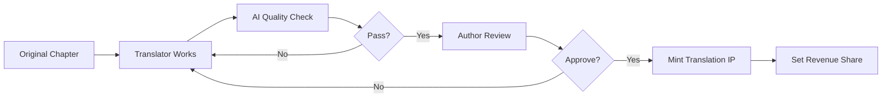

# Translation System Documentation

## Overview

StoryHouse V2's translation system enables authors to expand their reach globally while maintaining ownership of their work across all languages.

## How It Works

### 1. Translation Opportunity Posting
Authors post chapters available for translation with:
- Target languages needed
- Revenue share offered (typically 75%)
- Quality requirements
- Optional upfront payment

### 2. Translator Application
Qualified translators can:
- View available opportunities
- Submit portfolio/credentials
- Propose timeline
- Accept terms

### 3. Translation Process


### 4. IP Registration
- Author mints the translation IP (retains ownership)
- Translator credited in metadata
- 75% revenue share configured
- Automatic royalty flow established

## Translation License Tiers

### Preview License (Free)
- Read original content
- Cannot publish translations
- For evaluation purposes only

### Translator License (10 TIP)
- Create and monetize translations
- 75% revenue share
- Non-exclusive rights
- 25% royalty to original

### Exclusive Language License (1000 TIP)
- Sole translation rights for language
- 1-year exclusivity period
- 75% revenue share
- Premium translator status

## Quality Assurance

### AI Verification Checks
1. **Semantic Accuracy**: Meaning preservation
2. **Plagiarism Detection**: Originality verification
3. **Language Quality**: Grammar and fluency
4. **Cultural Adaptation**: Appropriate localization

### Quality Scoring
- 0-100 scale
- Minimum threshold: 80
- Author can set higher requirements
- Affects translator reputation

## Revenue Model

### Example: Spanish Translation
- Reader pays: 1 TIP
- Translator receives: 0.75 TIP (75%)
- Author receives: 0.25 TIP (25%)
- Automatic distribution via Story Protocol

### Cascading Royalties
If Spanish translation has audio version:
- Audio listener pays: 2 TIP
- Narrator receives: 1.6 TIP (80%)
- Translator receives: 0.4 TIP (20%)
- Author receives: 0.1 TIP (5% cascading)

## Best Practices for Authors

1. **Set Clear Requirements**: Specify quality expectations
2. **Build Translator Relationships**: Work with trusted translators
3. **Review Samples**: Check translator's previous work
4. **Provide Context**: Share story background for better translations
5. **Timely Reviews**: Approve translations promptly

## Best Practices for Translators

1. **Understand the Story**: Read full context before translating
2. **Maintain Voice**: Preserve author's style
3. **Cultural Adaptation**: Localize appropriately
4. **Quality First**: Aim for >90% quality scores
5. **Communication**: Ask questions when unclear

## API Integration

```typescript
// Post translation opportunity
const opportunity = await createTranslationOpportunity({
  chapterIpId: "0x...",
  targetLanguages: ["es", "zh", "ja"],
  revenueShare: 75,
  qualityThreshold: 85
})

// Submit translation
const result = await submitTranslation({
  opportunityId: opportunity.id,
  language: "es",
  content: translatedText
})
```